# Stats for Data Engineers (Explained Like You’re a Human, Not a Textbook)

If you’re a data engineer, you’ve probably had this moment:

You’re just trying to move data from Point A to Point B… and suddenly someone asks:

> “Can you compute the variance, validate normality, tune the model, explain cross-entropy, and maybe also sprinkle in Bayesian optimization?”

And you’re thinking:

> “Sure. Right after I finish fixing the pipeline that broke because a column called `user_id` turned into `User Id`.”

This article is a friendly, practical tour of the stats + ML concepts that show up constantly around data engineering, data science, and modern ML systems (especially LLM workflows).

No heavy math required. We’ll do plain language, good analogies, and examples that make sense even if you haven’t touched calculus since it ghosted you.

---

## Table of Contents

[[TOC]]

---

## Quick stats vocabulary (the stuff people mix up)

Before we start, let’s clear up a few definitions that cause *constant* confusion. This will save you from 90% of “wait… what?” moments later.

### Latency (in plain English)
**Latency** is just “how long you waited.”

If you tap a button and it takes time to respond, that time is latency.

**Analogy**: ordering food.
- Short latency: your pizza arrives quickly.
- Long latency: you finish a whole episode while staring at “Out for delivery.”

When engineers say “p95 latency,” they’re basically saying: “For most people, how long was the wait?”

If you prefer a non-tech word, just read “latency” as **waiting time**.

### Mean vs Average (yes, people argue about this)
- **Mean**: the “add everything, divide by how many” number.
- **Average**: in everyday language, people usually mean the **mean**… but sometimes they mean “typical.”

So when someone says “the average waiting time,” ask yourself:
- do they mean the **mean**?
- or do they mean something more “typical” like the **median**?

### Mean vs Median (the classic trap)
- **Mean**: sensitive to outliers.
- **Median**: the middle value when you sort the data (more robust to outliers).

**Example (waiting time):** `[10, 11, 12, 13, 200]`
- mean ≈ 49.2 (pulled up by the 200ms outlier)
- median = 12 (more “typical”)

If you’re monitoring waiting time, **median + percentiles** often tell the story better than mean.

### Mode
- **Mode**: the value that shows up **the most often**.

#### Explain it like you’re 5
If you ask 10 kids their favorite ice cream and you hear:
`vanilla, vanilla, chocolate, vanilla, strawberry, chocolate, vanilla, mint, vanilla, chocolate`

The mode is **vanilla**, because it appears the most.

#### A super simple numbers example
Numbers: `[2, 2, 2, 5, 5, 9]`
- mode = **2** (it happens 3 times)

#### Why mode is useful (when it’s actually meaningful)
Mode shines when the data naturally “snaps” to certain values and piles up there.

**Real-life example (sizes)**  
If most people buy shoe size 42, then 42 is the mode. That’s useful for inventory planning.

**IT/data examples (very common in practice)**  
- **Most common HTTP status code**: if the mode is `200`, life is good. If the mode becomes `500`, your on-call phone is about to start doing cardio.
- **Most common error type**: the mode might be “Timeout” → tells you where to focus first.
- **Most common category value**: if `country = \"US\"` is the mode, that might be expected… but if `country = NULL` becomes the mode, that’s a data quality alarm.

#### Important: mode is not always “the typical value”
Mode is “most frequent,” not “most representative.”

Example: in a restaurant, if most orders are exactly **1 item**, then mode = 1.  
But the average number of items might still be higher because some customers order big.

#### Multiple modes can happen (bimodal/multimodal)
Sometimes you have two peaks, meaning you might have two different “populations.”

Example:
`[1, 1, 1, 10, 10, 10]`
- modes = **1 and 10**

In systems, that can mean two different behaviors, like cache hit vs cache miss.

#### When mode is not that useful
If almost every value is unique (common in continuous measurements), the mode can be meaningless.

Example:
`[0.91, 0.92, 0.93, 0.94, 0.95]`
- no repeats → mode doesn’t help much

#### Quick rule of thumb
- Use **mode** for “most common category/value” (status codes, error types, enums, buckets).
- Use **median/percentiles** for “typical experience” in numeric data (especially with outliers).

### Population vs Sample (and why it matters)
- **Population**: the whole thing (all users, all requests, all rows).
- **Sample**: a subset you actually measured.

Common confusion: people compute a metric on a sample and talk like it’s the population truth. Sampling is fine — just be honest about it.

### Parameter vs Statistic (two words that look identical at 2am)
- **Parameter**: a “true” value about the whole population (usually unknown).
- **Statistic**: the number you computed from a sample (what you actually have).

#### Super simple example (requests)
You have **10 million requests** today.

- The *true* average waiting time of **all 10 million** events = a **parameter** (you don’t know it unless you measure all of them).
- You sample **10,000 events** and compute their average waiting time = a **statistic** (your best estimate).

#### Rule of thumb
- Parameter = “the real truth about everything”
- Statistic = “my measured estimate from a subset”

If someone says “our mean waiting time is 120ms,” quietly ask: **120ms from the entire population or from a sample?**

### Standard deviation vs Standard error (they’re not the same)
- **Standard deviation (SD)**: how spread out individual values are.
- **Standard error (SE)**: how uncertain your estimate is (usually the uncertainty of the **sample mean**).

#### Picture it (latency again)
Imagine you sample 1,000 waiting times (deliveries, support tickets, or app responses).

- SD answers: “Do individual requests vary a lot?”  
  (Lots of fast requests + some slow ones → SD is big.)

- SE answers: “If I repeated this sampling again and again, how much would my **estimated mean** move around?”  
  (More samples → the estimated mean becomes steadier → SE gets smaller.)

#### Key relationship (no panic math)
SE usually shrinks as you collect more data:
- bigger sample size → smaller SE

#### Rule of thumb
- SD = variability of the *data*
- SE = uncertainty of the *average you computed*

Practical monitoring tip: SD helps you understand “how noisy is the system,” SE helps you understand “how stable is my estimate.”

### Percent vs Percentile vs “percentage points”
- **Percent**: “out of 100” (e.g., error rate is 2%).
- **Percentile**: a position in a distribution (e.g., p95 waiting time).
- **Percentage points**: difference between percents (e.g., 2% → 3% is +1 percentage point).

#### Percent vs Percentile (very, very simple)
- **Percent = “how much out of 100?”** (a fraction)
- **Percentile = “what rank am I compared to others?”** (a position)

Two quick examples (different questions):

1) **Test score (percent)**  
You got **80%** on the exam.  
Meaning: you got **80 out of 100 points** (or 8/10, 40/50, etc.).

2) **Class rank (percentile)**  
You are in the **80th percentile**.  
Meaning: you did **better than (or equal to) 80% of people**.  
It does *not* mean you scored 80%.

So:
- 80% = “my score out of 100”
- 80th percentile = “my position in the group”

#### Percentile (made easy)
Percentile is just **ranking**.

### The simplest way to think about it
Imagine **100 people** standing in a line, sorted from shortest wait to longest wait.

- **p50** is person #50 (the middle) → this is also the **median**
- **p90** is person #90 → 90 people are faster/equal, 10 are slower
- **p95** is person #95 → 95 people are faster/equal, 5 are slower
- **p99** is person #99 → only 1 person is slower (the extreme tail)

### Tiny concrete example (sorted numbers)
Waiting times (minutes): `[8, 9, 10, 11, 30]`
- p50 ≈ 10 minutes (middle value)
- p80 is around 11 minutes (most are ≤ 11 minutes)
- p95 is near 30 minutes (almost everyone is ≤ 30 minutes)

### In real life
When you see **p95 waiting time = 30 minutes**, it means:
> 95% of people waited 30 minutes or less. The slowest 5% waited longer than 30 minutes.

#### Why percentiles matter in IT
Means can hide bad tail performance.

Two services can have the same mean waiting time, but one has horrible p99. People usually notice p95/p99 much more than the mean.

### Probability vs Likelihood (sounds the same, isn’t)
- **Probability**: “If my model is true, how likely is this data?”  
  Think: *model → data*.
- **Likelihood**: “Given this data, which model (or parameter) makes it most plausible?”  
  Think: *data → model*.

Yes, the math expression can look similar, which is why this topic confuses people and starts unnecessary debates on the internet.

#### A coin analogy (simple and surprisingly effective)
Imagine two coins:
- Coin A: fair (50% heads)
- Coin B: biased (90% heads)

You flip a coin 10 times and you see: **9 heads, 1 tail**.

- **Probability question**:  
  “If Coin A is the one I’m using, what’s the probability of seeing 9 heads out of 10?”  
  (That’s \(P(data \mid CoinA)\).)

- **Likelihood question**:  
  “Given I saw 9 heads, which coin is more plausible: A or B?”  
  (You compare how well each coin explains the data. The one that makes the data less ‘surprising’ has higher likelihood.)

#### Data engineering / monitoring analogy
You see **error rate = 5%** today.

- Probability thinking: “If the system is healthy, how likely is a 5% error day?”  
  (If that’s super unlikely, something’s off.)

- Likelihood thinking: “Given I observed 5%, is it more plausible that:
  - the deploy introduced a bug,
  - a dependency is failing,
  - or traffic mix changed?”

  You compare explanations and pick the one that best fits the evidence.

#### Quick rule of thumb
- **Probability**: rate/chance of outcomes under a known model.
- **Likelihood**: scoring how well different models/parameters explain what you observed.

### Correlation vs Causation (every dashboard’s villain)
- **Correlation**: two things move together.
- **Causation**: one thing *causes* the other.

#### The classic example
Ice cream sales correlate with drowning incidents. Ice cream didn’t do it — **summer** did.

#### A more “IT” example
You deploy a new version and notice:
- CPU usage went up
- latency went up

They correlate, but causation isn’t guaranteed.

Possible explanations:
- the deploy introduced a performance regression (causal)
- traffic doubled at the same time (confounder)
- a downstream dependency slowed down, causing retries (hidden cause)

Correlation tells you where to look. It doesn’t tell you who to blame.
#### A quick “confounder” trick (the real villain)
A **confounder** is a third thing that affects both variables.

Example:
- More users online → more traffic
- More traffic → more CPU and more latency

So CPU and latency move together, but traffic is pulling the strings.
#### How to get closer to causation (practical version)
- **Controlled experiments** (A/B tests): best when possible
- **Holdout / canary** deploys: compare new vs old under similar load
- **Difference-in-differences**: compare changes vs a control group
- **Time ordering**: causes usually happen before effects (sounds obvious, gets ignored daily)
#### A small joke, because we deserve it
Correlation is like seeing two coworkers arrive at the office at the same time and concluding they’re married.

Sometimes they are.

Most of the time, it’s just the same bus.

---

## Why should data engineers care about stats?

Because **data engineering isn’t just plumbing**.

It’s plumbing where the water is **messy**, the pipes are **distributed**, and everyone blames you when the dashboard looks “off.”

Stats helps you answer questions like:
- Is this metric change real, or just noise?
- Is the data stable, drifting, or broken?
- Are our experiments trustworthy?
- Are we building monitoring that catches real issues instead of crying wolf?

---

## Descriptive stats for monitoring (the daily stuff)

### Variance

**Variance** measures how spread out numbers are.

Think of it like this:
- If everyone in a room is about the same height, the “height variance” is small.
- If the room contains toddlers, basketball players, and someone on stilts… variance is large.

### Why it matters for data engineers
Variance shows up in:
- anomaly detection (spikes vs normal fluctuations)
- feature stability (is this feature predictable?)
- monitoring (is this KPI naturally noisy?)

### Tiny example
Daily orders: `[98, 101, 99, 100, 102]` → low variance (stable)

Daily orders: `[60, 180, 95, 130, 35]` → high variance (wild)

---

### Standard deviation

**Standard deviation** is just variance, but in a more human-friendly unit.

Variance is in “squared units” (like “meters squared”), which is mathematically useful but emotionally confusing.

Standard deviation answers:
> “On average, how far do values wander from the mean?”

**Analogy (party version):** If variance is “how chaotic the party is,” standard deviation is “how far guests are likely to wander away from the snack table.”

---

## Distributions you’ll actually meet (and why they show up)

### Uniform distribution

Uniform is the “everything in this range is equally likely” distribution.

**Analogy**: a fair spinner that’s equally likely to land anywhere.

**Where it shows up in IT/data**:
- random sampling
- load testing where you “spread” requests evenly
- randomized A/B assignment (when done correctly)

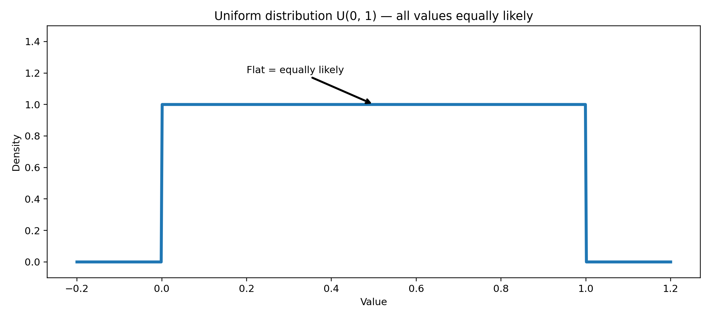

---

### Binomial distribution

Binomial answers: **“How many successes do I get in \(n\) tries?”**

**Analogy**: flipping a coin \(n\) times and counting heads.

**Where it shows up in IT/data**:
- number of failed requests out of \(n\)
- number of users who convert out of \(n\) visits

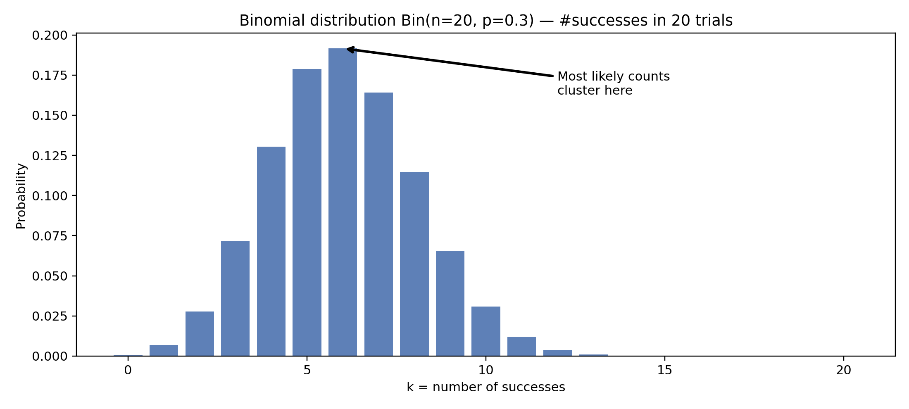

---

### Poisson distribution

Poisson answers: **“How many events happen in a fixed time window?”** (when events are independent and the average rate is roughly stable).

**Analogy**: “How many cars pass this point in 1 minute?”

**Where it shows up in IT/data**:
- errors per minute
- arrivals per minute (tickets, events, requests in some regimes)
- incident counts per week

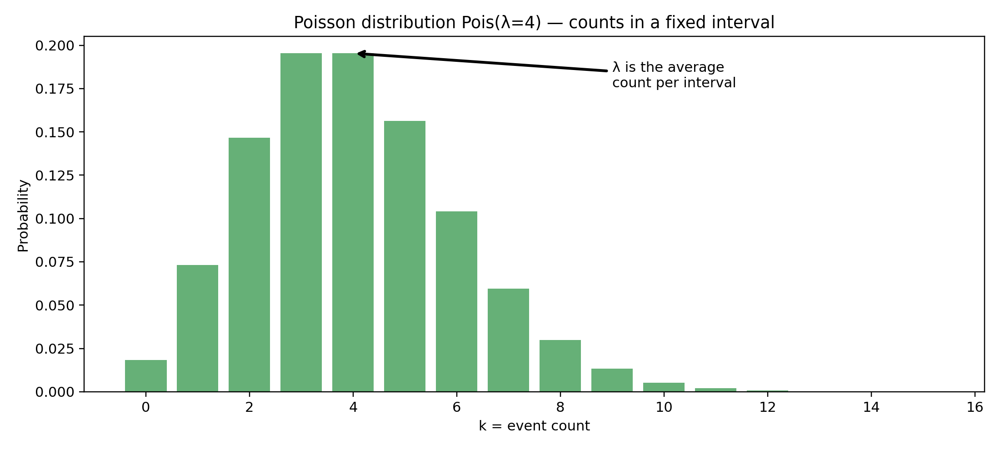

---

### Exponential distribution

Exponential is the “time between events” partner of Poisson.

**Analogy**: “How long until the next bus arrives?” (in a simplified random-arrival world).

**Where it shows up in IT/data**:
- time between failures in simple models
- time between arrivals/events (inter-arrival time)

---

### Normal distribution (the famous bell curve)

A **normal distribution** is the famous *bell curve*: it’s smooth, bell‑shaped, and symmetric around the center (the mean) [Outlier normal distribution article](https://articles.outlier.org/normal-distribution-curve-definition).

### Explain it like you’re 5
Imagine you have a big jar of candies, but the candies are different sizes.

- Most candies are **medium**.
- Some are **a bit small** or **a bit big**.
- Very tiny or very giant candies are **rare**.

If you draw a picture of “how many candies are each size,” you often get a **hill**:
- the **top of the hill** = the most common (the “middle” size)
- the **sides** = less common
- the **far edges** = very rare

That hill is the bell curve.

### Grown-up translation (still simple)
Normal-ish shapes often happen when a value is influenced by **many small, independent effects**.

Example: “How long does it take someone to arrive at work?”
- traffic lights
- a random slow car
- how fast they walk
- whether they stop for coffee (the most important variable)

### How to read the bell curve (what the axes mean)
On a bell curve chart:
- **x-axis**: the value (e.g., waiting time)
- **y-axis**: “how common” that value is (density)

Two key things to notice:
- **Center** (mean): the average
- **Width** (standard deviation): how spread out values are

One important detail people miss:
> On a normal curve, the **probability is the area under the curve**, not the height at one exact point. [Outlier normal distribution article](https://articles.outlier.org/normal-distribution-curve-definition)

If the bell is **tall and skinny** → low variability (more consistent)

If the bell is **short and wide** → high variability (more chaotic)

### The “68–95–99.7” rule (one super practical fact)
If data is roughly normal:
- about **68%** of values fall within **±1 standard deviation** of the mean
- about **95%** within **±2 standard deviations**
- about **99.7%** within **±3 standard deviations**

Translation: anything beyond **3σ** is *rare* (a good clue for anomaly detection when the normal assumption is reasonable).

### One more easy “picture” in words
If 100 kids line up by height and the heights are roughly normal:
- ~68 kids are in the “middle-ish” group (within 1σ)
- only a few kids are in the “very tall” or “very short” ends (the tails)

**Analogy (keep it human):** Think of adult heights in a big population:
- most people are near the middle
- a few are very tall/very short
- extreme heights are rare

### Big warning (data engineers: read this twice)
A lot of real-world data is *not* normal.

Examples:
- waiting time (like delivery times): often right-skewed (long tail)
- income: very skewed
- user activity: a few power users dominate

So: **normal is a helpful model, not a law of nature**.

### Diagram: what “normal” looks like

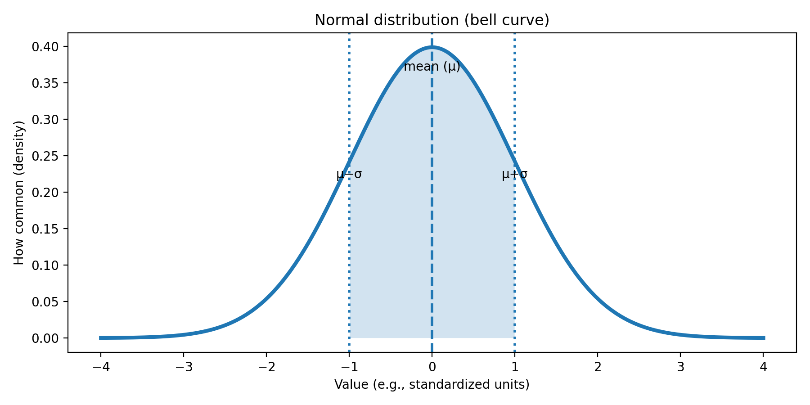

---

### Student’s t distribution

Student’s t is like the normal distribution, but with **heavier tails** when you have a **small sample size**.

Translation: with few samples, “surprises” are more likely — so we use t when estimating means from small datasets.

**Where it shows up**:
- confidence intervals for a mean when \(n\) is small
- early-stage A/B testing and experimentation

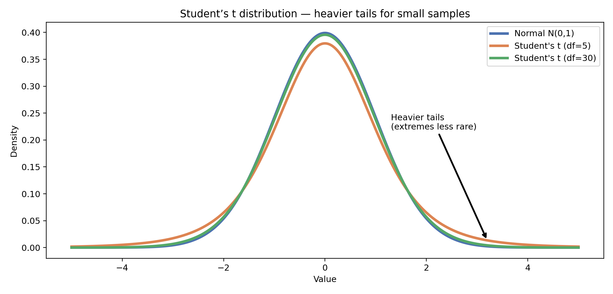

---

### Chi-squared distribution

Chi-squared shows up when you’re dealing with **variance** and **goodness-of-fit** (comparing observed vs expected counts).

**Analogy**: “How far are my observed counts from what I expected, overall?”

**Where it shows up in IT/data**:
- goodness-of-fit tests
- checking if observed categories match an expected distribution

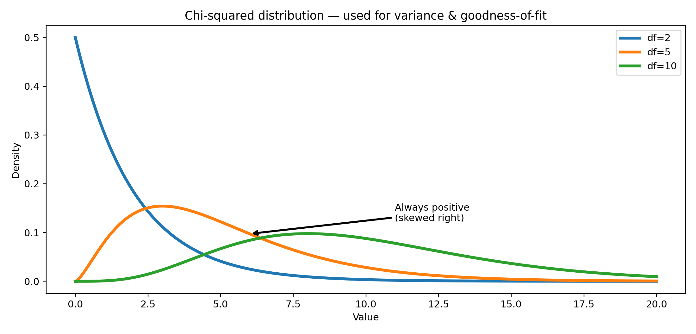

---

### Central Limit Theorem (CLT)

The **Central Limit Theorem** is basically the reason stats works in the real world.

It says (informally):
> If you take enough independent samples and average them, the averages tend to look normal… even if the original data isn’t.

### Let’s break that down like a normal person
CLT is **not** saying your raw data becomes normal.

CLT is saying this:
> If you repeatedly take samples and compute their **average**, those averages start forming a bell curve.

Even if the original data is skewed.

### Soup analogy (still undefeated)
You’re tasting soup:
- one spoonful might be too salty
- another might be bland
- but if you taste **many spoonfuls** and average your impression, you get a reliable sense of the soup

That’s CLT: **averages are less chaotic than individual observations**.

### A super practical example (waiting time)
Waiting time often looks like:
- many fast outcomes
- a few *very* slow ones (the long tail)

So raw waiting time is usually not normal.

But if you:
- take 100 random events and compute their mean waiting time
- repeat that many times

…the distribution of those means becomes much more bell-shaped.

### Why it matters for data engineers
CLT is why these things work reasonably well:
- **sampling** (averages stabilize)
- **A/B testing** (differences of averages become analyzable)
- **aggregated metrics** (daily/weekly averages are smoother than raw events)

### The key intuition
- Raw events: noisy, messy, weird
- Averages of many events: calmer, more predictable

### Diagram: CLT in pictures

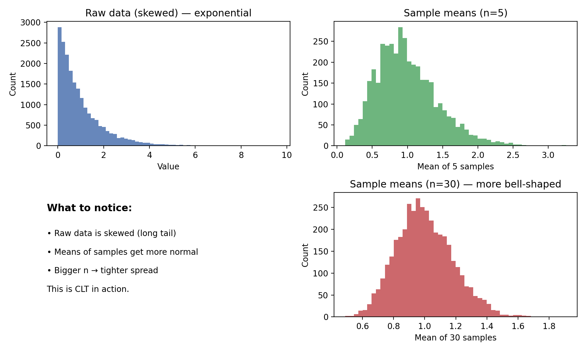

---

## How to read the charts in this article (quick guide)

If charts make you feel like you’re staring at modern art, here’s a simple way to read them.

This section includes **annotated versions of the exact charts used in this article** (with arrows pointing to what I’m talking about), so you can “see it” instead of guessing.

### Histogram
A **histogram** shows how often values fall into ranges (“bins”).
- **x-axis**: value range (e.g., waiting time)
- **y-axis**: count (or frequency)

What to look for:
- **Skew**: long tail to the right means “a few very large values”
- **Multiple peaks**: could mean multiple populations (e.g., cache hits vs misses)

#### Example on the CLT chart (histogram, annotated)
In the CLT figure below, each panel is a histogram.

Look at:
- the **right-skew / long tail** in the raw data
- how the **sample means** get more bell-shaped as \(n\) increases

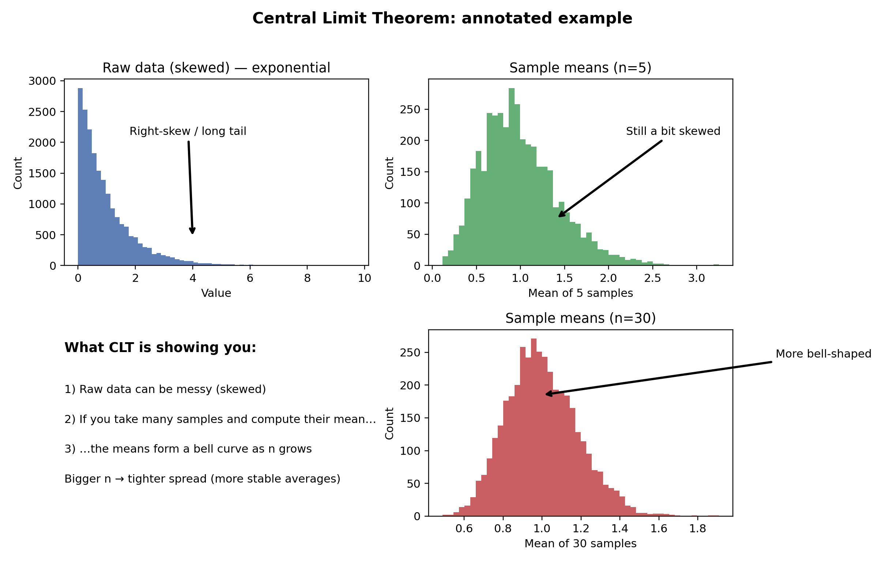

### Bell curve / density curve
A **density curve** is like a smooth version of a histogram.
- **Peak** = most common values
- **Tails** = rare extremes

What to look for:
- **Wider curve** = higher standard deviation
- **Narrow curve** = more consistent values

#### Example (bell curve, annotated)
This annotated bell curve shows:
- the **mean (μ)** in the center
- the **tails** (rare extremes)
- the idea of **μ ± 1σ** (roughly the “typical range” in normal-ish data)

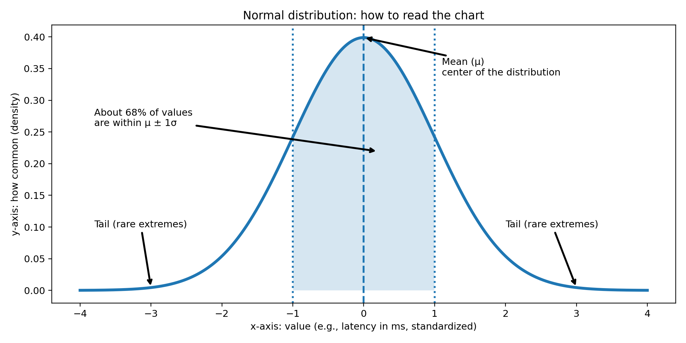

### “Sample means” chart (CLT)
If you see a plot called “distribution of sample means,” it’s showing:
- take many samples of size \(n\)
- compute the mean of each sample
- plot those means

As \(n\) increases, the means typically:
- look more normal
- have less spread

That’s the “averages calm down” effect.

#### Example (moving average, annotated)
This one isn’t CLT, but it’s another chart you’ll see everywhere in monitoring:
- the **raw metric** wiggles (noise)
- the **moving average** smooths it to reveal the trend

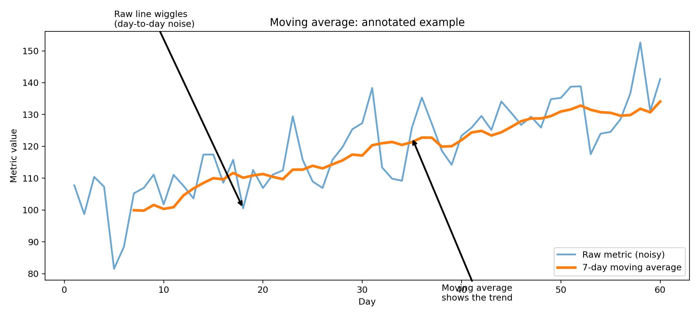
---

### Moving Average

A **moving average** smooths noisy data by averaging over a sliding window.

**Analogy:** it’s the “video stabilization” feature for a noisy metric.

**Example:** if daily users bounce around because weekends exist, a 7-day moving average makes the trend easier to see.

**Where it’s used:** dashboards and monitoring (fewer false alarms).

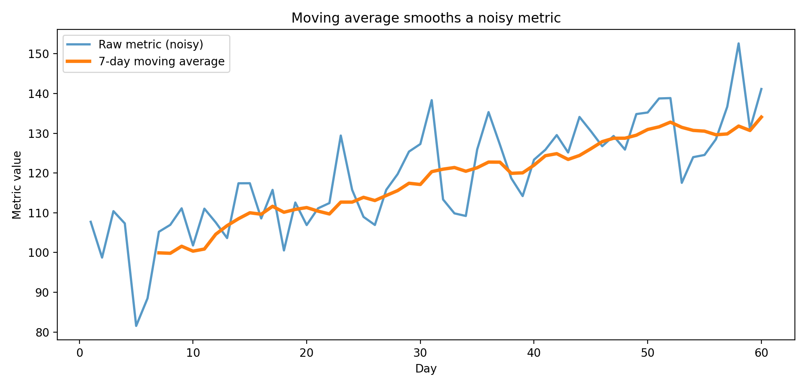

---

## Simulation & uncertainty (when the world is random)

### Monte-Carlo (MC) simulation

**Monte-Carlo simulation** means:
> Use randomness + lots of trials to estimate something.

**Analogy:** Instead of calculating exactly how many jellybeans are in a jar, you:
- grab random handfuls
- estimate
- repeat
- average

### Why it matters in IT / data work
Monte Carlo is used for:
- risk estimation
- capacity planning under uncertainty
- probabilistic modeling
- evaluating strategies when exact math is hard

---

### Bayesian Optimization

**Bayesian optimization** is a smart way to tune hyperparameters when experiments are expensive.

If grid search is:
> “Try everything and hope my laptop forgives me”

Bayesian optimization is:
> “Use what I learned from past tries to pick the next best try.”

**Analogy:** Imagine finding the best coffee shop in a city.
- Grid search: visit every shop.
- Bayesian optimization: after a few visits, you start making smarter choices based on patterns.

### Why it’s relevant for data engineers
In ML platforms, tuning jobs can cost real money. Bayesian optimization helps reduce wasted runs.

---

### Gradient descent

**Gradient descent** is how many models learn.

You have a **loss function** (a number representing how bad your predictions are), and you want to minimize it.

Gradient descent is:
> “Take steps downhill until you reach a low point.”

**Analogy:** You’re hiking in fog trying to reach the valley.
You can’t see the entire landscape, but you can feel the slope under your feet.
So you step in the direction that goes down.

---

### The gradient (important, and simpler than it sounds)

The **gradient** is a vector of partial derivatives of your loss with respect to each parameter.

In normal language:
- It tells you **how sensitive the loss is** to small changes in each parameter.
- If the gradient is big for a parameter, changing that parameter changes the loss a lot.

**Analogy:** You’re tuning a sound mixer.
- If turning knob A slightly makes the music dramatically louder, knob A has a “big gradient.”
- If turning knob B does almost nothing, knob B has a “small gradient.”

This is why gradients guide learning.

---

### Softmax activation function

**Softmax** converts a bunch of raw scores into probabilities that add up to 1.

### Example
If a model outputs scores for 3 classes:
- cat: 2.0
- dog: 1.0
- pizza: 0.1

Softmax turns these into probabilities like:
- cat: 0.66
- dog: 0.24
- pizza: 0.10

(Exact values depend on the formula, but the idea is: bigger score → bigger probability.)

**Analogy:** Softmax is like a group vote where louder scores influence more, but everyone still gets some voice.

---

### Cross-entropy loss

**Cross-entropy loss** is a way to measure how wrong your predicted probabilities are.

If the true label is “cat,” and your model assigns:
- cat: 0.99 → low loss (good)
- cat: 0.10 → high loss (bad)

**Analogy:** It’s like grading confidence.
If you’re confidently wrong, you get a harsher penalty.

### Why it matters for LLMs
Modern LLMs are trained (a lot of the time) to predict the next token.
Cross-entropy shows up everywhere in training logs.

---

### Dropout & Early stopping

Both are ways to fight overfitting (when the model memorizes training data instead of learning patterns).

### Dropout
**Dropout** randomly turns off some neurons during training.

**Analogy**: It’s like practicing a presentation while randomly losing a few slides.
You’re forced to understand the story, not memorize the exact order.

### Early stopping
**Early stopping** means: stop training when validation performance stops improving.

**Analogy**: Baking cookies.
If you keep baking “just to be sure,” you don’t get better cookies—you get charcoal.

---

## Classic ML building blocks (still everywhere)

### Linear regression vs Logistic regression

### Linear regression
Predicts a **number**.
Examples:
- house price
- delivery time
- CPU usage

### Logistic regression
Predicts a **probability of a class** (often 0/1).
Examples:
- will user churn? (yes/no)
- is this transaction fraud? (yes/no)

### Easy mental model
- Linear regression: a straight line that outputs any real value.
- Logistic regression: a curve that outputs values between 0 and 1 (probabilities).

---

### Bias–variance tradeoff

This is the classic “too simple vs too complex” problem.

- **High bias**: model is too simple → underfits (misses patterns).
- **High variance**: model is too complex → overfits (learns noise).

**Analogy (darts):** Learning to throw darts:
- High bias: you always throw near the same wrong spot.
- High variance: your throws are all over the place.

The sweet spot is accurate *and* consistent.

---

## Probabilistic graphs & decision-making

### Bayesian networks

A **Bayesian network** is a probabilistic graph of cause-and-effect (or dependency) relationships.

Nodes are variables, edges represent conditional dependence.

**Analogy:** It’s like a “dependency graph,” but for uncertainty.

Example:
- “Rain” influences “Traffic.”
- “Traffic” influences “Late to work.”

Bayesian networks help answer questions like:
- “Given that I’m late, how likely was traffic the cause?”

---

### Markov Decision Process (MDP)

An **MDP** is a formal way to describe decision-making where outcomes depend on:
- current state
- chosen action
- transition probabilities
- rewards

**Analogy (video game):**
- state: where you are, your health, your inventory
- action: move, jump, fight
- reward: points, progress, survival

MDPs are the foundation of reinforcement learning.

---

### Reinforcement Learning (RL): what it is

Reinforcement Learning is a computational approach of learning from actions.

We build an agent that learns from the environment by interacting with it through trial and error and receiving rewards (negative or positive) as feedback.

### Goal
The goal of any RL agent is to maximize its expected cumulative reward (expected return).

Because RL is based on the reward hypothesis:
> All goals can be described as maximizing expected cumulative reward.

### The RL loop
It’s a loop producing sequences of:
- state
- action
- reward
- next state

### Discounting rewards
To calculate expected return, we often discount rewards:
- rewards that come sooner are more predictable
- far-future rewards are less certain

**Analogy:** Would you prefer:
- $100 today
- or “maybe $100” next year?

Discounting captures that preference.

---

### RL methods: policy-based vs value-based

To solve an RL problem, you want to find an optimal policy.

A **policy** is the “brain” of your agent: it tells you what action to take given a state.

The **optimal policy** maximizes expected return.

There are two broad approaches:

### Policy-based methods
You train the policy directly.

**Analogy:** you directly practice decisions: “When I see X, I do Y.”

### Value-based methods
You learn a value function (how good states/actions are), then use that to choose actions.

**Analogy:** instead of memorizing what to do, you learn to score options and pick the best.

---

### The Bellman equation

The **Bellman equation** captures a simple idea:
> The value of a state is the immediate reward plus the discounted value of the next state (assuming you act optimally).

**Analogy:** Choosing a route home:
- You care about how good the next step is,
- but also how good it sets you up for after that.

Bellman equations are core to dynamic programming and RL.

---

## Deployment note: making models cheaper to run

### Model quantization

**Quantization** makes models smaller and faster by using lower-precision numbers.

Example:
- instead of 32-bit floats, use 16-bit or 8-bit representations

**Analogy:** It’s like compressing a photo.
- You might lose a tiny bit of quality,
- but it loads faster and takes less space.

### Why it matters in IT and LLMs
Quantization can:
- reduce latency
- reduce memory
- make deployment cheaper

Which is especially helpful when you’re serving big models at scale.

---

## A data engineer’s cheat-sheet summary

If you remember nothing else, remember this:
- **Variance / std dev**: how noisy the world is.
- **Normal + CLT**: why averages behave nicely.
- **Moving average**: how to calm down noisy dashboards.
- **Monte Carlo**: estimate things by simulating many possibilities.
- **Bayesian optimization**: tune smartly when experiments are expensive.
- **Softmax + cross-entropy**: the standard combo for classification and token prediction.
- **Gradient descent + gradients**: how models learn.
- **Dropout + early stopping**: how models avoid memorizing.
- **Bias–variance**: too simple vs too complex.
- **Bayesian nets / MDP / RL / Bellman**: making decisions under uncertainty over time.
- **Quantization**: cheaper, faster models.

---

## Conclusion (and what’s next)

If you’re building data systems, you’re already doing applied statistics—whether you call it that or not.

Here’s the big picture (in human terms):
- **Spread** (variance / standard deviation) tells you how noisy reality is.
- **Distributions** tell you what “normal behavior” looks like (and what counts as weird).
- **Sampling intuition** (CLT) is why averages and experiments are even possible.
- **Optimization basics** (gradients, descent, loss) explain what your ML training logs are really saying.

If you take one practical lesson into your day job, take this:
> Don’t only monitor the average. Monitor the distribution (p50/p95/p99).
Because users don’t experience “the mean.” They experience the one request that took 9 seconds right before a demo.

More articles are coming. Next up, I’ll go deeper on:
- monitoring and alerting with percentiles (and why p99 is dramatic)
- A/B testing mindset for engineers (without pain)
- practical LLM evaluation (RAG + retrieval quality)
And if someone tells you “data engineering is just moving data,” smile politely…

Then ask them why they can’t move their metric back to what it was last week.

