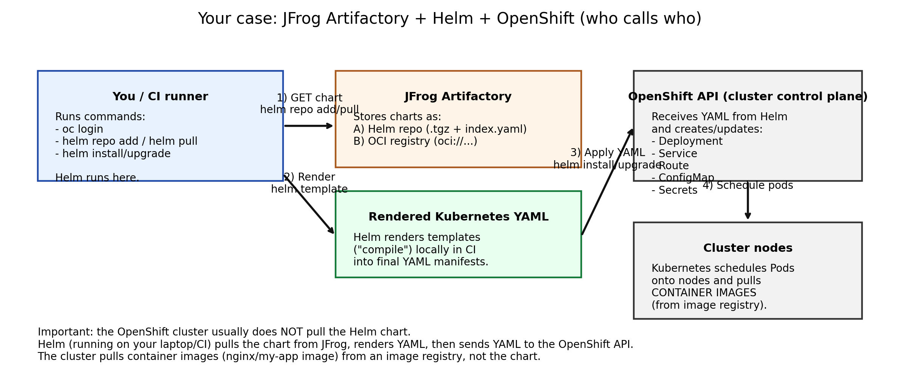

# Helm Charts for Beginners (Kubernetes / OpenShift) — simple introduction

## 1) What Helm is (plain language)

Think of **Helm** as an “app installer” for Kubernetes.

- Kubernetes runs your app using YAML files (Deployment, Service, etc.).
- A **Helm chart** is a **bundle** of those YAML files + a way to customize them.

Instead of managing 15 YAML files by hand, you say:
- “Install this chart”
- “Use these settings (values)”

---

## 2) Chart structure (what’s inside)


In simple terms:
- **`Chart.yaml`**: chart name + version.
- **`values.yaml`**: your settings (image, replicas, ports…).
- **`templates/`**: YAML templates (they contain placeholders like `{{ .Values.replicaCount }}`).

---

## 3) The Helm workflow (the big picture)


Your colleague said “compile a Helm chart” — Helm doesn’t compile like Java.

In Helm, “compile” usually means:
- **render templates → produce final YAML**

You can render without installing:

```bash
helm template myapp ./mychart -f my-values.yaml
```

---

## 4) Common commands (cheat sheet)

```bash
# Create a starter chart
helm create mychart

# Validate the chart
helm lint ./mychart

# Render ("compile") to YAML without a cluster
helm template myapp ./mychart -f my-values.yaml

# Install
helm install myapp ./mychart -n my-namespace -f my-values.yaml

# Upgrade
helm upgrade myapp ./mychart -n my-namespace -f my-values.yaml

# Rollback
helm rollback myapp 1 -n my-namespace

# Uninstall
helm uninstall myapp -n my-namespace
```

---

## 5) “How do I get a Helm chart inside the OpenShift cluster?” (simple answer)

Very important clarification:

- You usually **don’t upload the chart into the cluster** as a permanent “chart object.”
- What happens is:
  1) Helm reads the chart **from your laptop / CI runner**
  2) Helm renders templates to YAML
  3) Helm sends YAML to the OpenShift API
  4) The cluster stores a **release record** so Helm can manage it later

So the real question is:

> “How do I run `helm install` against my OpenShift cluster?”

**A) Connect Helm to OpenShift**

```bash
oc login https://api.<cluster>:6443
oc new-project my-project
# or
oc project my-project

helm install myapp ./mychart -n my-project -f my-values.yaml
```

**B) OpenShift specifics (what might break)**

- In Kubernetes you often use **Ingress**.
- In OpenShift you often use **Route**.
- Some charts need small changes to work on OpenShift (security/permissions too).

---

## 6) How teams store/share charts (3 common ways)


- **Git repo**: simplest (CI installs from a folder)
- **Helm repo**: package `.tgz` + `index.yaml` and host it
- **OCI registry**: store charts in a registry (like images)

---

## 7) Your case: JFrog (Artifactory) + OpenShift (simple call flow)\n+\n+If your charts live in **JFrog Artifactory**, the key point is:\n+\n+- **Your laptop/CI pulls the chart from JFrog**\n+- Helm renders YAML locally\n+- Helm applies YAML to the OpenShift API\n+- **Cluster nodes pull container images**, not the Helm chart\n+\n+Diagram:\n+\n+
