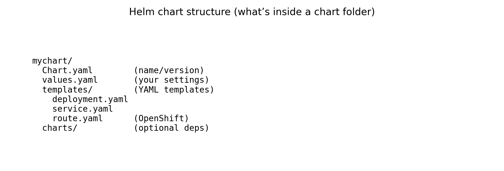
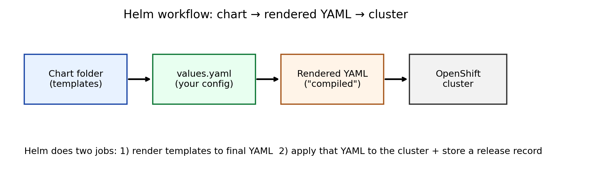
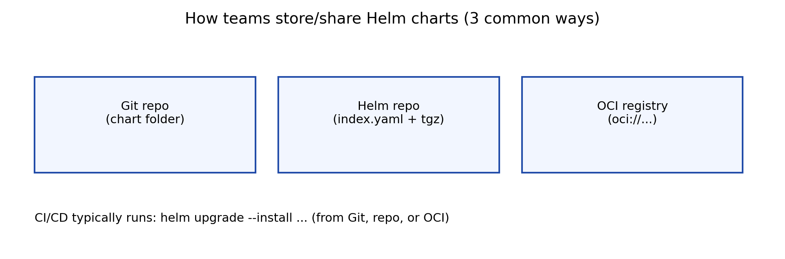

# Helm Charts Tutorial (Beginner) — create, deploy (OpenShift), and store

This is the **hands-on tutorial** part.

If you want the “what is Helm / structure / workflow” overview, read:
- `dataengineering/cloud/helm-charts-intro.md`

---

## 1) Goal (what we will build)

We will:
- create a chart
- configure it to deploy **nginx**
- render the YAML (“compile”)
- deploy it to an OpenShift project
- learn 3 simple ways to store/share the chart

---

## 2) Requirements

- Helm installed: `helm version`
- OpenShift CLI installed: `oc version`
- Access to a cluster (login credentials)

---

## 3) Create a starter chart

```bash
mkdir -p helm-demo && cd helm-demo
helm create hello-chart
```

Chart structure reminder:



---

## 4) Configure the app to deploy (values)

Edit `hello-chart/values.yaml` and set a real image. Example:

```yaml
replicaCount: 1

image:
  repository: nginx
  tag: "1.25"

service:
  type: ClusterIP
  port: 80
```

---

## 5) Validate the chart

```bash
helm lint ./hello-chart
```

---

## 6) Render (“compile”) to YAML locally

This is the safest step before you touch the cluster:

```bash
helm template hello ./hello-chart
```

If the output YAML looks wrong, fix `values.yaml` or templates and rerun.

Workflow reminder:



---

## 7) Deploy to OpenShift

**Step A — Login and choose a project**

```bash
oc login https://api.<cluster>:6443
oc new-project hello-project
# or
oc project hello-project
```

**Step B — Install the chart into that namespace**

```bash
helm install hello ./hello-chart -n hello-project
```

Verify:

```bash
helm list -n hello-project
oc get all -n hello-project
```

**Step C — Upgrade (after changing values/templates)**

```bash
helm upgrade hello ./hello-chart -n hello-project
```

**Step D — Uninstall**

```bash
helm uninstall hello -n hello-project
```

---

## 8) OpenShift routing: Ingress vs Route (beginner view)

- Kubernetes often uses **Ingress**.
- OpenShift commonly uses **Route**.

If you want a URL on OpenShift, you may add a `Route` template.

Example `hello-chart/templates/route.yaml`:

```yaml
apiVersion: route.openshift.io/v1
kind: Route
metadata:
  name: {{ include "hello-chart.fullname" . }}
spec:
  to:
    kind: Service
    name: {{ include "hello-chart.fullname" . }}
  port:
    targetPort: http
```

Tip: teams usually make this optional with a value like `route.enabled: true`.

---

## 9) How to store/share your chart (3 easy options)



**Option 1 — Store chart folder in Git (simplest)**

```bash
helm upgrade --install hello ./hello-chart -n hello-project -f values-prod.yaml
```

**Option 2 — Helm repo (package + index)**

```bash
helm package ./hello-chart
helm repo index .
```

Host the `.tgz` + `index.yaml` (GitHub Pages, S3, Nexus/Artifactory).

**Option 3 — OCI registry (modern)**

High-level flow:

```bash
helm package ./hello-chart
helm registry login <registry>
helm push hello-chart-0.1.0.tgz oci://<registry>/charts

helm install hello oci://<registry>/charts/hello-chart -n hello-project
```

---

## 10) Final mental model

- Chart = blueprint
- Values = settings
- Render (“compile”) = blueprint → final YAML
- Install/upgrade = apply YAML to OpenShift
- Store/share = Git or Helm repo or OCI registry
