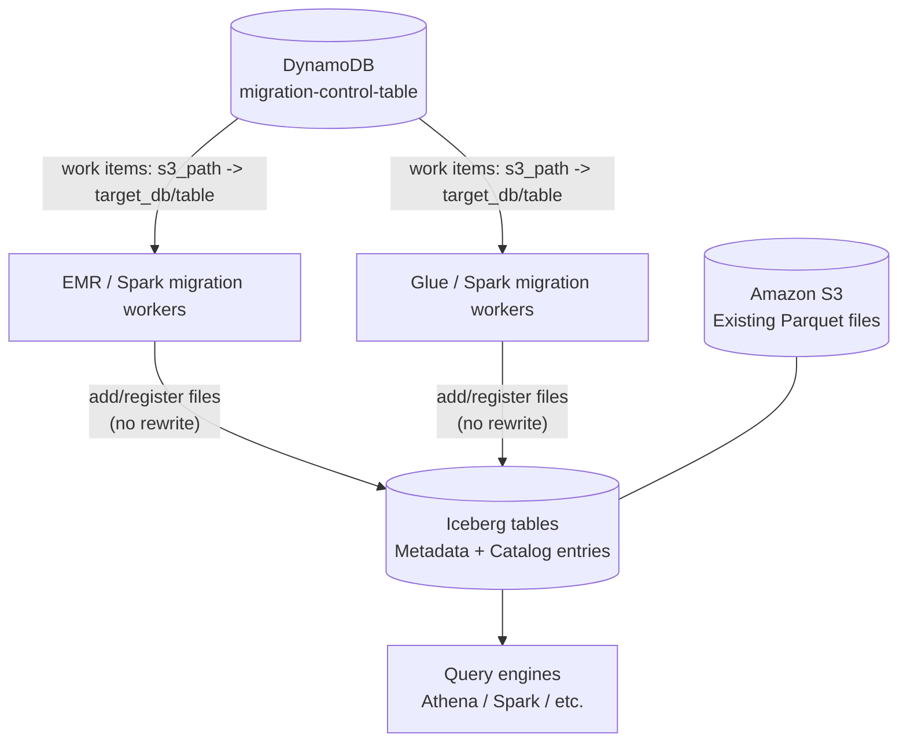
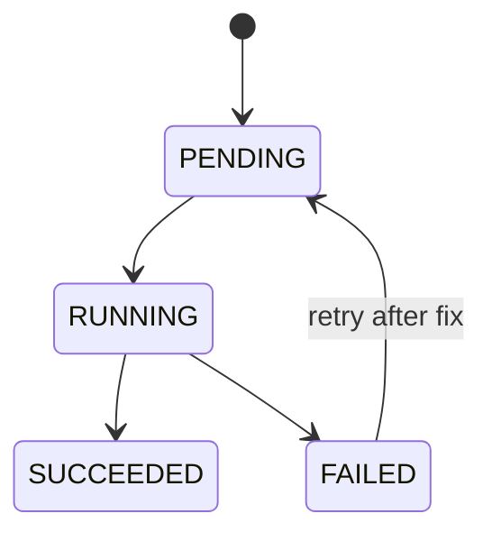

# Enterprise-scale “in-place” migration to Apache Iceberg (simple guide)

Source article (AWS Big Data Blog): [Enterprise scale in-place migration to Apache Iceberg: Implementation guide](https://aws.amazon.com/blogs/big-data/enterprise-scale-in-place-migration-to-apache-iceberg-implementation-guide/)

## Goal (in one sentence)

**Turn an existing Parquet data lake into Iceberg tables _without rewriting the Parquet files_,** while keeping the process scalable, repeatable, and trackable at enterprise scale.

---

## Why people move from “classic Parquet lake” to Iceberg (simple history)

### The “classic” data lake era
For years, many data lakes were built like this:
- Data stored as **Parquet** in S3.
- Tables defined as **external tables** (Hive / Glue / Athena).
- Partitions stored in folder paths like `.../date=2026-01-21/hour=10/...`.

This worked well, but at large scale teams hit pain points:
- **Consistency**: Two jobs writing at the same time can create partial/inconsistent states.
- **File management**: Lots of small files, compaction, and messy partitions.
- **Schema changes**: Adding/renaming columns can be risky and painful.
- **Time travel / rollback**: Hard to reliably query “as of yesterday’s version”.

### The “table format” era (Iceberg/Delta/Hudi)
Modern table formats (like **Apache Iceberg**) add a table layer that brings:
- **ACID transactions** (safe, consistent commits)
- **Schema evolution** (change schema safely)
- **Snapshots/time travel** (query older versions)
- **Better partition evolution** (change partitioning over time)

Iceberg doesn’t replace Parquet; it **organizes Parquet files** with metadata so tools can treat them like a real table.

---

## What “in-place migration” means

**In-place migration** = you keep your existing Parquet files where they are and make Iceberg “adopt” them by writing Iceberg metadata that points to those files.

So instead of:
- rewriting data into new files

you do:
- **register / add existing files into Iceberg metadata**

This is especially useful when you have **many terabytes/petabytes** and rewriting would be too slow/expensive.

---

## Big picture architecture (what AWS proposes)

The AWS article’s key idea is: use **DynamoDB as a control plane** to track which S3 paths have been migrated, and then run migration workers (Spark/EMR/Glue) that update Iceberg tables and update state.

### Architecture diagram (ASCII)

```
                   (Control plane: tracking + retries)
             +---------------------------------------------+
             |             Amazon DynamoDB                 |
             |  migration-control-table (s3_path -> target)|
             +-------------------+-------------------------+
                                 |
                           "work to do"
                                 |
      +--------------------------+---------------------------+
      |                                                      |
      v                                                      v
+-------------+                                      +----------------+
| EMR / Spark |                                      | Glue / Spark   |
| migration   |                                      | migration      |
| workers     |                                      | workers        |
+------+------+                                      +-------+--------+
       |                                                     |
       |   writes Iceberg metadata (no rewrite of Parquet)    |
       v                                                     v
  +-------------------+                               +-------------------+
  |  S3 Parquet data   |                               | Iceberg metadata |
  | (existing files)   |                               | + catalog entries|
  +-------------------+                               +-------------------+
                 \                                         /
                  \                                       /
                   v                                     v
                 +-------------------------------------------+
                 |       Query engines (Athena, Spark)       |
                 |     now read as Iceberg tables safely     |
                 +-------------------------------------------+
```

### Same architecture (Mermaid)



---

## Key components explained like you’re new

### 1) S3 paths (your “source datasets”)
Your data already exists in S3 as Parquet files, often partitioned like:
```
s3://my-bucket/events/event_date=2026-01-21/hour=10/part-0000.parquet
```

### 2) Iceberg table
An Iceberg table is basically:
- your data files (Parquet) **plus**
- metadata files that describe which data files belong to which snapshot of the table.

### 3) Catalog (Glue Data Catalog)
A “catalog” is where the table name lives (database/table definitions). On AWS, Glue is commonly used.

### 4) DynamoDB control table (the “orchestrator brain”)
DynamoDB stores rows like:
- **source**: `s3_path`
- **target**: `target_db_name`, `target_table_name`
- plus migration state fields (status, errors, timestamps, retry count, etc.)

This lets you:
- run migrations in parallel
- retry failures safely
- audit what happened

---

## Two in-place migration methods in the AWS article

The AWS blog describes **two** ways to “adopt” existing Parquet.

### Method A: Iceberg `add_files` (fast onboarding for raw Parquet paths)
**Use when**:
- You have Parquet files in S3 (not necessarily already registered as Hive/Glue tables).
- The layout is **Hive-style partitioned** (important!).

**What happens**:
- You create an empty Iceberg table (schema + partition spec).
- You run `add_files` to tell Iceberg: “these Parquet files belong to this table”.
- Iceberg records file-level metadata and partitions (from the path).

**Mental model**:
> “Iceberg, please adopt these existing files as-is.”

### Method B: Iceberg `migrate` + `register_table` (best for existing Hive-registered tables)
**Use when**:
- You already have a Hive-style table (or similar) registered somewhere.

**What happens** (conceptually):
- Iceberg converts the table definition into an Iceberg-managed format.
- It registers the Iceberg table in the catalog so engines can query it as Iceberg.

**Mental model**:
> “Convert this existing table definition into an Iceberg table definition.”

---

## The “control plane” idea (why DynamoDB matters at enterprise scale)

At small scale, you can migrate one table manually.

At enterprise scale, you might have:
- thousands of datasets
- many S3 prefixes
- many teams
- failures that must be retried

So the AWS approach uses DynamoDB as a **single source of truth** for migration state:



This provides:
- **Centralized control**: know exactly what needs migration.
- **Lifecycle tracking**: which stage each dataset is in.
- **Auditability**: store errors per dataset path.
- **Re-runs**: clear flags and rerun failed items.

---

## Real example (small, concrete)

Imagine you have clickstream data in S3:

```
s3://acme-lake/clicks/event_date=2026-01-21/hour=10/part-0000.parquet
s3://acme-lake/clicks/event_date=2026-01-21/hour=11/part-0001.parquet
```

You want the Iceberg table:
- database: `analytics`
- table: `clicks_iceberg`

### DynamoDB control row (concept)
- `s3_path` = `s3://acme-lake/clicks/`
- `target_db_name` = `analytics`
- `target_table_name` = `clicks_iceberg`

### Migration worker does
1. Reads control row from DynamoDB.
2. Creates (or ensures) an Iceberg table `analytics.clicks_iceberg` exists.
3. Runs Iceberg adoption step (`add_files` or `migrate/register_table`).
4. Updates DynamoDB status:
   - `SUCCEEDED` or `FAILED` (with error message).

### Result
Athena/Spark can query:
- `SELECT count(*) FROM analytics.clicks_iceberg;`
with Iceberg features like safe concurrent writes and snapshots.

---

## Very important detail: Hive-style partitions (why your folder layout matters)

The AWS article highlights a common gotcha:

### Hive-style partitioning (good case)
Partition values are encoded in the path:
```
.../event_date=2026-01-21/hour=10/part-0000.parquet
```
Iceberg can often infer partitions from the folder names during `add_files`.

### Non-Hive layout (problem case)
No partition columns in the path:
```
.../date/part-0000.parquet
.../date/part-0001.parquet
```
If partition information isn’t in the path (and may not be in the file), Iceberg can’t map partitions reliably when adopting files, which can lead to:
- missing/incorrect partition metadata
- surprising NULLs / incomplete results in queries
- failures on incremental operations

### Recommended fix (from the AWS article)
If the layout isn’t Hive-style, a safer approach is:
- create a Glue table pointing to the Parquet data (with correct schema/partitions)
- use an Iceberg procedure like a “snapshot”/conversion flow so partitions and schema are correctly understood

(See the AWS blog’s Appendix C discussion in the source article.)

---

## Managed vs external tables (a safety warning)

Many “classic lake” tables are **external**: dropping the table doesn’t delete data files.

Iceberg tables in Glue/Athena can behave more like **managed/internal** tables:
- Dropping an Iceberg table may also remove underlying data (depending on how it was created and managed).

So:
- **Be careful with `DROP TABLE` on Iceberg tables** in production.

This is covered in the source AWS blog (Appendix D).

---

## When would you choose each method? (cheat sheet)

### Choose `add_files` when…
- You have raw Parquet in S3 you want to “onboard” quickly.
- The data is in **self-describing formats** (Parquet/ORC/Avro).
- The dataset is **Hive-partitioned**, or you’re confident partitions can be derived.

### Choose `migrate` + `register_table` when…
- You already have a Hive-style table definition you want to convert.
- You want a more “table-centric” conversion path (not just file adoption).

---

## A junior-friendly “walkthrough” of the migration pipeline

### Step 0 — Inventory what you have
You list S3 prefixes you want to migrate:
- `s3://bucket/table1/`
- `s3://bucket/table2/`
- …

### Step 1 — Put the inventory into DynamoDB
Each row says: “this S3 path becomes that Iceberg table”.

### Step 2 — Workers run in parallel
Spark on EMR/Glue reads DynamoDB rows and migrates them.

### Step 3 — Track status + retries
If one table fails (bad schema, bad partitions, permissions), you fix the issue and retry that row.

### Step 4 — Validate with queries
Use Athena/Spark to validate counts, schemas, partitions, and sample queries.

---

## What “success” looks like (practical checks)

After migrating a dataset, you typically verify:
- **Row counts** match between old and new views.
- **Schema** matches expected columns and types.
- **Partition pruning** works (queries by date/hour are faster).
- You can do Iceberg operations:
  - inserts/merges (depending on engine support)
  - time travel/snapshots (engine-dependent)

---

## Summary

- **Goal**: adopt existing Parquet into Iceberg without rewriting, at scale.
- **How**: use **DynamoDB** as a migration control plane + Spark workers to apply one of two methods:
  - `add_files` (adopt raw Parquet paths, best with Hive-style partitions)
  - `migrate` + `register_table` (convert existing table definitions)
- **Why**: Iceberg adds ACID consistency, schema evolution, and snapshot/time travel, making large lakes easier and safer to operate.

---

## Source

- AWS Big Data Blog: [Enterprise scale in-place migration to Apache Iceberg: Implementation guide](https://aws.amazon.com/blogs/big-data/enterprise-scale-in-place-migration-to-apache-iceberg-implementation-guide/)


