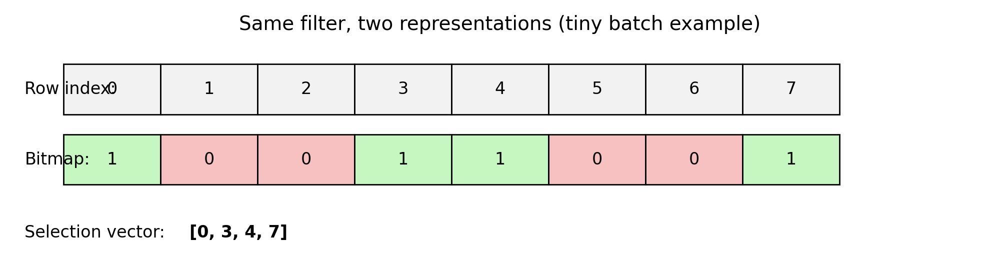
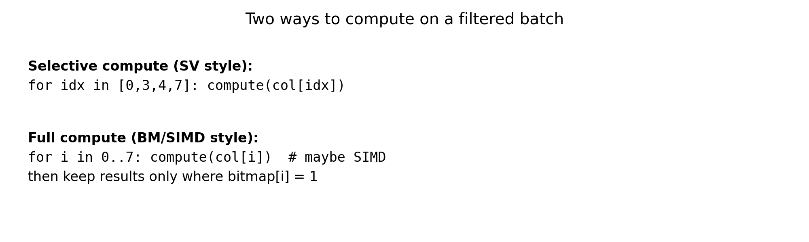
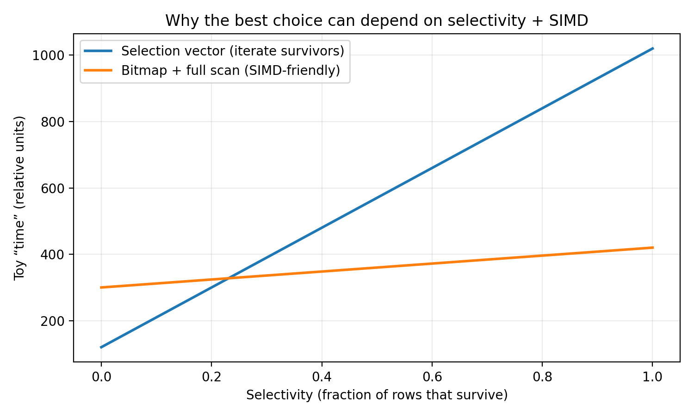

# Filter Representation in Vectorized Query Execution (DAMON’21) — Super Simple Explanation

Paper: **“Filter Representation in Vectorized Query Execution”** (Ngom et al., 2021).

This is the “explain it like I’m new” version.

You’ll learn:
- what **vectorized execution** is (batch processing)
- why DBs need a **filter representation** inside a batch
- what **Selection Vectors (SV)** and **Bitmaps (BM)** are
- why **SV wins sometimes** and **BM wins sometimes**

---

## 1) Vectorized execution: the 10-second definition

Instead of processing **1 row at a time**, the DB processes a **small batch** (often 1–2k rows) at a time.

Why this helps:
- **Less overhead**: fewer “next() / iterator” calls
- **Better cache use**: the CPU likes sequential work
- **SIMD opportunity**: the CPU can do the same operation on multiple values at once

(You don’t need to be a CPU expert. Just remember: **batch work is easier for the CPU to do fast**.)

---

## 2) The core problem: “some rows survive, some rows don’t”

Inside one batch, you apply steps like:
- `WHERE` filters
- joins
- computed columns

After each step, you must remember:
> which positions (rows) in this batch are still valid

That “memory” is the **filter representation**.

---

## 3) Our tiny running example (we’ll reuse it)

Batch positions: `0 1 2 3 4 5 6 7`

Suppose a filter keeps only positions: **0, 3, 4, 7**

There are two common ways to store this.

---

## 4) Two filter representations (SV vs BM)

### A) Selection Vector (SV)

A **selection vector** is a list of the surviving indexes:

- `SV = [0, 3, 4, 7]`

Analogy: **VIP guest list**.

How you read data with SV (idea):
- for each `idx` in the list, read `col[idx]`

Good part:
- if only a few rows survive, the list is short → you do less work

Not-so-good part:
- you have an extra “jump”: read `idx` first, then read `col[idx]` (indirection)

### B) Bitmap (BM)

A **bitmap** is 1 bit per position:

- `BM = 1 0 0 1 1 0 0 1`

Analogy: **light switches**. 1 = ON (keep), 0 = OFF (drop).

Good part:
- it aligns perfectly with positions 0..N → very nice for simple scans and SIMD

Not-so-good part:
- iterating “only the 1s” can require extra bit-scanning logic

### Diagram: same filter, two representations

---

## 5) Two types of work operators do: Update vs Map

### Update (changes who survives)
Example: `WHERE amount > 100`
- some rows fail the predicate
- the filter representation changes (SV list or BM bits change)

### Map (does NOT change who survives)
Example: compute `amount_with_tax = amount * 1.2`
- you compute a new vector
- survivors are the same as before

---

## 6) Two compute strategies: Selective vs Full (this is the big “why”) 

Even after you have SV/BM, you can compute in two ways.

### Strategy 1: Selective compute
Compute only for surviving rows.

In our example, survivors are `[0, 3, 4, 7]`, so you compute 4 times.

This is usually great when selectivity is low (few survivors).

### Strategy 2: Full compute
Compute for **every** position in the batch (0..7), then ignore results for invalid rows.

This can sound wasteful, but it can be faster because:
- the loop is simple and predictable
- it can be SIMD vectorized

### Diagram: selective vs full

---

## 7) Selectivity: the knob that changes everything

**Selectivity** = fraction of rows that survive.

- 10% selectivity → 10% survive → most rows die
- 90% selectivity → 90% survive → most rows live

Intuition (real life):
- If only **3 people** passed security, you only guide those 3 to the room (selective)
- If **almost everyone** passed, you just open the door and let the whole crowd flow (full scan)

### Diagram: why “best choice” can flip

This chart is a **toy intuition** picture (not exact paper numbers), but it shows the idea:

---

## 8) The paper’s main result (in simple words)

Their experiments show:

- **Bitmaps (BM) are strong** when the operation can be done with **SIMD** (vectorized CPU instructions).
- **Selection vectors (SV) are strong** for many other operations because “iterate survivors” can be cheaper than bitmap scanning.

So it’s not “BM always wins” or “SV always wins”.

It depends on:
- **selectivity** (how many survive)
- **iteration cost** (how expensive is it to loop?)
- **operation cost** (how expensive is the actual computation?)
- **SIMD-friendliness** (can we do it in a vectorized way?)

---

## 9) Concrete examples (the stuff you can picture)

### Example A: simple numeric predicate (SIMD-friendly)
Predicate: `amount > 100`

- This is a simple comparison over numbers.
- CPUs can often do many comparisons at once (SIMD).

Here, using **BM** can be very good, especially if selectivity is moderate/high.

### Example B: string-heavy predicate (often not SIMD-friendly)
Predicate: `email LIKE '%@gmail.com'` or regex checks

- String ops have variable length, branching, and irregular memory access.

Here, **SV** often makes sense if selectivity is low, because you don’t want extra bitmap scanning overhead.

### Example C: expensive UDF
Predicate: `is_fraud(transaction)` where `is_fraud` is complex

- The operation itself is expensive.
- If you can avoid calling it for rows that will be filtered out, that’s huge.

This pushes you toward **SV + selective compute** (if selectivity is low).

---

## 10) Cheat-sheet (quick decision guide)

This is a practical starter rule (not perfect, but useful):

- **Few survivors (low selectivity)** → prefer **SV + selective compute**
- **Many survivors (high selectivity)** AND computation is **SIMD-friendly** → prefer **BM + full compute**

Simple table:

| Situation | Likely better | Why |
|---|---|---|
| Filter keeps **very few** rows | SV | You only touch survivors |
| Filter keeps **most** rows + work is SIMD-friendly | BM | Full scans + SIMD are efficient |
| Work is branchy/irregular (strings, complex UDFs) | SV | Bitmap scanning overhead often won’t pay |
| Not sure | Benchmark | Paper’s big message: it’s workload + hardware dependent |

---

## 11) Glossary (tiny)

- **Tuple**: row
- **Vector / batch**: small chunk of rows (often 1–2k)
- **Selectivity**: fraction that survives
- **SIMD**: do the same operation on multiple values in one instruction
- **Selection vector (SV)**: list of surviving indexes
- **Bitmap (BM)**: 1 bit per position (1 = survive)

---

## 12) 30-second recap

- Vectorized engines process **batches** to reduce overhead.
- Inside each batch, we need to track **which rows are valid**.
- Two main choices: **SV** (list of survivors) and **BM** (bits).
- **SV often wins** when few survive or work is irregular.
- **BM often wins** when work is SIMD-friendly and many survive.
