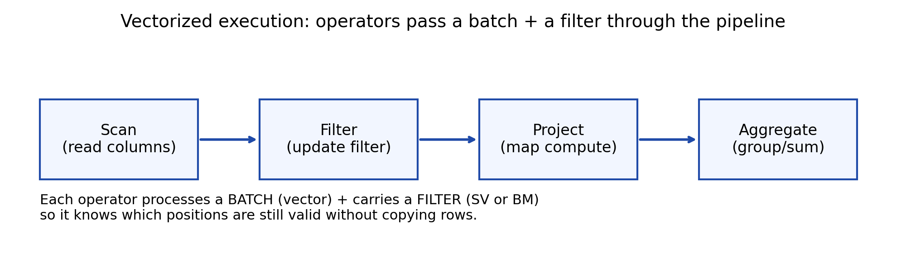
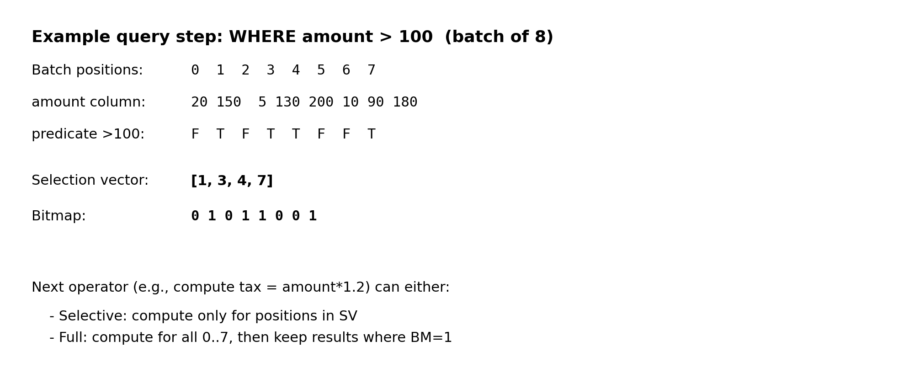
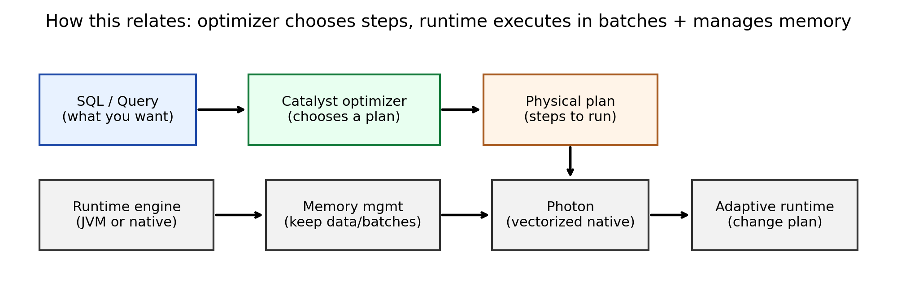

# Filter Representation in Vectorized Query Execution — explained for someone new to IT

If you don’t know IT or databases yet, this is the right version.

## The one-sentence meaning

A **filter representation** is just a way for a database to remember:

> “In this small group of rows, which ones should I keep using, and which ones should I ignore?”

The big reason it exists is to avoid expensive copying of data again and again.

---

## 1) Real-life story (no database words)

Imagine a factory line:

- A **box** contains **1,000 items**.
- The box goes through several **stations**.
- Each station does something to the items.

Now imagine one station checks quality:
- some items are **good**
- some items are **bad**

Question: When the box goes to the next station, how do we handle the bad items?

Two choices:

### Choice A: Copy only the good items into a new box
- You take good items out and build a new box.
- This is simple… but it’s a lot of physical work (copying/moving items).

### Choice B: Keep the same box, but add a “keep/ignore list”
- You don’t move the items.
- You attach a small note that says “these positions are good.”

That small note is the **filter representation**.

---

## 2) Same idea inside a database

A database often processes data in small chunks (a **batch**):
- Instead of working with 1 row, it works with a small group like 1,000 rows.

Why? Because doing work in groups is usually faster for the computer.

In this document:
- **row** = one record (like one order)
- **batch** = a small group of rows processed together
- **operator** = a “station” in the pipeline (filter, compute a new column, group/sum, etc.)

### Diagram: the pipeline

---

## 3) Tiny example with numbers (8 rows)

We have 8 orders with an `amount` value:

Positions: `0 1 2 3 4 5 6 7`

`amount`:   `20 150 5 130 200 10 90 180`

We apply a simple rule:

> Keep only orders where amount > 100

So the “good” positions are: **1, 3, 4, 7**

### Diagram: what changes after the filter

---

## 4) Two ways to write the “keep/ignore note”

Both ways mean the SAME thing (“keep 1,3,4,7”), they are just written differently.

### A) Selection Vector (SV) = a list of good positions

Example:
- `SV = [1, 3, 4, 7]`

How to read it:
- “Only look at rows number 1, then 3, then 4, then 7.”

Real-life analogy:
- A list of seat numbers of people who passed security.

### B) Bitmap (BM) = a row of 0/1 flags

Example:
- `BM = 0 1 0 1 1 0 0 1`

How to read it:
- “At each position: 1 means keep it, 0 means ignore it.”

Real-life analogy:
- Light switches: ON = keep, OFF = ignore.

---

## 5) Why do we care which one we use?

Because the next station might do more work.

Example: compute a new value

> new_amount = amount * 1.2

There are two styles:

### Style 1: Work only on the good rows
Using SV `[1,3,4,7]`, you compute only 4 multiplications.

This is great when:
- very few rows survived

### Style 2: Work on every row, then ignore the bad ones
You compute 8 multiplications, then you only keep results where BM=1.

This can be great when:
- most rows survived
- the work is simple math
- the computer can do simple math very fast in a tight loop

---

## 6) The paper’s main message (in beginner language)

The paper compares SV vs BM and basically says:

- Sometimes it’s faster to use a **list of good positions** (SV).
- Sometimes it’s faster to use **0/1 flags** (BM).

Which one is faster depends on:

- **How many rows survive**
  - if only a few survive → SV is often good
  - if most survive → BM can be good

- **What kind of work you do next**
  - simple number work (add/multiply/compare) often works nicely with BM
  - complicated work (like strings / lots of “if” logic) often benefits from SV

### Beginner cheat-sheet

| If… | Usually choose… | Why |
|---|---|---|
| Only a few rows survive | SV | You touch only the survivors |
| Most rows survive and work is simple math | BM | Scanning everything can be very efficient |
| Work is complicated/irregular | SV | Less overhead than dealing with many flags |

---

## 7) Super simple glossary (no IT assumption)

- **Row**: one item/record (example: one order).
- **Batch**: a small group of rows processed together.
- **Pipeline**: multiple stations in a row (scan → filter → compute → sum).
- **Filter**: a rule that keeps some rows and rejects others.
- **Filter representation**: the “note” that says which rows are still valid.
- **Selection Vector (SV)**: a list of the positions that are valid.
- **Bitmap (BM)**: 0/1 flags for each position (1 = valid, 0 = invalid).
- **Position / index**: the row number inside the batch (0,1,2,3…).

---

## 8) How this connects to Spark / Databricks (JVM, Catalyst, Photon, adaptivity) — very simple

You asked about these terms. They are “the bigger system” around the same idea (process data in batches and try hard not to waste work).

### Diagram: simple view of the stack

### Memory management (simple meaning)
**Memory management** is how the system uses RAM so it doesn’t crash and doesn’t slow down.

Relate to what we explained:
- Your batch vectors (like the `amount` array) live in memory.
- If you keep copying survivors into new arrays too often, you waste memory + time.
- So engines prefer “keep the data, carry a small keep/ignore note” (SV/BM style thinking).

In big data systems this also includes:\n+- deciding what stays in RAM vs what spills to disk\n+- avoiding creating too many temporary objects/arrays\n+
### JVM (simple meaning)
The **JVM** is the “machine” that runs Java/Scala code (Spark is mostly JVM-based).\n+
Why it matters:\n+- The JVM allocates and frees memory for objects.\n+- Too many temporary objects (like lots of tiny arrays) can cause **garbage collection** pauses (the JVM stopping briefly to clean memory).\n+\n+Relate it back:\n+- Designs that reduce copying and reduce allocations can run smoother.\n+
### Catalyst query optimizer (simple meaning)
**Catalyst** is Spark’s “planner.”\n+\n+It takes your SQL / DataFrame operations and decides:\n+- the order of steps (filter first? join first?)\n+- which algorithms to use\n+\n+Relate it back:\n+- Catalyst tries to push filters earlier (so fewer rows survive later steps).\n+- That makes the “keep/ignore note” even more valuable, because you avoid doing work on rows that will be dropped.\n+
### Photon (simple meaning)
**Photon** (Databricks) is a faster execution engine that runs many operations in a very CPU-efficient way (often native code, very vectorized).\n+\n+Relate it back:\n+- Photon is exactly the kind of engine where “batch processing + vectorized operations” matters a lot.\n+- In that world, representing filters as bitmaps and using SIMD-friendly loops can be a big win for simple numeric operations.\n+
### Runtime adaptivity / Dynamic query optimization (simple meaning)
These mean:\n+\n+> “The system can change its plan while the query is running, based on what it learns.”\n+\n+Example:\n+- The optimizer *thought* a filter would keep 80% of rows, but at runtime it keeps only 2%.\n+- The engine may switch to a different join method, or change parallelism, or choose a different strategy.\n+\n+Relate it back:\n+- This paper’s message is “the best strategy depends on how many survive + what operation you do.”\n+- Runtime adaptivity is basically the system doing that reasoning automatically while running.\n+
### Partition coalescing (simple meaning)
A **partition** is just “a chunk of the data” processed in parallel.\n+\n+**Partition coalescing** means:\n+\n+> “If we have too many tiny partitions, merge them into fewer bigger ones.”\n+\n+Why?\n+- Too many tiny tasks adds overhead (scheduling, setup time).\n+\n+Relate it back:\n+- It’s the same theme as vectorization:\n+  - don’t do work one-by-one (too much overhead)\n+  - do work in sensible-sized chunks (batches / partitions)\n+
---

## 9) 15-second recap

- Databases often process data in small groups.
- After a filter, some rows are rejected.
- Instead of copying data, the DB keeps the data and carries a small “keep/ignore” note.
- That note can be written as a **list (SV)** or **0/1 flags (BM)**.
