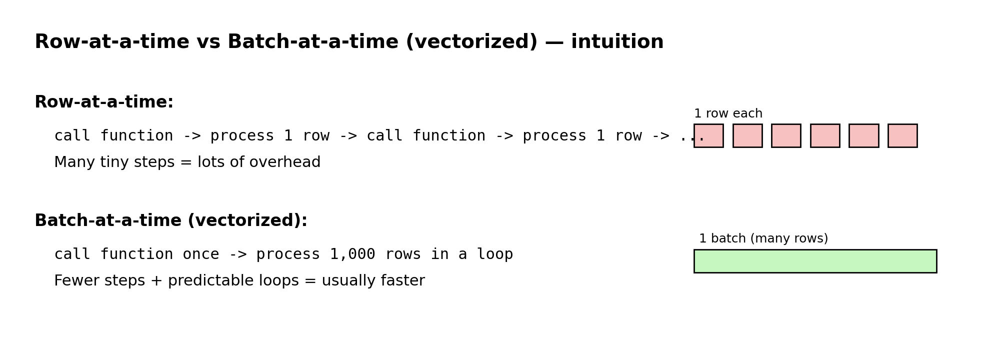
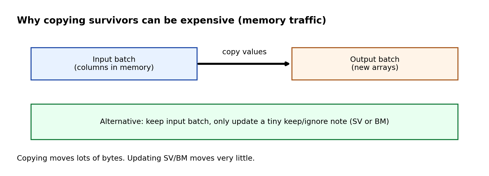
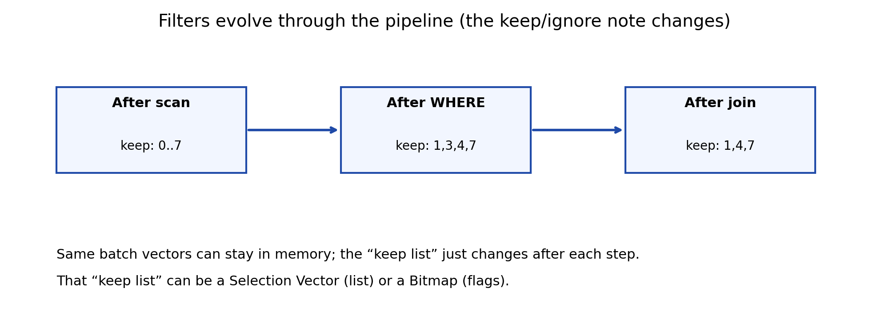
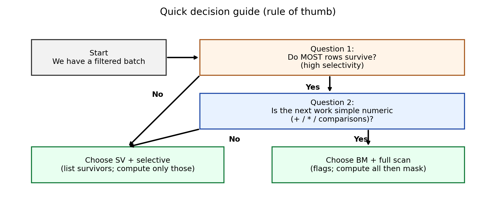

# Suggested Medium titles (pick one)

1) **Stop Copying Rows: The “Keep/Ignore Note” Behind Fast Databases (SV vs Bitmaps)**
2) **How Databases Go Fast (Without Magic): Selection Vectors vs Bitmaps**
3) **Vectorized Execution Explained for Beginners: The Filter Trick That Saves CPU**

---

# Stop Copying Rows: The “Keep/Ignore Note” Behind Fast Databases (SV vs Bitmaps)

Picture this:

You run a query on a huge table.
It finishes in seconds.

Your brain says: “Wow, that database must be doing something genius.”

The truth is often simpler:

> Fast engines avoid doing the same heavy work again and again.
> Especially: they try to avoid copying data around.

This article explains one surprisingly powerful idea from the research paper **“Filter Representation in Vectorized Query Execution” (Ngom et al., 2021)**:

> Instead of physically removing rows after every filter, engines keep data in place and carry a small **keep/ignore note**.

That keep/ignore note is called a **filter representation**.

---

## The one-sentence meaning

A **filter representation** is just a way to remember:

> “In this small group of rows, which ones should I keep using, and which ones should I ignore?”

---

## Quick definitions (easy)

- **Row**: one record (example: one order).
- **Batch**: a small group of rows processed together (example: 1,000 rows).
- **Pipeline**: steps in a row (scan → filter → compute → sum).
- **Filter**: a rule that keeps some rows and rejects others.
- **Filter representation**: the keep/ignore note attached to a batch.

---

## Why databases process in batches (vectorized execution)

Computers pay a cost every time they “start doing something.”
If you do work one row at a time, you pay that start-cost a lot.

So many analytics engines do this instead:
- grab a **batch** (like 1,000 rows)
- loop over it in a tight, predictable way

### Diagram: row-at-a-time vs batch-at-a-time



---

## The big picture (architecture)

A vectorized database processes batches through operators (think: stations on a factory line).

### Diagram: batch + filter flows through the pipeline


Important idea:
- The batch values (columns) can stay in memory.
- The keep/ignore note changes as you apply filters.

---

## Why this filter thing exists (the purpose)

When you filter data, you have two choices.

### Option A: Copy only survivors
You build a new output batch containing only rows that passed.

This is simple, but copying again and again can be expensive.

### Option B: Don’t copy; keep the batch and carry a keep/ignore note
You keep the values where they are.
You only update the small note that says which positions are valid.

### Diagram: why copying can be expensive



This is the mindset shift:

- Copying moves lots of data.
- Updating a small note moves very little.

---

## A tiny example with real numbers (8 rows)

We have one batch with 8 rows.

Positions: `0 1 2 3 4 5 6 7`

`amount`:   `20 150 5 130 200 10 90 180`

Filter rule:

> Keep rows where amount > 100

Survivors are positions: **1, 3, 4, 7**

### Diagram: what changes after the filter


---

## Two ways to write the keep/ignore note

Both options mean the same thing (“keep 1,3,4,7”), they’re just stored differently.

### 1) Selection Vector (SV) = list of survivor positions

- `SV = [1, 3, 4, 7]`

How to read it:
- “Only look at rows number 1, then 3, then 4, then 7.”

Real-life analogy:
- a guest list of seat numbers for people allowed inside.

### 2) Bitmap (BM) = 0/1 flags for each position

- `BM = 0 1 0 1 1 0 0 1`

How to read it:
- “At each position: 1 means keep it, 0 means ignore it.”

Real-life analogy:
- a row of light switches (ON = keep, OFF = ignore).

---

## Real example: one query, step-by-step (what a DB is doing)

Imagine a normal analytics query:

```sql
SELECT
  country,
  SUM(amount * 1.2) AS taxed_revenue
FROM orders
WHERE amount > 100
GROUP BY country;
```

Conceptually:

1) **Scan**: read columns in batches (`amount[]`, `country[]`).
2) **Filter**: apply `amount > 100` → update keep/ignore note (SV or BM).
3) **Compute**: calculate `amount * 1.2` for valid rows.
4) **Aggregate**: group by `country`, sum values for valid rows.

### Diagram: the keep/ignore note changes across steps



---

## Why SV vs BM matters (the easy performance story)

After filtering, the next step might compute something.
Example: `amount * 1.2`.

There are two styles:

### Style A: Compute only survivors (often pairs well with SV)
If only a few rows survived, don’t waste time computing the rest.

### Style B: Compute everything, then ignore bad rows (often pairs well with BM)
This can be faster when:
- most rows survived, and
- the work is simple math,
- the computer can run a very tight loop efficiently.

---

## Cheat-sheet: what to pick (rule of thumb)

### Diagram: quick decision flow



Or a table:

| If… | Usually choose… | Why |
|---|---|---|
| Only a few rows survive | SV | Touch only survivors |
| Most rows survive and work is simple numeric (math/compare) | BM | Scanning everything can be very efficient |
| Work is complicated/irregular (strings, complex logic) | SV | Less overhead than many flags |

---

## Real-world connection: Spark / Databricks (simple)

Spark and Databricks are big systems, but they chase the same goal:

> Do less wasted work, move less data, and use CPU/memory efficiently.

### Diagram: simple view of the stack


### Memory management
Memory management is how the system uses RAM so it doesn’t crash and doesn’t slow down.

Link to our story:
- lots of copying → lots of memory work
- keeping data in place → less memory work

### Catalyst optimizer (Spark)
Catalyst is Spark’s “planner.”

It tries to pick a plan that makes the runtime cheaper, like:
- pushing filters early
- simplifying expressions

### Photon (Databricks)
Photon is an execution engine that is very good at running batch-style operations efficiently.

This connects directly to the paper’s world: vectorized execution loves predictable loops.

### Runtime adaptivity / dynamic query optimization
Meaning:

> The system can change its plan while running, based on what it learns.

Example:
- the planner expects 80% of rows survive
- at runtime only 2% survive
- the engine switches strategies to match reality

### Partition coalescing
A partition is a chunk of data processed in parallel.

Coalescing means:
- too many tiny chunks → merge into fewer, bigger chunks

It’s the same principle as batching:
- fewer tiny tasks → less overhead

---

## Common beginner confusions (quick fixes)

### “Why not just delete the bad rows?”
Because deleting/copying all the time costs work.
It’s often cheaper to leave data where it is and just remember “ignore these positions.”

### “Is SV always better?”
No. If most rows survive and the next step is simple math, BM + full scan can be faster.

### “Is BM always better?”
No. For irregular work (strings, complex rules), SV can be simpler and faster.

---

## A tiny checklist you can use in real projects

If you’re tuning a Spark/Databricks job or any analytics pipeline:

- **Are you copying/shuffling data a lot?** (often expensive)
- **Can you filter earlier?** (reduce wasted work)
- **Is your work simple numeric or complex/branchy?** (impacts what optimizations help)
- **Are you doing too many tiny tasks?** (coalesce/adjust partitioning)

---

## Conclusion

If you only remember one thing:

- Fast engines often don’t copy data after every filter.
- They keep batches in place and carry a small keep/ignore note.
- That note can be a **Selection Vector (list of survivors)** or a **Bitmap (0/1 flags)**.

And the broader lesson:

> Performance is often about reducing overhead and reducing unnecessary movement of data.
