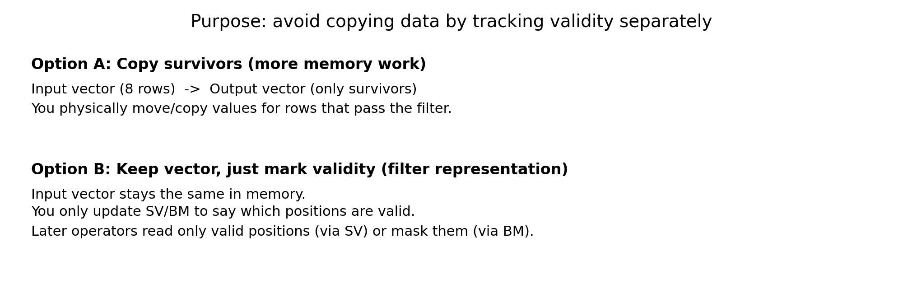

# Filter Representation in Vectorized Query Execution (DAMON’21) — What it REALLY is (with examples)

Paper: **“Filter Representation in Vectorized Query Execution”** (Ngom et al., 2021)

If you feel “I don’t get the purpose,” focus on this sentence:

> A filter representation is a **cheap way to remember which rows are still valid inside a batch**, so operators can keep working without copying data.

---

## 1) The big picture (architecture)

A vectorized DB executes queries as a pipeline of operators. Each operator processes:
- a **batch (vector)** of values (often 1–2k rows)
- plus a **filter** telling it which batch positions are valid

### Diagram: batch + filter flows through the pipeline


Key idea:
- The *columns* for the batch (arrays of values) stay in memory.
- The filter changes as the query applies conditions.

---

## 2) Why do we even need this? (the purpose)

When you apply a `WHERE` condition, you have two choices:

### Option A: Copy survivors into a new output vector
If a row passes the filter, you physically copy its values into a new vector.

Problem:
- copying values again and again costs CPU and memory bandwidth

### Option B: Don’t copy. Keep the vectors and just “mask” invalid rows
You keep the original vectors in place.
You only update a small structure that says “these positions are valid.”

That structure is the **filter representation** (SV or BM).

### Diagram: copy vs mask



This is the whole motivation:
- **copying** is often expensive
- **marking validity** can be cheap

---

## 3) A tiny, concrete example (8-row batch)

Imagine one batch has 8 rows.

Batch positions: `0 1 2 3 4 5 6 7`

Column `amount`:
- `20, 150, 5, 130, 200, 10, 90, 180`

Query step:

```sql
WHERE amount > 100
```

Which positions survive?
- positions **1, 3, 4, 7** survive (150, 130, 200, 180)

### Diagram: step-by-step batch filter


---

## 4) Two ways to represent the same survivors (SV vs BM)

Survivors are: `1, 3, 4, 7`

### A) Selection Vector (SV)
A selection vector is a list of surviving positions:

- `SV = [1, 3, 4, 7]`

How operators use it (idea):
- iterate `idx` in `[1,3,4,7]`
- read values like `amount[idx]`

Analogy:
- a **VIP guest list**: you only check the people listed

### B) Bitmap (BM)
A bitmap is one bit per position:

- `BM = 0 1 0 1 1 0 0 1`

How operators use it (idea):
- either scan all positions and “mask out” the invalid ones
- or do more complex logic to iterate only the 1s

Analogy:
- **light switches**: 1 = keep, 0 = drop

---

## 5) The second key idea: Selective vs Full compute

Once you have survivors, the next operator might compute something:

```sql
SELECT amount * 1.2 AS amount_with_tax
```

There are two strategies:

### Strategy 1: Selective compute
Compute only for survivors.

With `SV = [1,3,4,7]` you compute 4 multiplications (not 8).

This is great when **few rows survive**.

### Strategy 2: Full compute
Compute for all 8 positions, then keep results only where `BM=1`.

This can be faster when:
- the operation is simple (like `* 1.2`)
- the CPU can do it with SIMD
- scanning 0..7 is a tight simple loop

---

## 6) A more “real” query walkthrough (what happens in a DB)

Take a very normal analytics query:

```sql
SELECT
  country,
  SUM(amount * 1.2) AS taxed_revenue
FROM orders
WHERE amount > 100
GROUP BY country;
```

In a vectorized engine, conceptually:

1) **Scan** operator reads columns in batches:
   - `amount[]` vector
   - `country[]` vector

2) **Filter** operator evaluates `amount > 100` for the batch:
   - it does NOT copy rows
   - it updates the filter representation (SV or BM)

3) **Project** operator computes `amount * 1.2`:
   - either selective (only survivors) or full (compute all, then mask)

4) **Aggregate** operator groups and sums only the valid rows:
   - uses the filter to skip invalid positions

So the filter representation is like a “do not use these positions” note that travels with the batch.

---

## 7) When is SV better vs BM better? (simple rule)

The paper’s main finding:
- **BM tends to win** when the operator is **SIMD-friendly** (simple arithmetic/comparisons) because full scans + SIMD work well with bitmasks.
- **SV tends to win** for many other operations because iterating survivors is simpler/cheaper than bitmap scanning.

### Cheat-sheet

| Situation | Likely better | Why |
|---|---|---|
| Very few rows survive | SV + selective | Touch only survivors |
| Many rows survive + simple numeric work | BM + full | Tight loops + SIMD |
| Irregular work (strings, complex UDFs) | SV | Bitmap scanning overhead often doesn’t pay |
| Unsure | Benchmark | Data + hardware decide |

---

## 8) Glossary (tiny)

- **Tuple**: row
- **Batch / vector**: a small chunk of rows processed together
- **Filter representation**: data structure telling which batch positions are valid
- **SV (selection vector)**: list of valid positions
- **BM (bitmap)**: 1 bit per position (1 = valid)
- **Selectivity**: fraction of rows that survive
- **SIMD**: CPU doing the same operation on multiple values at once

---

## 9) 20-second recap (purpose)

- Vectorized execution processes data in **batches**.
- After each step, some rows are invalid.
- Instead of copying data, the DB keeps vectors and uses **SV or BM** to mark which positions are valid.
- SV vs BM is a performance tradeoff depending on selectivity + SIMD.
