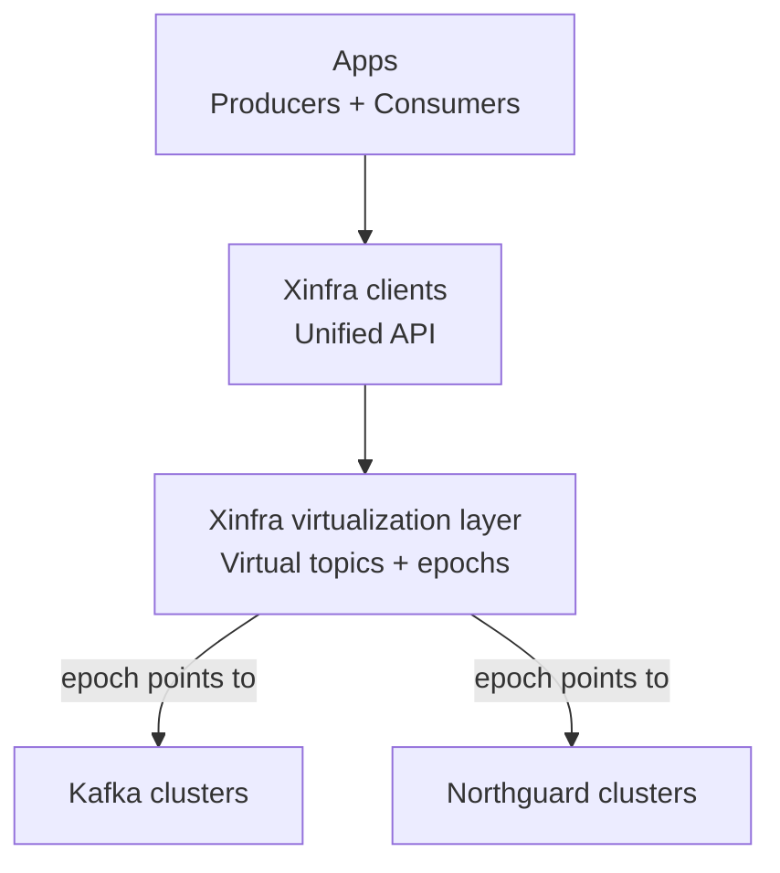
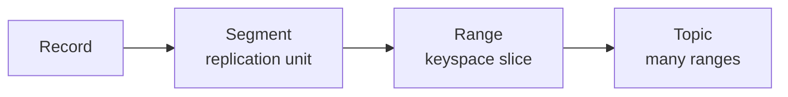
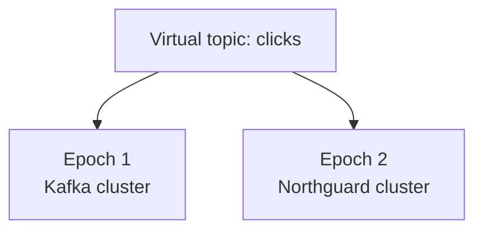
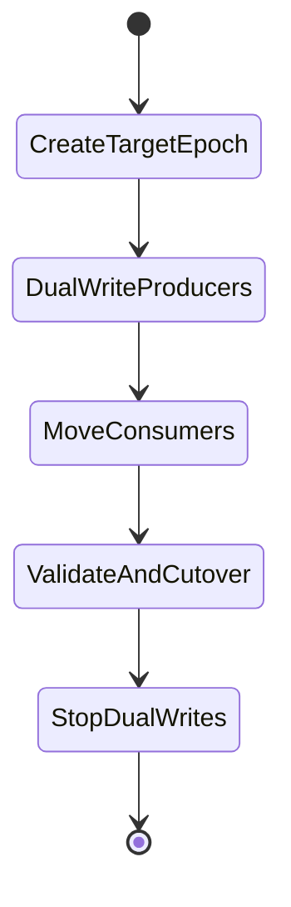

# Northguard + Xinfra (LinkedIn) — Easy Guide for Junior IT / Data Engineers

Source article (LinkedIn Engineering): [Introducing Northguard and Xinfra: scalable log storage at LinkedIn](https://www.linkedin.com/blog/engineering/infrastructure/introducing-northguard-and-xinfra)

## The goal (plain words)

LinkedIn wanted a **next-generation replacement for Kafka’s storage layer** that:
- scales to massive volume **and** massive metadata (topics/partitions),
- is easier to operate (“lights-out”),
- gives **stronger consistency + durability**,
- and allows **migrating from Kafka without downtime**.

They built:
- **Northguard**: a new **log storage system** (where records are stored and replicated).
- **Xinfra**: a **virtualized Pub/Sub layer** that can sit over Kafka *and* Northguard to make migrations and multi-cluster growth transparent.

---

## 60-second background (why Kafka became hard at LinkedIn scale)

Kafka is a “distributed commit log” that decouples producers and consumers (Pub/Sub). LinkedIn originally created Kafka so many services could:
- publish events once,
- let many consumers read them,
- and **replay history** to reprocess when bugs happen.

But at LinkedIn’s scale, the article describes Kafka operating at roughly:
- **32 trillion records/day**
- **17 PB/day**
- **400K topics**
- **10K+ machines** across many clusters

At that scale, common pain points become major:
- **Scalability**: metadata + cluster size bottlenecks
- **Operability**: balancing partitions, running lots of clusters + supporting tooling
- **Availability/Consistency tradeoffs**: partitions are heavy units of replication
- **Durability**: “good enough” becomes not good enough for critical systems

---

## The mental model: “log storage” vs “Pub/Sub experience”

### Two layers (simple)

1) **Storage layer**: how bytes are stored, replicated, and read efficiently  
2) **Pub/Sub layer**: how apps produce/consume topics, manage consumer groups, checkpoints, migrations

LinkedIn separated these concerns:
- **Northguard** focuses on the storage layer.
- **Xinfra** provides a stable Pub/Sub experience across multiple storage backends.

---

## High-level architecture (easy diagram)

### What apps want

```
Producers  --->  Topic  --->  Consumers (often via consumer groups)
```

### What LinkedIn built (conceptual)

```
Apps (Producers/Consumers)
          |
          v
   Xinfra clients (one API)
          |
          v
  +------------------------+
  | Xinfra virtualization  |
  | - virtual topics       |
  | - epochs/migration      |
  | - consumer groups      |
  | - checkpoints          |
  +-----------+------------+
              |
      +-------+--------+
      |                |
      v                v
   Kafka clusters   Northguard clusters
  (old backend)     (new backend)
```

### Mermaid version (GitHub-safe)



---

## Northguard in simple words

Northguard is “log storage” optimized for:
- scaling both **data** and **metadata**
- avoiding load hotspots (“balanced by design”)
- easier operations when clusters get huge

The key design change: **replicate smaller units** (segments) and distribute load via **log striping**.

---

## Northguard data model (record → segment → range → topic)

The article describes these building blocks:

### 1) Record
- smallest unit, basically `(key, value, headers)` bytes.

### 2) Segment (unit of replication)
- a sequence of records.
- can be **active** (appendable) or **sealed** (immutable).
- sealed when it hits limits like size/time or failures.

### 3) Range (log abstraction)
- a sequence of segments for a **contiguous keyspace** slice.
- ranges can be split/merged over time.

### 4) Topic
- a named collection of ranges that cover the whole keyspace.
- has a **storage policy** (retention, placement constraints).

### Diagram



---

## What is “log striping”? (the big idea)

### Problem with “big replication units”
If replication happens in big chunks (like partitions), you can get:
- uneven load (some partitions are hot)
- slow rebalancing when adding/removing brokers
- operational tools needed to constantly shuffle data around

### Northguard’s approach
Replicate **segments** and stripe them across brokers:
- load spreads more evenly,
- failures don’t stall the whole system as badly,
- replenishing replication factor can be faster and more automatic.

**Simple analogy**:
- Kafka-style: replicate “big folders”
- Northguard-style: replicate “smaller files” and spread them around continuously

---

## Concrete example (why smaller replication units help)

### Example scenario
You have a topic `user_activity` receiving bursts (e.g., during major events).

#### In a partition-heavy world
- If the hot traffic hashes to a small set of partitions, a few brokers become overloaded.
- To fix it, you rebalance partitions (heavy move).

#### With segment-based striping
- New segments can be created and placed across brokers.
- The system has more flexibility to distribute load without giant reshuffles.

Result: **less manual babysitting**, better “balanced by design” behavior.

---

## Xinfra in simple words (virtualization layer)

Xinfra is a layer that:
- lets applications use a **single API/client**
- and hides the fact that the underlying topic might live in:
  - Kafka cluster A today
  - Northguard cluster B tomorrow

### The key concept: “epochs”
A **virtual topic** can have multiple epochs.
- Epoch 1 might be on Kafka
- Epoch 2 might be on Northguard

Apps keep producing/consuming via the same virtual topic name; Xinfra routes traffic correctly.



---

## Migration (how they move from Kafka to Northguard without downtime)

The article’s high-level migration strategy:
- Create a **new epoch** in the target system (Northguard).
- Migrate **producers first**, then consumers.
- Producers do **dual writes** during migration (write to both old and new) so rollback is possible.
- Maintain ordering guarantees via controlled migration steps.
- After everything is stable, **turn off dual writes**.

### Migration stages (diagram)



### Concrete migration example
You have topic `payments_events`.
1. Xinfra creates `payments_events` epoch on Northguard.
2. Producers start dual-writing (Kafka + Northguard) for safety.
3. Consumers are gradually moved to read from the new epoch.
4. After validation, disable dual writes.
5. Retention policy eventually deletes old Kafka data.

---

## Why virtualization (Xinfra) is a big deal (junior-friendly)

Without virtualization, clients often assume:
- “a topic belongs to one physical cluster”

That makes migration painful:
- app config changes
- coordination across thousands of services
- risk of downtime

With Xinfra:
- **apps don’t need to know** where the topic physically lives
- you can grow capacity by spreading topics across multiple clusters
- you can migrate backends (Kafka → Northguard) transparently

---

## Quick comparison: “what improved” (high level)

The article highlights improvements in:
- **Scalability**: better handling of huge metadata and cluster growth
- **Operability**: less manual rebalancing and tooling dependency
- **Availability**: better behavior under replica failures
- **Consistency**: less need to sacrifice consistency for availability
- **Durability**: stronger durability guarantees (fsync-based acknowledgements)

---

## Practical takeaways (what you should remember)

- **Kafka isn’t just a queue**; it’s a replayable log that powers reprocessing and many data/infra use cases.
- At extreme scale, **metadata and operability** become the hard problems, not just throughput.
- LinkedIn’s approach is to split responsibilities:
  - **Northguard**: storage mechanics at scale
  - **Xinfra**: stable Pub/Sub interface + virtualization + migration
- “Virtual topics + epochs + dual write” is a common pattern for **zero-downtime migrations**.

---

## Source

- LinkedIn Engineering: [Introducing Northguard and Xinfra: scalable log storage at LinkedIn](https://www.linkedin.com/blog/engineering/infrastructure/introducing-northguard-and-xinfra)


