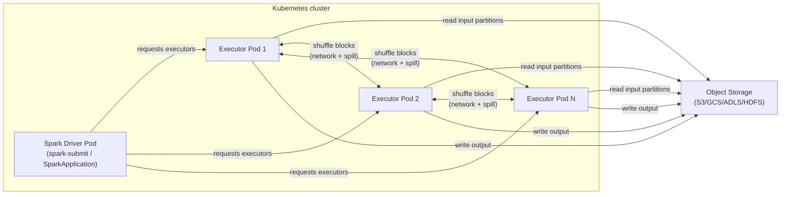
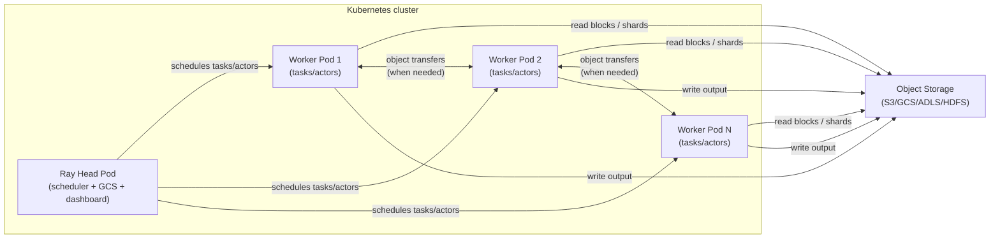

# Spark vs Ray — Deep Dives (Shuffles, Actors, Kubernetes, Cost)

If you want a simpler version first, read:
- `article/spark-vs-ray-easy-guide.md`

This note goes deeper on four practical topics that tend to dominate real-world performance and operability when comparing Spark and Ray:

- Spark shuffles and how to avoid them
- Ray actor patterns for feature computation and batch inference
- Running both on Kubernetes
- Cost–performance tradeoffs

---

## Architecture diagrams (easy mental models)

### Spark job on Kubernetes (driver + executors, shuffle between executors)



### Ray on Kubernetes (head + workers, tasks/actors scheduled to workers)



---

## Realistic sizing + “how much storage is processed?” (with numbers)

### What “storage processed” means (simple accounting)

For a batch job, a useful first-order estimate is:

\[
\text{bytes processed} \approx \text{input read} + \text{shuffle write} + \text{shuffle read} + \text{output write}
\]

Notes:
- Shuffle write and shuffle read are often of similar magnitude; Spark UI exposes both.
- For object storage, “read” and “write” are usually the dominant billable bytes and wall-clock drivers.
- Compression and column pruning can change *physical bytes* dramatically (Parquet is your friend).

### Baseline cluster configurations used below (so numbers are interpretable)

To make examples concrete, I’ll use two “typical” cluster shapes and give **runtime ranges** (because object-store throughput, skew, spills, and CPU cost vary a lot across environments).

#### Spark baseline (CPU ETL)

- **Nodes**: 20 worker nodes
- **Per node**: 16 vCPU, 64 GB RAM, fast ephemeral disk
- **Executors**: 5 per node × 3 cores each = 15 cores/node (leave headroom)
- **Total cores**: ~300
- **Total executor memory**: ~20 × 5 × 10 GB = 1,000 GB (example)
- **Key configs** (typical starting point):
  - `spark.sql.adaptive.enabled=true`
  - `spark.sql.shuffle.partitions=2000` (then let AQE coalesce)
  - broadcast threshold tuned to your executors (don’t rely on defaults blindly)

#### Ray baseline (CPU feature compute / CPU inference)

- **Nodes**: 20 worker nodes
- **Per node**: 16 vCPU, 64 GB RAM
- **Ray resources**: 15 CPUs/node usable for tasks/actors (leave headroom)
- **Total CPUs**: ~300

#### Ray baseline (GPU inference)

- **Nodes**: 4 worker nodes
- **Per node**: 8 vCPU, 64 GB RAM, 1× GPU (e.g., T4/A10 class)
- **Total GPUs**: 4

### Example 1 — Spark ETL: join + aggregate on 1 TB of Parquet (shuffle-heavy)

**Use case**: build daily customer metrics from clickstream.

- **Fact table**: 1.0 TB Parquet/day (compressed on storage)
- **Dimension**: 50 GB Parquet (customers)
- **Transform**:
  - filter to last day
  - join fact → customers on `customer_id`
  - `groupBy(customer_id).agg(...)`
  - write 120 GB Parquet output (compressed)

#### What gets processed (two join strategies)

**A) Sort-merge join (no broadcast)**

- **Input read**: ~1.05 TB
- **Shuffle for join**:
  - shuffle write: ~1.05–1.30 TB (depends on projection, encoding, skew)
  - shuffle read: ~1.05–1.30 TB
- **Shuffle for aggregation**:
  - shuffle write: ~0.40–0.90 TB (depends on cardinality and pre-aggregation)
  - shuffle read: ~0.40–0.90 TB
- **Output write**: ~120 GB

**Total “storage processed” (rough)**: ~3.0 TB to ~4.4 TB

**B) Broadcast the 50 GB dimension (if it fits safely per executor)**

- **Input read**: ~1.05 TB
- **Broadcast**: 50 GB replicated to executors (network-heavy but avoids a full shuffle of the fact)
- **Shuffle for aggregation only**:
  - shuffle write/read: ~0.40–0.90 TB each
- **Output write**: ~120 GB

**Total “storage processed” (rough)**: ~2.0 TB to ~2.9 TB

#### Expected wall-clock time on the Spark baseline

These ranges assume “healthy” object-store throughput and no catastrophic skew:

- **Sort-merge path**: ~25–60 minutes
- **Broadcast join path**: ~15–40 minutes

Why ranges are wide:
- If shuffle spills heavily, you can lose 2–5× time.
- If `customer_id` is skewed (heavy hitters), the stage tail dominates.
- Object-store read bandwidth (and request rates) can vary a lot by environment.

#### The “avoid shuffle” takeaway

If 50 GB is truly broadcast-safe in your environment, you often save **~1–2 TB of shuffle bytes** and **10–20+ minutes** of wall-clock on clusters of this size.

### Example 2 — Spark: global dedup on 500 GB (forced shuffle)

**Use case**: remove duplicate events by `(event_id)` before downstream joins.

- **Input**: 500 GB Parquet
- **Operation**: `dropDuplicates("event_id")`
- **Output**: 420 GB Parquet

**This is inherently shuffle-heavy** (you must bring identical keys together).

Rough bytes:
- **Input read**: 500 GB
- **Shuffle write/read**: 500–800 GB each (depends on projection and encoding)
- **Output write**: 420 GB

**Total processed**: ~1.9 TB to ~2.5 TB

**Expected time (Spark baseline)**: ~12–30 minutes (skew and spills are the biggest drivers).

## Spark shuffles (what they are, why they hurt, and how to avoid them)

### What a “shuffle” means in Spark

A **shuffle** is Spark’s distributed **data redistribution** step. It happens when Spark needs to **repartition records across the cluster** so that records with the same key (or required partitioning) end up together.

Shuffles are triggered by **wide transformations**, where output partitions depend on many input partitions (as opposed to narrow transformations like `map`, `filter`).

Common shuffle-triggering operations:

- **Aggregations**: `groupBy`, `groupByKey`, `reduceByKey`, `agg`, `cube`, `rollup`
- **Joins** (often): `join`, `left/right/full`, especially when neither side is broadcast
- **Distinct / Dedup**: `distinct`, `dropDuplicates`
- **Order / sort**: `orderBy`, `sort`, many window operations
- **Repartitioning**: `repartition`, `coalesce` (can avoid shuffle only in some cases)

In Spark SQL / DataFrames, shuffles show up as **`Exchange`** operators in the physical plan (and often `SortMergeJoin` or `HashAggregate` stages).

### Why shuffles are expensive

Shuffles are commonly the most expensive part of a Spark job because they combine several bottlenecks:

- **Network I/O**: executors exchange many blocks over the network
- **Disk I/O**: shuffle spill occurs when in-memory buffers are insufficient
- **Serialization / deserialization**: data is encoded, transferred, decoded
- **Skew amplification**: hot keys create stragglers that hold the whole stage hostage
- **Stage boundaries**: shuffles create new stages, increasing scheduling overhead

Rule of thumb: if you want a big speedup, eliminate or reduce shuffles first, then micro-optimize.

### How to spot shuffles quickly

- **Spark UI**
  - **Stages**: wide stage boundaries and high shuffle read/write indicate shuffles
  - **Tasks**: long tails (few tasks much slower) often means skew
  - **Metrics**: “Shuffle Read Size / Records”, “Shuffle Write Size”, “Spill (Memory/Disk)”
- **Explain plan**
  - DataFrame: `df.explain("formatted")`
  - Look for `Exchange`, `Sort`, `SortMergeJoin`, `HashAggregate`

### Avoiding shuffles: the practical playbook

#### 1) Prefer broadcast joins when one side is small

If one table fits in memory per executor, a **broadcast hash join** avoids shuffling the large table.

- **Spark SQL auto broadcast**: controlled by `spark.sql.autoBroadcastJoinThreshold`
- **Force broadcast**: `broadcast(smallDf)` in DataFrame API

Notes:
- Broadcasting is per executor; “small” depends on executor memory and concurrency.
- Be careful with very wide rows: size on disk ≠ size in JVM.

#### 2) Partition deliberately (and reuse partitioning)

If you repeatedly join/aggregate by the same key, align partitioning once and keep it:

- Use `repartition(numPartitions, col("key"))` once early (yes, this is a shuffle) to avoid *many* later shuffles.
- Persist/caching can make sense if you reuse the dataset and it’s cheaper than recomputing.

Good patterns:
- Pipeline where multiple downstream operations share the same key distribution
- Large dimension table reused across multiple joins

Anti-pattern:
- Calling `repartition()` multiple times with different keys without a reason

#### 3) Tune partition counts and sizes (avoid too few or too many)

Key knobs:
- **Spark SQL**: `spark.sql.shuffle.partitions` (default often too high/low depending on cluster)
- **RDD default**: `spark.default.parallelism`

Targets (rough guidance):
- Avoid huge partitions that spill (e.g., multi-GB)
- Avoid tiny partitions that cause scheduler overhead
- For file-based inputs, aim for reasonable input partition sizes (commonly 128–256MB compressed-ish, but depends heavily on CPU vs I/O)

In Spark 3.x, **AQE** (Adaptive Query Execution) can coalesce shuffle partitions automatically:

- `spark.sql.adaptive.enabled=true`
- `spark.sql.adaptive.coalescePartitions.enabled=true`

#### 4) Replace `groupByKey` with map-side aggregations

In RDD land:
- Prefer **`reduceByKey`**, **`aggregateByKey`**, **`combineByKey`** over `groupByKey`
- Map-side combining reduces shuffle volume substantially

In DataFrame land:
- Prefer aggregations that push partial aggregates early (Spark’s optimizer typically does this)
- Avoid UDF-heavy aggregation patterns that block optimizer opportunities

#### 5) Handle skew explicitly (it’s the #1 “mysterious” slowdown)

Symptoms:
- Few tasks much slower than the rest
- Long stage tail even with plenty of cluster capacity

Mitigations:
- **AQE skew join handling**:
  - `spark.sql.adaptive.enabled=true`
  - `spark.sql.adaptive.skewJoin.enabled=true`
- **Salting keys** for heavy hitters (classic approach):
  - Add random salt to skewed key on the large side
  - Expand small side accordingly (or broadcast it)
- **Pre-aggregate** before joining (reduce rows per key)
- **Split heavy keys** using domain-specific logic (e.g., time bucketing)

#### 6) Avoid global sorts when you don’t need them

`orderBy` forces a global sort (shuffle + sort). Alternatives:

- Use `sortWithinPartitions` when global ordering isn’t required
- For “top K”, prefer `orderBy(...).limit(K)` (Spark can optimize)
- Use partition pruning and local ordering for downstream file writing

#### 7) Reduce shuffle payload (move less data)

- Project early: select only columns you need
- Filter early: push predicates down where possible
- Use efficient encodings: avoid exploding nested structures unnecessarily
- Consider bucketing (when stable join keys and repeated joins make it worthwhile)

### When a shuffle is actually OK (or required)

Some correctness requirements demand shuffles:

- Full shuffle join where neither side is broadcastable
- Global deduplication
- Exact global ordering

The goal is not “zero shuffles”, it’s “minimum shuffle volume and minimal skew”.

---

## Ray actor patterns for feature computation and batch inference

Ray gives you a different set of primitives than Spark:

- **Tasks**: stateless, embarrassingly parallel units of work
- **Actors**: stateful workers (a Python process with mutable state)
- **Object store**: shared-memory-ish transfer of large objects (plus spilling)

Actors are especially valuable when you want:

- **Warm state**: models, feature dictionaries, embeddings, DB connections
- **Controlled concurrency**: limit parallelism per model/GPU/DB
- **Affinity**: keep work and state colocated

### Pattern 1: Model-per-actor (batch inference with warm model state)

Use an actor to load the model once, then serve inference requests.

Core idea:
- Each actor loads and holds the model in memory.
- You dispatch many batches to the same actor.

Benefits:
- Avoids repeated model initialization
- Natural place to manage batching and pre/post-processing
- Easy to pin resources (CPU, GPU)

Key design choices:
- **Batching**: prefer fewer, larger batches to reduce overhead (but don’t blow memory)
- **Backpressure**: limit in-flight requests per actor
- **Concurrency**: use Ray actor concurrency controls if your model supports parallelism

Operational concerns:
- If actors die, you need idempotent processing or retry semantics.
- For GPU inference, keep batch sizes stable to avoid fragmentation and variability.

### Pattern 2: Sharded feature store actors (online-ish feature computation)

If you compute features that depend on some keyed state (e.g., per user/item),
use a set of actors that each own a shard of the keyspace.

Core idea:
- Hash key → route to an actor shard.
- Actor maintains cache/state for that shard (e.g., rolling aggregates).

Benefits:
- Great fit for incremental features and sessionization
- Keeps hot keys’ state local, avoids cross-worker synchronization

Key design choices:
- **Sharding strategy**: stable hashing vs explicit partitions
- **State size**: keep bounded with TTL/LRU and periodic compaction
- **Checkpointing**: periodically persist state to durable storage if needed

Pitfalls:
- Skewed keys can overload a shard; you may need dynamic re-sharding or a “heavy hitter” shard.
- Large state increases recovery time after actor restart.

### Pattern 3: Actor pool with fixed parallelism (rate limiting external systems)

When feature computation or inference depends on an external bottleneck (database, feature store, API),
the “right” throughput is often **bounded by the external system**, not by CPU.

Core idea:
- Create a fixed-size pool of actors that hold long-lived connections/clients.
- Dispatch work to the pool so concurrency is capped.

Benefits:
- Prevents accidental traffic spikes from melting dependencies
- Keeps connections warm (TLS handshakes, auth, prepared statements, caches)

Design notes:
- Add retries with jitter, and make requests idempotent where possible.
- Prefer bulk APIs / vectorized reads over per-row queries.

### Pattern 4: Pipeline stages as actors (ETL + inference without giant intermediate materializations)

For workflows like “read → featurize → infer → post-process → write”, an actor per stage can:

- keep stage-local caches alive
- apply backpressure naturally (bounded in-flight items between stages)
- reduce peak memory by streaming through the pipeline

This is especially helpful when intermediate artifacts are large and you don’t want to persist everything.

### Ray Data pattern: `map_batches` with a callable class (batch inference at scale)

For batch inference on datasets, `ray.data` often gives the cleanest “Spark-like” experience:

- It reads data in blocks
- It schedules transforms across the cluster
- It supports batch-oriented compute

The common pattern is a **callable class** that loads the model once per worker process and runs inference on each batch.

High-level structure:

```python
import ray
import ray.data as rd

class Predictor:
    def __init__(self):
        self.model = load_model_once()

    def __call__(self, batch):
        return predict_batch(self.model, batch)

ds = rd.read_parquet("s3://bucket/features/")
out = ds.map_batches(Predictor, batch_format="pandas", concurrency=..., num_gpus=...)
out.write_parquet("s3://bucket/preds/")
```

Key tuning levers:
- **Batch size**: too small → overhead; too big → memory spikes
- **Concurrency**: tune to match CPU/GPU and model characteristics
- **Resource annotations**: ensure you request GPUs for GPU models and avoid accidental oversubscription

### Example 3 — Ray CPU feature computation: 200 GB/day, 3 feature families

**Use case**: compute a daily feature table used by training and batch inference.

- **Input**: 200 GB Parquet/day (compressed)
- **Features**:
  - windowed counts per user (needs grouping)
  - join with a small lookup (e.g., 2 GB)
  - vectorized transforms (normalization, bucketization)
- **Output**: 120 GB Parquet/day

Two reasonable approaches in Ray:

**A) Ray Data pipeline (batch blocks)**

- `read_parquet` → `map_batches` for vectorized transforms → partition-local aggregations where possible → `write_parquet`

Rough bytes:
- **Input read**: 200 GB
- **Output write**: 120 GB
- **Intermediate**: depends on whether you force a global regrouping; keep it partition-local if you can.

**Total processed (typical)**: ~350–700 GB

**Expected wall-clock (Ray CPU baseline)**: ~8–25 minutes

**B) Sharded feature actors (keyed state)**

- Hash `user_id` → route events to shard actors → actors maintain rolling aggregates → periodically flush to Parquet

This can be faster for incremental pipelines, but you must manage:
- skew (heavy users)
- state size (TTL/LRU)
- checkpointing / recovery time

### Example 4 — Ray batch inference on CPU: 100M rows (~100 GB) with a small model

**Use case**: run an XGBoost/linear model on a large feature table.

- **Input**: 100M rows, ~100 GB Parquet (compressed), ~50–200 features
- **Model**: small CPU model (fits in memory)
- **Output**: 100M predictions (~1–5 GB compressed)

If you batch well (e.g., 50k–200k rows/batch) and keep preprocessing vectorized:

- **Per-core throughput (typical)**: ~200–2,000 rows/sec/core
- **Cluster throughput (300 cores)**: ~60k–600k rows/sec

**Expected wall-clock**:
- Best case (fast model, vectorized, good IO): ~3–10 minutes
- Typical: ~10–30 minutes
- Worst case (Python loops, tiny batches): 60+ minutes

Bytes:
- **Input read**: ~100 GB
- **Output write**: ~1–5 GB
- **Total processed**: ~110–150 GB

### Example 5 — Ray batch inference on GPUs: 500M rows (~500 GB) with a deep model

**Use case**: embeddings + neural model scoring.

- **Input**: 500M rows, ~500 GB Parquet
- **Cluster**: 4 GPUs (Ray GPU baseline)

Very rough throughput ranges (model-dependent):
- **Per GPU**: ~2k–30k rows/sec (depends on model size, feature prep, batch size)
- **4 GPUs**: ~8k–120k rows/sec

**Expected wall-clock**:
- ~70 minutes (at 120k rows/sec)
- up to ~17 hours (at 8k rows/sec)

This is why GPU inference is mostly about:
- choosing the right batch size (to saturate GPU without OOM)
- minimizing CPU-side preprocessing
- ensuring read/decode throughput keeps up with GPUs

### Reliability + performance “gotchas” with actors

- **Idempotency**: retries happen; make writes idempotent or use exactly-once mechanisms downstream.
- **Checkpointing state**: if actors hold important state, persist snapshots to object storage periodically.
- **Object store pressure**: large intermediate objects can fill the Ray object store; enable spilling and monitor it.
- **Many tiny tasks**: Ray is fast, but millions of micro-tasks will still create overhead. Batch work.

---

## Running Spark and Ray on Kubernetes

Both Spark and Ray run well on Kubernetes, but the “shape” of the deployment differs:

- Spark is **job-oriented**: driver + executors start, run, and exit.
- Ray is **service/cluster-oriented**: a Ray cluster stays up (head + workers), and you submit jobs to it (or run services on it).

### Spark on Kubernetes (practical notes)

Common deployment models:

- **Spark Operator** (recommended for many teams): you define a `SparkApplication` CRD and let the operator manage the driver/executors.
- **Direct spark-submit to k8s**: `spark-submit --master k8s://...` using a container image.

Core concepts:
- **Driver pod**: orchestrates the job
- **Executor pods**: do the work
- **Container image**: must contain your code + dependencies, or mount them

Things that commonly matter in production:
- **Service account + RBAC**: driver needs permissions to create executor pods.
- **Requests/limits**: set CPU and memory requests to get predictable scheduling.
- **Dynamic allocation**: can reduce cost for bursty jobs; test carefully with shuffle-heavy stages.
- **Shuffle behavior**: most shuffles use local executor storage; ensure enough ephemeral disk and watch spills.
- **I/O path**: prefer reading/writing to object storage (S3/GCS/Azure) or a distributed FS; avoid PVC bottlenecks.

Observability:
- Spark UI via driver pod service/port-forward
- Logs via your cluster logging stack (e.g., Fluent Bit → Elasticsearch/OpenSearch)

### Ray on Kubernetes (practical notes)

Common deployment model:
- **KubeRay operator**: manages a `RayCluster` custom resource and handles autoscaling.

Core concepts:
- **Head pod**: schedules tasks/actors, hosts the dashboard, coordinates the cluster
- **Worker pods**: run tasks and actors; can be multiple node types (CPU/GPU)

Things that commonly matter in production:
- **Autoscaling**: Ray can scale worker pods based on queued work; configure min/max per node type.
- **Resource requests**: align Ray resources (`num_cpus`, `num_gpus`) with Kubernetes requests/limits to avoid mismatches.
- **Local disk + spilling**: plan for object spilling; mount fast ephemeral storage if possible.
- **Network**: ensure cluster DNS and service discovery are stable; some workloads are chatty.

Observability:
- Ray Dashboard via head service/port-forward
- Metrics via Prometheus (Ray exports metrics; integrate with your stack)

### Running both in one Kubernetes platform

If you operate both, the main “platform” concerns are shared:

- **Namespace and quota strategy**: prevent one team from consuming the entire cluster.
- **Node pools**: separate CPU-heavy and GPU-heavy workloads; optionally isolate “noisy” workloads.
- **Scheduling controls**: taints/tolerations, node selectors, pod priority classes.
- **Image management**: build reproducible images (pinned deps) for Spark driver/executors and Ray pods.
- **Storage**: standardize on object storage for large data movement; use PVCs mainly for small state/config.

Decision heuristic:
- Use **Spark on k8s** when you want batch ETL with mature SQL optimization and stable job semantics.
- Use **Ray on k8s** when you want Python-native distributed compute, stateful services, or model-serving style workflows.

---

## Cost–performance tradeoffs (how to reason about $ and latency/throughput)

“Cost–performance” is mostly about **where your bottleneck is** and **how much overhead you pay** to coordinate work.

### The main cost drivers (regardless of Spark vs Ray)

- **Compute**: CPU/GPU hours
- **Memory**: larger instances for fewer spills/cache misses
- **Storage**: ephemeral disk for shuffle/object spilling, and durable storage for outputs
- **Network**: cross-AZ traffic, object store reads/writes, shuffle transfers
- **Operational overhead**: engineering time to tune, debug, and operate reliably

### Spark cost–performance profile

Where Spark shines:
- Large-scale SQL-style transformations (joins, aggregations)
- Heavy use of columnar formats (Parquet) with predicate pushdown
- Cost-effective batch ETL when you can keep shuffles under control

Where Spark can get expensive:
- Shuffle-heavy pipelines with skew (long tails waste cluster time)
- Many iterative steps that repeatedly materialize large shuffles
- Workloads that are naturally stateful or service-like

Typical tuning-to-cost levers:
- **Avoid shuffles** and skew (largest lever)
- Right-size `spark.sql.shuffle.partitions` and enable **AQE**
- Broadcast joins when safe
- Reduce data scanned (partition pruning, column pruning)

### Ray cost–performance profile

Where Ray shines:
- Python-native distributed workloads (custom logic, ML pipelines)
- Stateful actors (warm models, caches, feature computation)
- Mixed CPU/GPU pipelines and online-ish services

Where Ray can get expensive:
- Too many tiny tasks (scheduling overhead dominates)
- Large intermediate objects that saturate the object store and trigger spilling
- Chatty workloads with high object transfer volume across nodes

Typical tuning-to-cost levers:
- **Batch work** (tasks and `map_batches`) to amortize overhead
- Keep large data in stable storage formats and stream through the pipeline
- Control concurrency (especially for GPUs and external systems)

### Kubernetes-specific tradeoffs (bin packing vs isolation)

Kubernetes gives flexibility, but you pay attention to:

- **Bin packing**: smaller pods can pack better; too small increases overhead and coordination.
- **Isolation**: dedicating node pools (e.g., GPU) reduces interference but can increase idle cost.
- **Autoscaling lag**: scaling up nodes/pods takes time; queueing can increase wall-clock latency.
- **Preemption/spot instances**: cheaper but requires retry-tolerant design (Spark stages and Ray tasks/actors).

### A practical decision checklist

Ask these questions first:

- **Is the workload primarily relational (joins/aggs) on large tabular data?**
  - Usually Spark-first (optimize shuffles/skew)
- **Is the workload primarily Python-native compute or stateful inference/feature pipelines?**
  - Usually Ray-first (actor or `ray.data` patterns)
- **Is end-to-end latency a key requirement?**
  - Ray is often simpler for low-latency pipelines/services; Spark can still work for micro-batches.
- **Is the data huge and the key distribution skewed?**
  - Spark needs skew strategies; Ray needs sharding strategies and batching.
- **Do you need both?**
  - Common pattern: Spark for heavy ETL → write Parquet → Ray for feature + inference.

### Metric framing: measure what you actually optimize

Instead of only “job runtime”, consider:

- **$/TB processed** (ETL)
- **$/M inferences** and **p95 latency** (inference)
- **$/day to keep a service up** (always-on Ray clusters)
- **wall-clock time** and **cluster utilization** (idle waste is cost)

---

## Quick “cheat sheet” summary table (use cases → bytes → time)

These are the same examples above, summarized:

| Use case | Engine | Input (compressed) | Approx bytes processed | Example cluster | Expected wall-clock |
|---|---:|---:|---:|---|---:|
| Join + agg daily metrics | Spark | 1.0 TB + 50 GB | ~3.0–4.4 TB (sort-merge) / ~2.0–2.9 TB (broadcast) | 20×(16 vCPU, 64 GB) | ~25–60 min / ~15–40 min |
| Global dedup by key | Spark | 500 GB | ~1.9–2.5 TB | 20×(16 vCPU, 64 GB) | ~12–30 min |
| Daily feature compute | Ray (CPU) | 200 GB | ~0.35–0.7 TB | 20×(16 vCPU, 64 GB) | ~8–25 min |
| CPU batch inference (small model) | Ray (CPU) | 100 GB | ~0.11–0.15 TB | 20×(16 vCPU, 64 GB) | ~10–30 min (typical) |
| GPU batch inference (deep model) | Ray (GPU) | 500 GB | ~0.55–0.75 TB | 4×(1 GPU, 8 vCPU, 64 GB) | ~1–17 hours |


