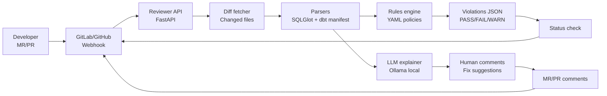

# AI Data Platform PR Gate (LLM + Rules Engine) — Blog Project Proposal

Inspired by the “AI-powered code review to enforce naming standards” idea (Git platform + local LLM + FastAPI), but expanded into a **data-platform-quality gate** that reviews **SQL + dbt + migrations + data contracts** before merge.

## 1) One-line pitch

Build a GitHub/GitLab bot that reviews data changes (SQL/dbt/migrations) and blocks merges when they violate **naming**, **schema evolution**, **PII**, **performance**, and **data contract** rules—using a hybrid approach: **deterministic parsing + LLM explanations**.

## 2) The problem (what teams struggle with)

In real data teams, many incidents come from “small” PR mistakes:
- Columns named inconsistently (`createdAt`, `Created_At`, `created_at`)
- Breaking schema changes (`int` → `string`, dropping columns without deprecation)
- PII leaks (adding `email` or `phone` without masking/tagging)
- Cost explosions (unbounded queries, missing partition filters)
- Missing ownership/docs (nobody knows who owns a table)

Classic linters help, but they often:
- miss **intent** (“is this column actually PII?”)
- produce confusing feedback
- don’t understand cross-file context (dbt model + YAML + SQL + migrations)

## 3) The solution (high level)

### Hybrid reviewer approach

- **Deterministic layer (rules engine)**:
  - parse SQL/dbt configs reliably
  - enforce hard rules (pass/fail)
  - produce structured violations

- **LLM layer (explainer + smart checks)**:
  - turns violations into human-friendly comments
  - detects “soft issues” (ambiguous columns, unclear naming, risky migrations)
  - proposes concrete fixes (renames, docstrings, tests)

### Why hybrid is better than “LLM-only”

If you rely only on an LLM:
- you risk false positives/negatives
- you can’t guarantee deterministic policy enforcement

If you rely only on rules:
- feedback feels robotic
- reviewers don’t learn the “why”

This project combines both: **rules decide**, **LLM explains**.

## 4) What it reviews (scope)

### Files
- SQL (`.sql`)
- dbt models + configs (`models/**/*.sql`, `schema.yml`)
- warehouse migrations (Flyway/Liquibase/SQL migrations)
- optional: Iceberg/Delta/Hudi table DDL conventions

### Rule categories (with concrete examples)

#### A) Naming standards (hard rules)
- enforce `snake_case` for columns and tables
- forbid ambiguous names: `value`, `data`, `misc`, `tmp`
- timestamp conventions:
  - event time: `event_ts`
  - ingestion time: `ingested_at`

**Example comment**:
> ❌ Column `CreatedAt` violates naming rule. Rename to `created_at`.

#### B) Schema evolution safety (hard rules + LLM guidance)
- forbid dropping columns without a deprecation window
- forbid type changes that break readers (configurable)
- require backfill plan when adding NOT NULL columns

**Example**:
> ❌ `ALTER TABLE users ALTER COLUMN age TYPE string` is risky. Prefer adding a new column `age_str`, backfill, then swap.

#### C) PII / compliance guardrails (hard rules)
- detect likely PII columns (email, phone, national_id, address)
- require tagging in dbt YAML (e.g., `meta: { pii: true }`)
- require masking/encryption policy reference

**Example**:
> ❌ Added column `email`. Missing `pii: true` tag + masking strategy.

#### D) Performance/cost linting (warnings or blocking)
- warn on `SELECT *`
- warn on joins without join keys
- warn on missing partition filters for large partitioned tables

**Example**:
> ⚠️ Query reads partitioned table `events` without filtering `event_date`. Add `WHERE event_date >= ...`.

#### E) Data contracts + documentation (hard rules for prod models)
- require `description`, `owner`, `sla/freshness`
- require tests for keys (`unique`, `not_null`)

**Example**:
> ❌ Model `fct_orders` missing owner + description in `schema.yml`.

## 5) Architecture (simple)

### Data flow

1. Developer opens an MR/PR
2. Git platform triggers webhook
3. Reviewer service fetches diff + changed files
4. Parser builds an “analysis bundle”
5. Rules engine runs deterministic checks
6. LLM generates helpful explanations + suggested fixes
7. Service posts comments + sets pass/fail status

### Diagram (GitHub-safe Mermaid)



## 6) Tech stack (recommended)

### Core
- **FastAPI**: webhook receiver + API
- **Ollama**: local LLM for explanations (privacy-friendly)
- **SQLGlot**: parse SQL to AST (more robust than regex)
- **dbt**:
  - read `manifest.json` (or parse project structure)
  - enforce YAML metadata/tests

### Optional “upgrade” tech (makes the blog more impressive)
- **OPA (Open Policy Agent)**: express policies in Rego for enterprise-style rules
- **Great Expectations**: auto-generate/validate expectations from schema changes
- **OpenTelemetry** + **Grafana**: track violation rates and “policy debt”
- **Redis** cache: speed up repeated diffs in CI

## 7) MVP you can build in 1–2 weekends

### MVP features
- GitHub *or* GitLab webhook integration
- Diff fetch + changed file extraction
- Deterministic checks:
  - snake_case column naming
  - forbid `SELECT *`
  - require `description` + `owner` in `schema.yml` for modified models
- LLM comment generator:
  - summarize issues in a friendly tone
  - propose exact fixes (“rename X to Y”, “add YAML snippet”)
- Post:
  - PR comment (summary)
  - status check (pass/fail)

### MVP demo scenario (for your blog)
1. PR adds a new model with `CreatedAt` and `email`
2. Bot comments:
   - rename to `created_at`
   - tag `email` as PII + require masking note
   - add dbt tests
3. After fixes, status turns green

## 8) Stretch goals (to make it “enterprise-grade”)

- **Schema evolution engine** (detect breaking changes across migrations)
- **Contract diff view**: show “before vs after” schema in PR
- **Learning mode**: warn-only for 2 weeks, then enforce
- **Policy-as-code**: repo-level `policies.yml` with overrides per team
- **Multi-warehouse support**:
  - Snowflake/BigQuery/Redshift
  - Lakehouse (Iceberg) conventions

## 9) How you’ll measure success (simple metrics)

- % of PRs blocked for real issues (should drop over time)
- number of PII violations caught pre-merge
- reduction in production incidents caused by schema changes
- faster review cycles (less back-and-forth on style/standards)

## 10) Repo structure (suggested)

```
ai-data-platform-pr-gate/
  app/
    main.py                 # FastAPI webhook
    git/
      github.py             # PR fetch + comments
      gitlab.py
    parsing/
      sql_parser.py         # SQLGlot AST
      dbt_parser.py
    rules/
      engine.py
      policies.example.yml
    llm/
      ollama_client.py
      prompts/
        review_comment.md
  tests/
  docker/
  README.md
```

## 11) Risks + how to handle them

- **False positives**: start with warn-only mode; add allowlist overrides.
- **LLM hallucination**: rules engine is the source of truth; LLM only explains.
- **Performance**: analyze only changed files; cache parsed AST.
- **Security**: do not send proprietary code to external APIs; default to local Ollama.

---

## Source inspiration

- Medium: AI-powered code review enforcing standards (Git platform + Ollama + FastAPI): `https://medium.com/@shahsoumil519/ai-powered-code-review-enforce-table-column-naming-standards-with-gitlab-ollama-fastapi-28a710bc9714`


