# LiteLLM Local Models - Architecture Diagrams

This document contains interactive Mermaid diagrams that can be rendered in GitHub, GitLab, and many markdown viewers.

---

## 1. High-Level System Architecture

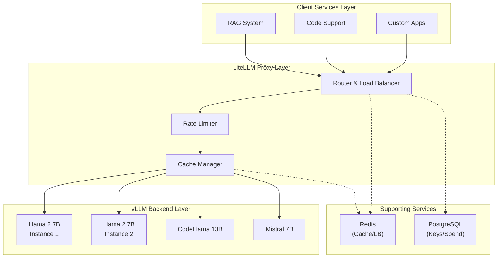

---

## 2. Component Interaction Flow

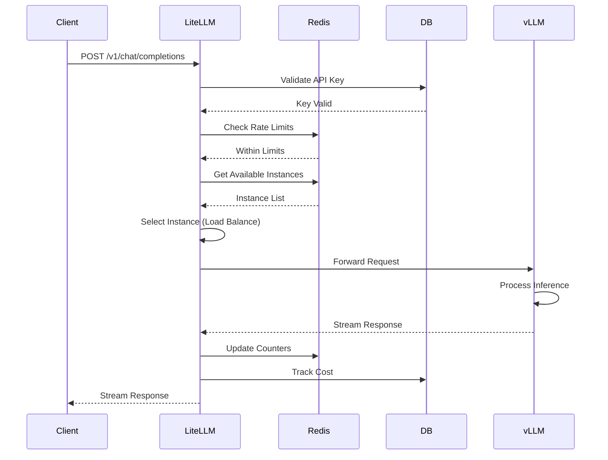

---

## 3. Load Balancing Architecture

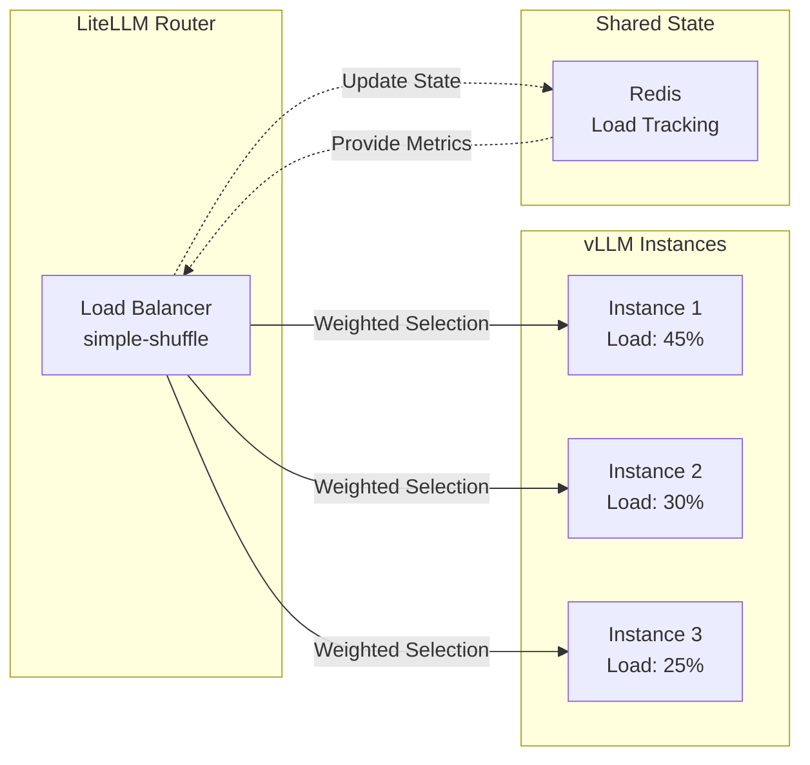

---

## 4. OpenShift Deployment Structure

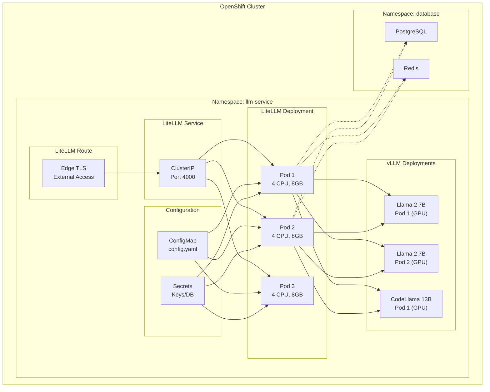

---

## 5. Request Flow Diagram

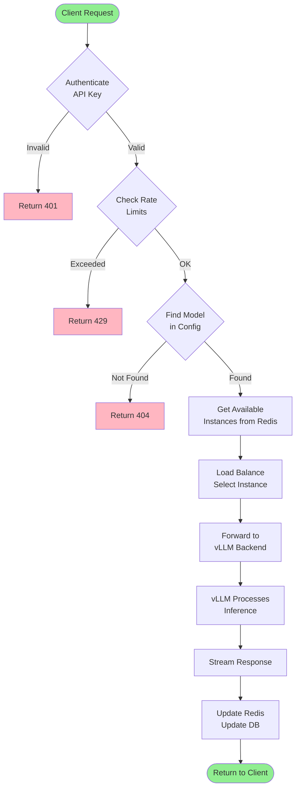

---

## 6. Failover and Resilience

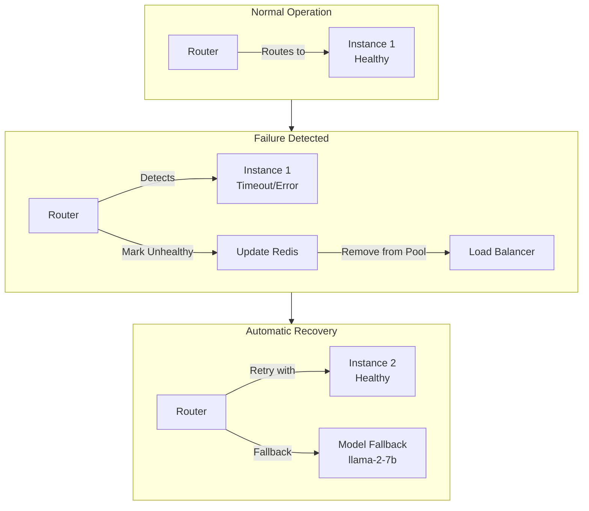

---

## 7. Caching Flow

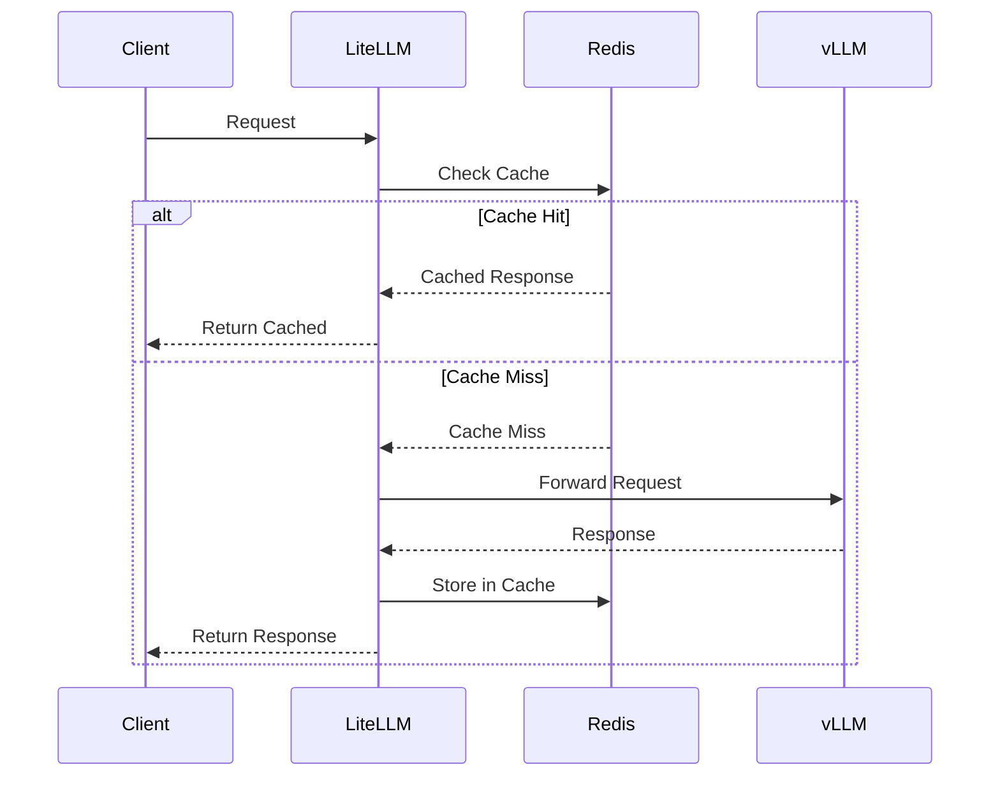

---

## 8. Network Architecture

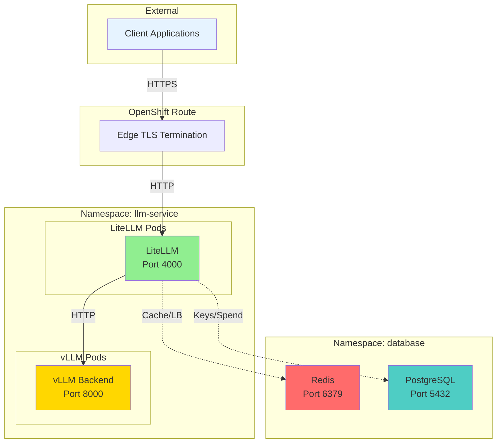

---

## 9. Data Flow - Complete Request Lifecycle

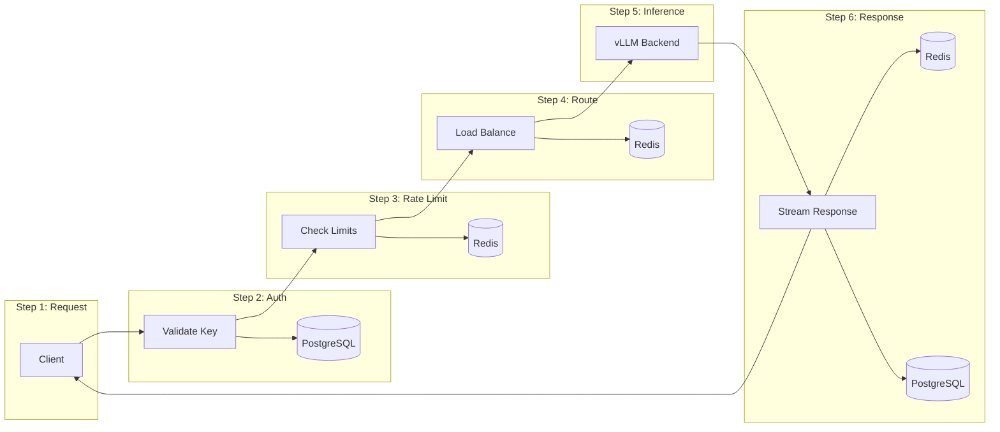

---

## 10. Health Check Architecture

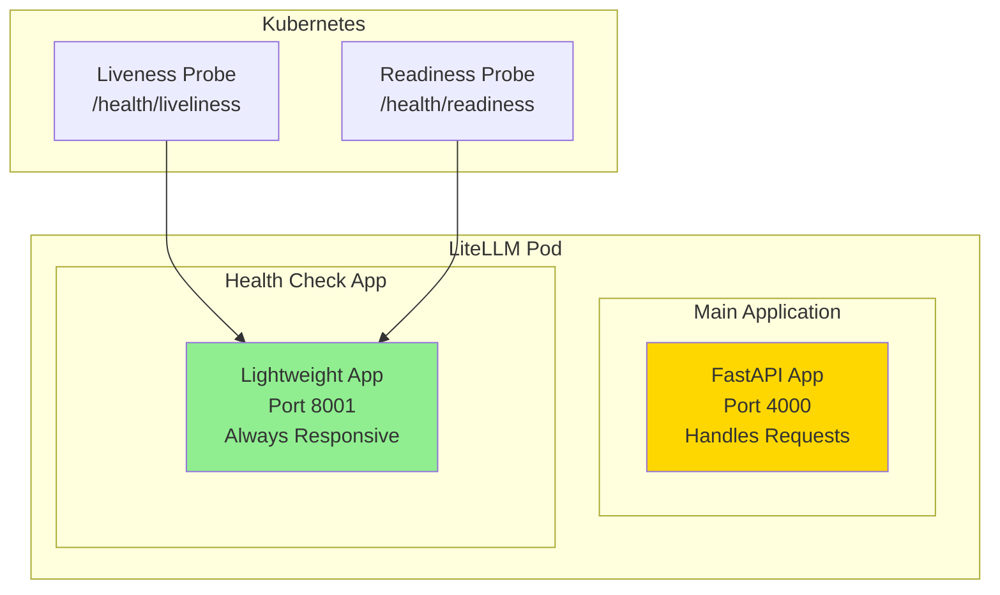

---

## 11. Model Routing Decision Tree

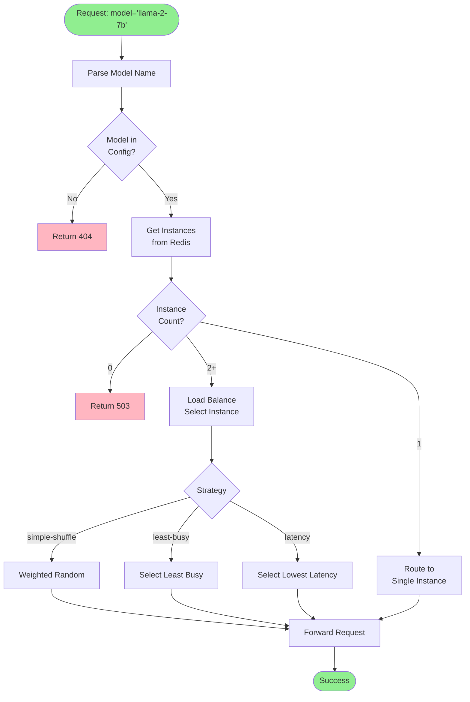

---

## 12. Scaling Architecture

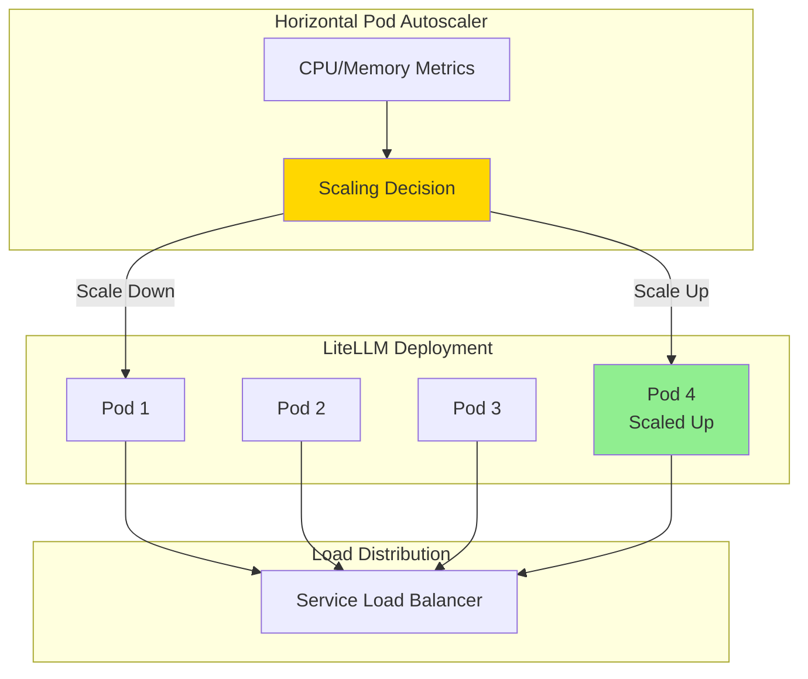

---

## How to View These Diagrams

### GitHub/GitLab
These Mermaid diagrams will render automatically in markdown files on GitHub and GitLab.

### VS Code
Install the "Markdown Preview Mermaid Support" extension.

### Online Viewers
- [Mermaid Live Editor](https://mermaid.live/)
- [Mermaid.ink](https://mermaid.ink/)

### Local Rendering
```bash
# Install Mermaid CLI
npm install -g @mermaid-js/mermaid-cli

# Render diagram
mmdc -i diagram.mmd -o diagram.png
```

---

## Diagram Legend

- **Green boxes**: Success states, healthy components
- **Yellow boxes**: Processing, active components
- **Red boxes**: Errors, failed states
- **Blue boxes**: External components, clients
- **Dashed lines**: Optional/background connections
- **Solid lines**: Direct data flow
