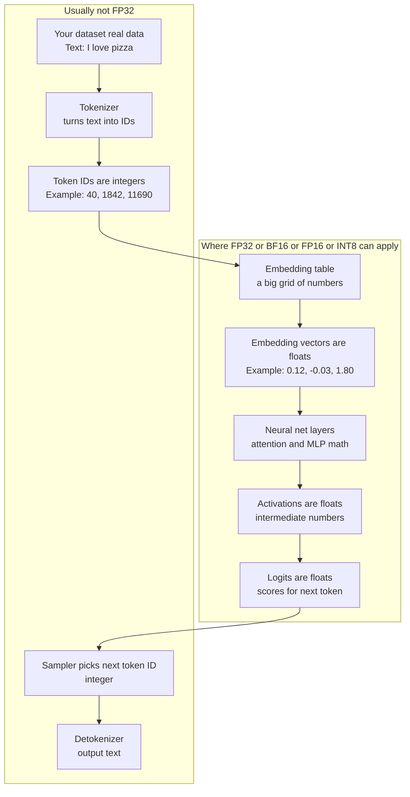
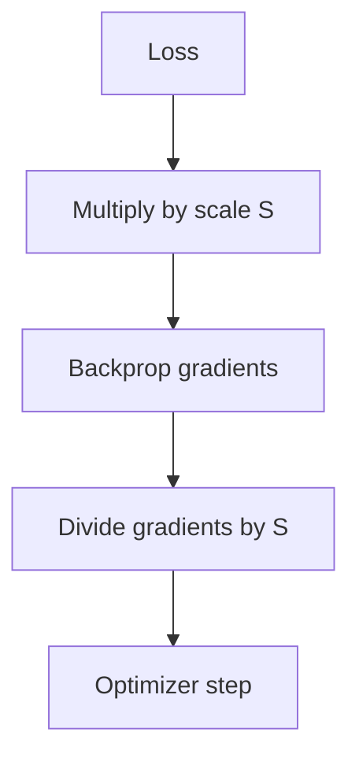

# FP32 vs FP16 vs BF16 (and INT8/INT4) — An Easy, Detailed Guide for Junior LLM Engineers

## Explain it like you’re 5 (ELI5)

### The 10-second version

- LLMs do **lots of math**.
- Numbers can be stored as **big careful numbers** (slower, bigger) or **small quick numbers** (faster, smaller).
- If numbers are too small/rough, the model can **make more mistakes**.

Imagine an LLM is a **huge kitchen** that cooks soup using numbers.

### Numbers are stored in “cups”

Computers don’t store “perfect” numbers. They store numbers using a cup that has two important parts:
- **How big the cup can be** (range)
- **How many little marks are on the cup** (precision)

```
Big cup = can hold very big / very small amounts without spilling
More marks = can measure more precisely
```

### FP32, FP16, BF16 (kid version)

- **FP32**: **big cup + many marks**
  - Very safe, very accurate
  - But heavier to carry (uses more memory)

- **FP16**: **small cup + some marks**
  - Lighter and faster
  - But it spills easily (numbers can become too big → `inf`) or disappears (too small → 0)

- **BF16**: **big cup + fewer marks**
  - Almost as safe as FP32 for “not spilling” (good range)
  - Not as precise as FP16, but usually good enough to cook the soup correctly

### Why LLMs care

- When **training** (learning), the kitchen mixes lots of ingredients and the amounts can change a lot.
  - If the cup is too small (FP16), things spill/vanish → training can break.
  - BF16 is popular because the cup is big enough to avoid many spills.

- When **inference** (just serving answers), you mostly want speed.
  - FP16/BF16 are often used because they’re faster and use less memory than FP32.

### INT8 / INT4 (super small cups)

INT8/INT4 are like using **tiny measuring spoons** instead of cups:
- very small storage (cheap!)
- can be fast
- but you lose detail, so you must be careful or the taste (quality) changes

### Quantization (ELI5)

**Quantization** means: instead of storing “smooth” numbers with millions of possible values, we store “chunky” numbers with fewer possible values.

Kid example:
- If you can only count using **0, 1, 2, 3, 4**, you can’t represent **2.7** exactly.
- So you pick the closest: **3**.

That is quantization: **rounding to fewer choices**.

Why people do it for LLMs:
- the model becomes **smaller** (cheaper to store)
- it can run **faster** (less memory to read)

Why it can hurt:
- rounding changes numbers a bit, so answers can change a bit too

### Where FP32 lives vs where text lives (ELI5 diagram)



```text
TEXT (dataset) -> tokenizer -> TOKEN IDs (integers)
                      |
                      v
        MODEL NUMBERS (floats) = weights, activations, logits
        Those floats may be stored as FP32 or BF16 or FP16
```


---

## Why this matters (the LLM reality)

Large Language Models are basically **giant math machines**:
- They multiply big matrices (very many times).
- They move huge tensors from memory to GPU cores and back.

So two things dominate your life:
- **How much memory you need** (and memory bandwidth).
- **How fast the GPU can do the math**.

**Numeric precision** (FP32, FP16, BF16, INT8, INT4…) directly affects:
- speed
- memory usage
- stability (will training diverge? will outputs degrade?)

---

## The core concept: numbers are stored with limited “space”

Computers don’t store real numbers perfectly. They store an **approximation** using a fixed number of bits.

### Floating point (FP) in one picture

A floating-point number stores:
- **sign** (positive/negative)
- **exponent** (rough magnitude / scale)
- **mantissa / fraction** (precision / detail)

ASCII diagram:

```
| sign | exponent | mantissa (fraction) |
```

**Intuition**:
- Exponent decides “how big can it get?” (dynamic range)
- Mantissa decides “how finely can it represent values?” (precision)

### Two types of numeric problems

- **Overflow**: number too big → becomes `inf`.
- **Underflow**: number too small → becomes 0 (or a “subnormal”).
- **Rounding error**: value gets rounded because mantissa can’t represent all digits.

---

## FP32 (float32): the safe default

### What it is
FP32 is the classic IEEE-754 32-bit float:

```
sign:     1 bit
exponent: 8 bits
mantissa: 23 bits
```

### What it means
- **Large dynamic range** (thanks to 8 exponent bits)
- **Good precision** (23 mantissa bits)

### In LLM terms
- Training in pure FP32 is **stable**, but expensive.
- Memory cost is high: **4 bytes per number**.

Example:
- A 7B-parameter model in FP32 weights alone is roughly:
  - 7e9 params × 4 bytes ≈ **28 GB** (just weights)

---

## FP16 (float16): faster + smaller, but smaller range

### What it is
IEEE-754 half precision:

```
sign:     1 bit
exponent: 5 bits
mantissa: 10 bits
```

### What it means
- **Much less dynamic range** than FP32 (only 5 exponent bits)
- Less precision (10 mantissa bits)
- Memory: **2 bytes per number** (half of FP32)

### Why FP16 can break training
FP16’s smaller exponent range makes it easier to overflow/underflow.

In training, gradients and activations can vary a lot in magnitude.
- Some values become too small → underflow → gradients become 0
- Some values become too big → overflow → `inf` → loss becomes `nan`

### The classic fix: Mixed Precision + Loss Scaling
Most modern training is **mixed precision**:
- store many tensors in **FP16/BF16** for speed and memory
- do some critical math (often accumulation) in **FP32**

**Loss scaling** idea (simple):
- multiply the loss by a large scale `S`
- gradients become bigger (less underflow)
- after backprop, divide gradients by `S`

Mermaid sketch:



### Where FP16 shines
- Inference on GPUs that support fast FP16 (Tensor Cores)
- Training when you use mixed precision carefully

---

## BF16 (bfloat16): FP16’s “range” with less precision

BF16 is popular for training because it changes the bit split:

```
sign:     1 bit
exponent: 8 bits
mantissa: 7 bits
```

### The key point
BF16 keeps the **same exponent bits as FP32 (8)**.
- So it has **similar dynamic range** to FP32.
- But it has **less precision** than FP16 (7 vs 10 mantissa bits).

### Why BF16 is great for training
Training stability often depends more on **range** than on ultra-fine precision.
So BF16 tends to:
- avoid many FP16 overflow/underflow issues
- reduce need for aggressive loss scaling

### Tradeoff
- BF16 has coarser precision (more rounding)
- But for many deep learning workloads, it’s “good enough” and stable

---

## FP16 vs BF16: the simplest comparison

Think of it like this:

- **FP16**: more precision detail, but smaller safe range
- **BF16**: larger safe range, but less detail

### Practical LLM rule of thumb
- **Training**: BF16 is often preferred (if hardware supports it)
- **Inference**: FP16 is common (and INT8/INT4 for compression)

Table:

| Format | Bits | Exponent bits | Mantissa bits | Range (rough) | Precision (rough) | Typical use |
|---|---:|---:|---:|---|---|---|
| FP32 | 32 | 8 | 23 | high | high | baseline, sensitive ops |
| FP16 | 16 | 5 | 10 | lower | medium | inference + mixed training |
| BF16 | 16 | 8 | 7  | high | lower | training (stable) |

---

## What actually runs on GPUs: multiply vs accumulate

In neural nets, you do a lot of:

\[
C = A \times B
\]

But internally this is many multiply-adds:

\[
\text{sum} = \sum_i a_i \cdot b_i
\]

### Why accumulation precision matters
Even if each multiply uses FP16/BF16, the **sum** can grow and needs stability.

Common practice:
- multiply in FP16/BF16
- accumulate in FP32

This is one reason mixed precision works so well.

---

## TF32 (you’ll see it on NVIDIA)

TF32 is a Tensor Core mode that behaves like:
- FP32 range (8-bit exponent)
- reduced mantissa precision (roughly 10-bit mantissa behavior)

It’s mainly about speeding up FP32-like training while keeping range.

(You may see this when training with “FP32” settings but getting Tensor Core speedups.)

---

## INT8 and INT4: quantization for inference

Floating point is flexible, but **integers are smaller and faster**.
Quantization stores weights/activations using fewer bits.

### INT8 (8-bit)
- good quality for many models
- widely supported by inference runtimes

### INT4 (4-bit)
- much smaller models
- can be tricky: needs careful quantization methods to keep quality

### What quantization really does
Instead of storing a float weight `w`, you store an integer `q` plus a scale:

\[
 w \approx s \cdot q
\]

Where:
- `q` is INT8 or INT4
- `s` is a float scale (per-tensor, per-channel, etc.)

Mermaid sketch:

```mermaid
flowchart LR
  W[FP weights] --> Q[Quantize<br/>to INT8/INT4]
  Q --> S[Store scale(s)]
  Q --> DQ[Dequantize on the fly]
  S --> DQ
  DQ --> MM[Matmul]
```

### Why this speeds up inference
- weights are smaller → fit in GPU memory better
- less memory bandwidth → often the real bottleneck

### Common LLM inference “precision ladder”
- FP16/BF16: high quality, faster than FP32
- INT8: big speed/memory wins, usually good quality
- INT4: maximum compression, quality depends on method and model

---

## How precision impacts LLM training (what you feel day-to-day)

### 1) Memory footprint
Training uses memory for:
- weights
- gradients
- optimizer states (often 2×–8× weights depending on optimizer)
- activations (can dominate)

Reducing precision can be the difference between:
- “fits on 1 GPU” vs “needs multiple GPUs”

### 2) Speed (Tensor Cores)
Modern GPUs have special hardware for low-precision matrix multiply.
So FP16/BF16 can be **much faster** than FP32.

### 3) Stability
Lower precision increases risk of:
- `nan` loss
- gradient underflow
- training divergence

That’s why BF16 is popular (good range) and why accumulation often stays FP32.

---

## How precision impacts LLM inference (what you care about)

### 1) Latency and throughput
- smaller precision → faster matmuls + less memory traffic

### 2) Cost
- smaller models → more concurrent users per GPU

### 3) Output quality
Quantization can slightly change outputs.
For a blog demo, you can show:
- perplexity difference
- or a small evaluation set comparison

---

## A junior-friendly decision guide

### If you are training from scratch
- Prefer **BF16 mixed precision** if your GPU supports it.
- Keep **optimizer states** in FP32 (common).

### If you are fine-tuning
- BF16 is a strong default.
- If you see instability in FP16, switch to BF16 or add loss scaling.

### If you are deploying inference
- Start with **FP16/BF16**.
- If you need cheaper serving, try **INT8**.
- If you need maximum compression, try **INT4** (validate quality!).

---

## Mini glossary

- **Dynamic range**: how big/small numbers can be before overflow/underflow.
- **Precision**: how many distinct values you can represent between two numbers.
- **Mixed precision**: use low precision for speed/memory, higher precision for stability-critical parts.
- **Loss scaling**: multiply loss to avoid gradient underflow in FP16.
- **Quantization**: represent floats using ints + scale(s) to reduce size and speed up inference.

---

## Quick mental picture (range vs precision)

```
More exponent bits  => bigger safe range (fewer inf/0 issues)
More mantissa bits  => finer precision (less rounding error)

FP16:  exponent small, mantissa bigger
BF16:  exponent big,   mantissa smaller
FP32:  exponent big,   mantissa big
```

---

## Source note

This article is a simplified educational write-up. If you want, tell me what GPU you use (A10, T4, A100, H100, etc.) and what you’re doing (training vs inference), and I can add a small “recommended settings” section tailored to your setup.
