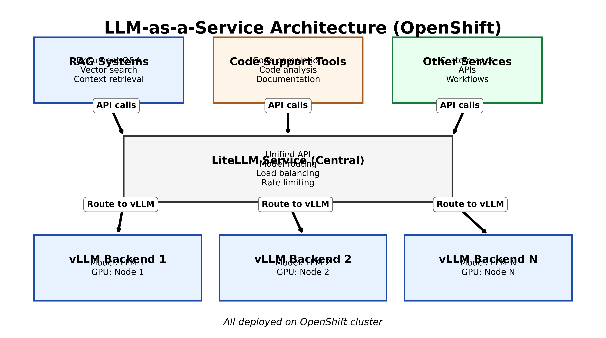
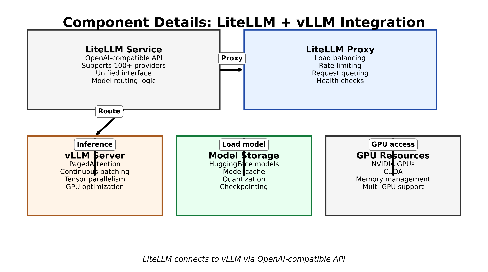
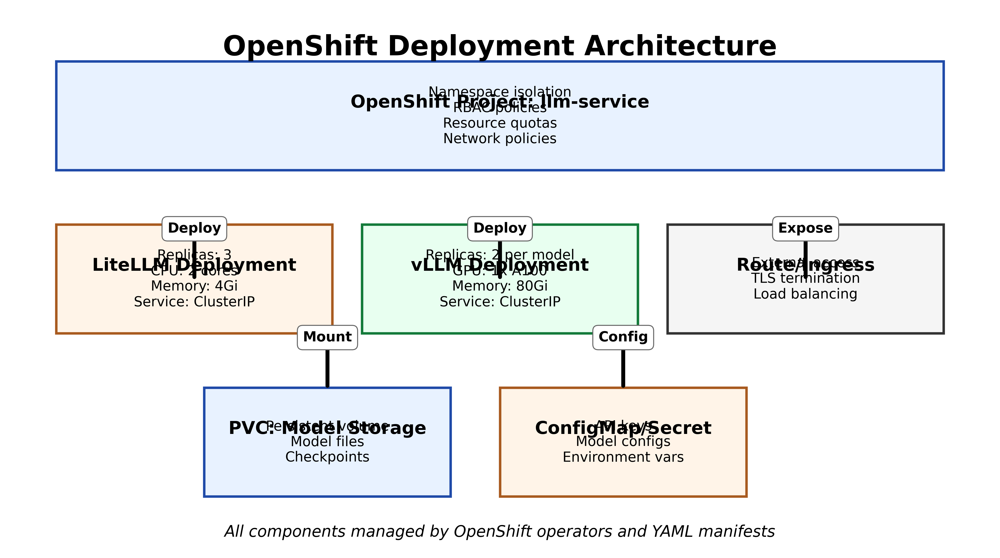

# LLM-as-a-Service Architecture: LiteLLM + vLLM on OpenShift

## Executive Summary

This document describes the architecture for a centralized **LLM-as-a-Service** system using **LiteLLM** as the unified API gateway and **vLLM** as the high-performance inference engine. The system will serve multiple client services (RAG systems, code support tools, and other applications) and is designed for deployment on **OpenShift**.

---

## 1) What is LiteLLM?

**LiteLLM** is a Python library that provides a **unified interface** to 100+ LLM providers (OpenAI, Anthropic, HuggingFace, local models, etc.).

**Key features**

- **OpenAI-compatible API**: Your services call LiteLLM as if it were OpenAI
- **Provider abstraction**: Switch models/providers without changing client code
- **Model routing**: Route requests to different backends based on model name
- **Load balancing**: Distribute requests across multiple vLLM instances
- **Rate limiting**: Built-in rate limiting and request queuing
- **Cost tracking**: Track usage and costs across providers

**Why use LiteLLM?**

Instead of each service integrating directly with vLLM or different providers, LiteLLM acts as a **central gateway**:
- **Consistency**: All services use the same API
- **Flexibility**: Change backends without touching client code
- **Observability**: Centralized logging and monitoring
- **Cost control**: Centralized rate limiting and usage tracking

---

## 2) What is vLLM?

**vLLM** is a high-performance LLM inference engine developed by UC Berkeley.

**Key features**

- **PagedAttention**: Efficient memory management for KV cache
- **Continuous batching**: Process multiple requests in parallel
- **Tensor parallelism**: Split models across multiple GPUs
- **High throughput**: 10-24x faster than HuggingFace Transformers
- **OpenAI-compatible API**: Works with LiteLLM out of the box

**Why use vLLM?**

- **Speed**: Much faster inference than standard HuggingFace
- **Efficiency**: Better GPU utilization
- **Scalability**: Handles many concurrent requests
- **Compatibility**: OpenAI-compatible API makes integration easy

---

## 3) System Architecture Overview

****

**High-level flow**

1. **Client services** (RAG, code tools, etc.) make API calls to LiteLLM
2. **LiteLLM** routes requests to appropriate vLLM backend(s)
3. **vLLM** runs inference on GPU nodes
4. **Responses** flow back through LiteLLM to clients

**Components**

- **LiteLLM Service**: Central API gateway (stateless, horizontally scalable)
- **vLLM Backends**: Model inference engines (GPU-required, can scale per model)
- **Client Services**: RAG systems, code support tools, custom applications

---

## 4) Component Details: LiteLLM + vLLM Integration

****

**LiteLLM configuration**

**LiteLLM connects to vLLM using the OpenAI-compatible API:**

**```yaml**
# config.yaml
**model_list:**
**  - model_name: llama-2-7b**
**    litellm_params:**
**      model: openai/vllm-llama-2-7b**
**      api_base: http://vllm-backend-1:8000/v1**
**      api_key: dummy-key**
**  **
**  - model_name: codellama-13b**
**    litellm_params:**
**      model: openai/vllm-codellama-13b**
**      api_base: http://vllm-backend-2:8000/v1**
**      api_key: dummy-key**
**```**

**vLLM server setup**

**vLLM runs as a standalone server:**

**```bash**
**python -m vllm.entrypoints.openai.api_server \**
**  --model /models/llama-2-7b \**
**  --tensor-parallel-size 2 \**
**  --gpu-memory-utilization 0.9 \**
**  --port 8000**
**```**

**How they connect**

**- LiteLLM treats vLLM as an "OpenAI provider"**
**- vLLM exposes `/v1/chat/completions` endpoint**
**- LiteLLM routes requests based on model name**
**- vLLM handles batching and GPU inference**

---

## 5) OpenShift Deployment Architecture

****

**Namespace structure**

**Create a dedicated OpenShift project:**

**```bash**
**oc new-project llm-service**
**```**

**Key OpenShift resources**

**1) LiteLLM Deployment**

**```yaml**
**apiVersion: apps/v1**
**kind: Deployment**
**metadata:**
**  name: litellm-service**
**  namespace: llm-service**
**spec:**
**  replicas: 3**
**  selector:**
**    matchLabels:**
**      app: litellm**
**  template:**
**    metadata:**
**      labels:**
**        app: litellm**
**    spec:**
**      containers:**
**      - name: litellm**
**        image: ghcr.io/berriai/litellm:latest**
**        ports:**
**        - containerPort: 4000**
**        resources:**
**          requests:**
**            cpu: "2"**
**            memory: 4Gi**
**          limits:**
**            cpu: "4"**
**            memory: 8Gi**
**        env:**
**        - name: CONFIG_FILE_PATH**
**          value: "/config/config.yaml"**
**        volumeMounts:**
**        - name: config**
**          mountPath: /config**
**      volumes:**
**      - name: config**
**        configMap:**
**          name: litellm-config**
**```**

**2) vLLM Deployment (GPU-required)**

**```yaml**
**apiVersion: apps/v1**
**kind: Deployment**
**metadata:**
**  name: vllm-backend-llama-2-7b**
**  namespace: llm-service**
**spec:**
**  replicas: 2**
**  selector:**
**    matchLabels:**
**      app: vllm**
**      model: llama-2-7b**
**  template:**
**    metadata:**
**      labels:**
**        app: vllm**
**        model: llama-2-7b**
**    spec:**
**      containers:**
**      - name: vllm**
**        image: vllm/vllm-openai:latest**
**        command:**
**        - python**
**        - -m**
**        - vllm.entrypoints.openai.api_server**
**        args:**
**        - --model**
**        - /models/llama-2-7b**
**        - --tensor-parallel-size**
**        - "2"**
**        - --port**
**        - "8000"**
**        resources:**
**          requests:**
**            nvidia.com/gpu: 1**
**            memory: 80Gi**
**          limits:**
**            nvidia.com/gpu: 1**
**            memory: 100Gi**
**        volumeMounts:**
**        - name: models**
**          mountPath: /models**
**      volumes:**
**      - name: models**
**        persistentVolumeClaim:**
**          claimName: model-storage-pvc**
**      nodeSelector:**
**        accelerator: nvidia-tesla-a100**
**```**

**3) Services**

**```yaml**
**apiVersion: v1**
**kind: Service**
**metadata:**
**  name: litellm-service**
**  namespace: llm-service**
**spec:**
**  selector:**
**    app: litellm**
**  ports:**
**  - port: 4000**
**    targetPort: 4000**
**  type: ClusterIP**
**```**

**4) Route (external access)**

**```yaml**
**apiVersion: route.openshift.io/v1**
**kind: Route**
**metadata:**
**  name: litellm-route**
**  namespace: llm-service**
**spec:**
**  to:**
**    kind: Service**
**    name: litellm-service**
**  port:**
**    targetPort: 4000**
**  tls:**
**    termination: edge**
**```**

**5) Persistent Volume for models**

**```yaml**
**apiVersion: v1**
**kind: PersistentVolumeClaim**
**metadata:**
**  name: model-storage-pvc**
**  namespace: llm-service**
**spec:**
**  accessModes:**
**  - ReadWriteMany**
**  resources:**
**    requests:**
**      storage: 500Gi**
**```**

---

## 6) Client Integration: RAG Systems

**RAG (Retrieval-Augmented Generation) systems can call LiteLLM:**

**```python**
**import openai**

# Point to LiteLLM instead of OpenAI
**client = openai.OpenAI(**
**    api_key="dummy-key",**
**    base_url="http://litellm-service.llm-service.svc.cluster.local:4000"**
**)**

# Use as normal OpenAI client
**response = client.chat.completions.create(**
**    model="llama-2-7b",**
**    messages=[**
**        {"role": "system", "content": "You are a helpful assistant."},**
**        {"role": "user", "content": f"Context: {retrieved_docs}\n\nQuestion: {user_query}"}**
**    ]**
**)**
**```**

**Benefits**:
**- RAG systems don't need to know about vLLM**
**- Can switch models without code changes**
**- Centralized rate limiting and monitoring**

---

## 7) Client Integration: Code Support Tools

**Code support tools (completion, analysis, documentation) can use LiteLLM:**

**```python**
**import openai**

**client = openai.OpenAI(**
**    api_key="dummy-key",**
**    base_url="http://litellm-service.llm-service.svc.cluster.local:4000"**
**)**

# Code completion
**response = client.chat.completions.create(**
**    model="codellama-13b",**
**    messages=[**
**        {"role": "user", "content": f"Complete this code:\n{code_context}"}**
**    ],**
**    temperature=0.2**
**)**
**```**

**Benefits**:
**- Use code-specific models (CodeLlama) via same API**
**- LiteLLM routes to appropriate vLLM backend**
**- Consistent interface across all tools**

---

## 8) Scaling and Performance

**Horizontal scaling**

- **LiteLLM**: Stateless, scale replicas based on request volume
- **vLLM**: Scale per model (each model can have multiple replicas)

**GPU considerations**

**- vLLM requires GPUs (NVIDIA A100, H100, etc.)**
**- Use OpenShift node selectors to schedule on GPU nodes**
**- Consider GPU memory utilization (0.9 = 90% of GPU memory)**

**Load balancing**

**- LiteLLM can route to multiple vLLM backends**
**- OpenShift Service provides load balancing**
**- LiteLLM proxy can do advanced routing**

---

## 9) Monitoring and Observability

**Key metrics**

- **LiteLLM**: Request rate, latency, error rate, model usage
- **vLLM**: GPU utilization, throughput (tokens/sec), queue length
- **OpenShift**: Pod health, resource usage, network traffic

**Logging**

**- Centralized logging via OpenShift logging stack**
**- LiteLLM logs: request/response, model routing decisions**
**- vLLM logs: inference timing, GPU stats**

**Health checks**

**```yaml**
**livenessProbe:**
**  httpGet:**
**    path: /health**
**    port: 4000**
**  initialDelaySeconds: 30**
**readinessProbe:**
**  httpGet:**
**    path: /health**
**    port: 4000**
**  initialDelaySeconds: 10**
**```**

---

## 10) Security Considerations

**Network policies**

**Restrict traffic between namespaces:**

**```yaml**
**apiVersion: networking.k8s.io/v1**
**kind: NetworkPolicy**
**metadata:**
**  name: litellm-policy**
**  namespace: llm-service**
**spec:**
**  podSelector:**
**    matchLabels:**
**      app: litellm**
**  ingress:**
**  - from:**
**    - namespaceSelector:**
**        matchLabels:**
**          name: rag-systems**
**    - namespaceSelector:**
**        matchLabels:**
**          name: code-tools**
**```**

**API keys**

**- Use OpenShift Secrets for API keys**
**- LiteLLM can validate API keys**
**- Rotate keys regularly**

**RBAC**

**- Limit who can deploy/modify LLM services**
**- Use OpenShift RBAC for namespace access**

---

## 11) Cost Optimization

**Model selection**

**- Use smaller models for simple tasks**
**- Reserve large models for complex queries**
**- LiteLLM routing can help here**

**GPU utilization**

**- Monitor GPU usage**
**- Right-size vLLM deployments**
**- Use quantization (INT8, INT4) to reduce memory**

**Request batching**

**- vLLM's continuous batching improves throughput**
**- Batch similar requests when possible**

---

## 12) Deployment Checklist

**- [ ] Create OpenShift project/namespace**
**- [ ] Set up GPU nodes (if not already available)**
**- [ ] Create PersistentVolumeClaim for models**
**- [ ] Download/prepare model files**
**- [ ] Create ConfigMap for LiteLLM config**
**- [ ] Deploy vLLM backends (one per model)**
**- [ ] Deploy LiteLLM service**
**- [ ] Create Services and Routes**
**- [ ] Configure network policies**
**- [ ] Set up monitoring/logging**
**- [ ] Test client integrations**
**- [ ] Load test and tune scaling**

---

## 13) Troubleshooting Common Issues

**vLLM out of memory**

**- Reduce `--gpu-memory-utilization`**
**- Use smaller models or quantization**
**- Increase GPU memory allocation**

**LiteLLM can't reach vLLM**

**- Check Service DNS names**
**- Verify network policies**
**- Check vLLM pod logs**

**Slow inference**

**- Check GPU utilization**
**- Verify tensor parallelism settings**
**- Monitor queue length in vLLM**

**High latency**

**- Check network between LiteLLM and vLLM**
**- Verify load balancing**
**- Consider colocating LiteLLM and vLLM**

---

## 14) Future Enhancements

- **Model caching**: Cache frequently used models
- **Auto-scaling**: Scale vLLM based on queue length
- **Multi-region**: Deploy across multiple OpenShift clusters
- **A/B testing**: Route traffic to different models
- **Cost tracking**: Detailed per-service cost breakdown

---

## Conclusion

This architecture provides a **centralized, scalable LLM-as-a-Service** solution using LiteLLM and vLLM on OpenShift. Key benefits:

- **Unified API**: All services use the same interface
- **High performance**: vLLM provides fast inference
- **Scalability**: Horizontal scaling of both components
- **Flexibility**: Easy to add new models or change backends
- **Observability**: Centralized monitoring and logging

**The system is production-ready and can serve multiple client services efficiently.**
