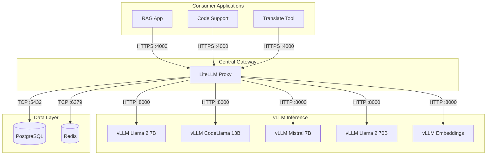
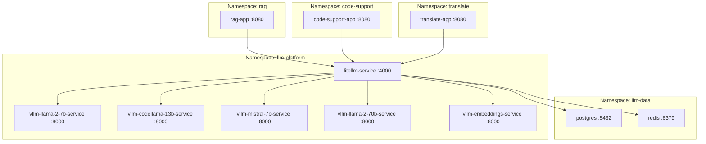
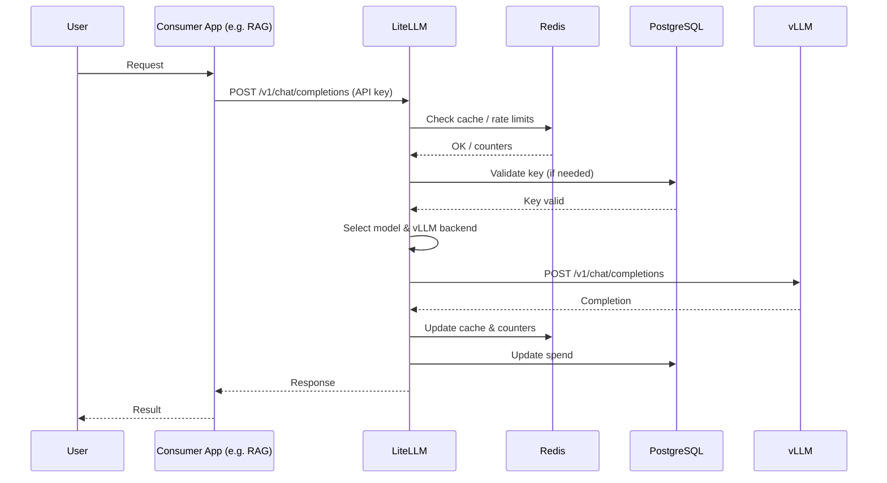
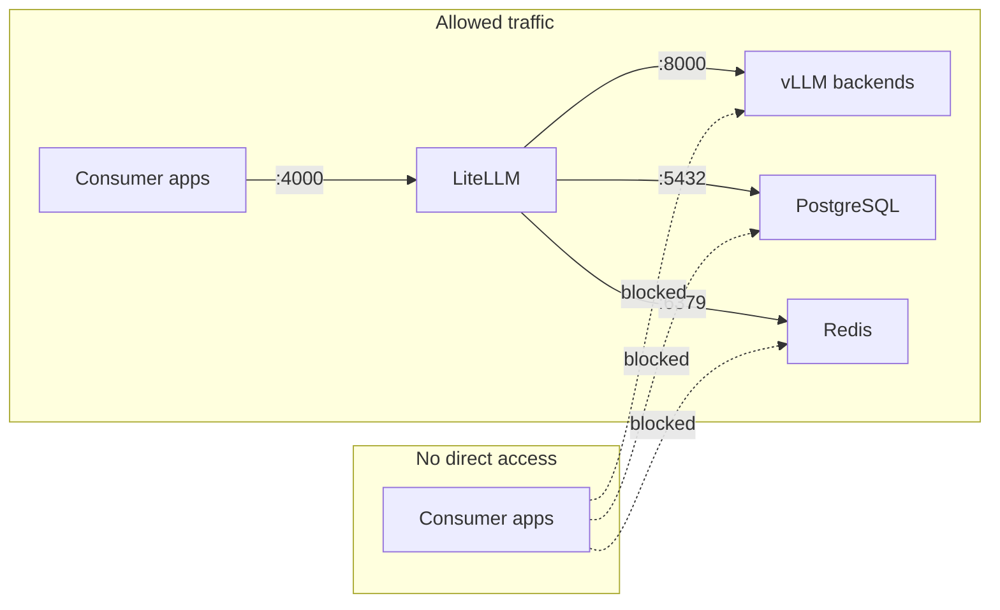
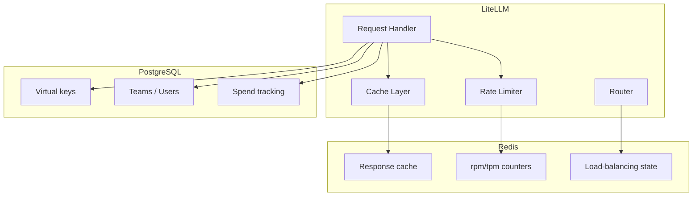
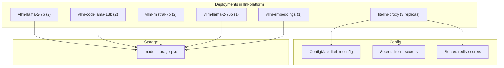

# 6. Architecture Diagrams — Central LLM Platform

Mermaid diagrams for the full on-prem OpenShift architecture with LiteLLM, vLLM, PostgreSQL, and Redis.

---

## 6.1 High-Level — Layers and Service Arrays

---

## 6.2 OpenShift Namespaces and Services

---

## 6.3 Communication Flow — Single Request

---

## 6.4 Network Policies — Allowed Directions

---

## 6.5 Data Flow — Redis and PostgreSQL

---

## 6.6 Deployment Array — llm-platform

---

## 6.7 Full System — Services in Arrays (Summary)

| Layer        | Services (array) |
|-------------|-------------------|
| Consumers   | rag-app, code-support-app, translate-app |
| Gateway     | litellm-service |
| vLLM        | vllm-llama-2-7b-service, vllm-codellama-13b-service, vllm-mistral-7b-service, vllm-llama-2-70b-service, vllm-embeddings-service |
| Data        | postgres, redis |

All details: [01-architecture-overview.md](./01-architecture-overview.md), [02-services-inventory.md](./02-services-inventory.md), [03-communication-matrix.md](./03-communication-matrix.md).
