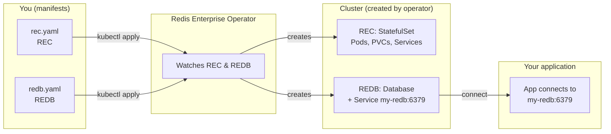

# Redis Enterprise Operator — How to Deploy and Most Important Variables

This document explains how to deploy the **Redis Enterprise operator** (on Kubernetes and OpenShift) and which variables matter most when installing the operator and when creating **Redis Enterprise clusters (REC)** and **Redis Enterprise databases (REDB)**.

---

## Table of Contents

1. [What Is the Redis Enterprise Operator?](#1-what-is-the-redis-enterprise-operator)
2. [Prerequisites](#2-prerequisites)
3. [How to Deploy the Operator](#3-how-to-deploy-the-operator)
4. [Most Important Variables](#4-most-important-variables)
5. [After the Operator Is Installed](#5-after-the-operator-is-installed)
6. [Summary](#6-summary)
7. [Junior-Friendly: What Are REC and REDB? Diagrams and Examples](#7-junior-friendly-what-are-rec-and-redb-diagrams-and-examples)

---

## 1. What Is the Redis Enterprise Operator?

The **Redis Enterprise operator** runs inside your Kubernetes or OpenShift cluster and manages **Redis Enterprise**:

- It watches two main **custom resources**: **RedisEnterpriseCluster (REC)** and **RedisEnterpriseDatabase (REDB)**.
- When you create a **REC**, the operator deploys a Redis Enterprise cluster (the control plane and data nodes).
- When you create a **REDB**, the operator creates a Redis database on that REC (the actual Redis instance your apps connect to).

So: **install the operator once → create REC (cluster) → create REDB (database) → connect your apps to the REDB.**

---

## 2. Prerequisites

Before deploying:

- **Kubernetes** (or OpenShift) in a [supported distribution](https://redis.io/docs/latest/operate/kubernetes/reference/supported_k8s_distributions/).
- **At least three worker nodes** (REC requires a minimum of 3 nodes).
- **kubectl** (or **oc** on OpenShift) and, for Helm installs, **Helm 3.10+**.
- **File descriptor limits** of at least 100,000 on the nodes (many clouds already meet this; otherwise enable [automatic resource adjustment](https://redis.io/docs/latest/operate/kubernetes/security/allow-resource-adjustment/) or set limits manually).
- **OpenShift only (older versions):** For Redis Enterprise 6.2.18-41 or earlier, install the required **security context constraint (SCC)** before installing the operator.

---

## 3. How to Deploy the Operator

You can deploy the Redis Enterprise operator in three main ways: **Helm**, **OpenShift OperatorHub**, or **bundle (plain YAML)**.

### 3.1 Deploy with Helm (Kubernetes or OpenShift)

Helm is the recommended way for standard Kubernetes and is also supported on OpenShift.

1. **Add the Redis Helm repo and refresh:**
   ```bash
   helm repo add redis https://helm.redis.io
   helm repo update
   ```

2. **Install the operator in a dedicated namespace:**
   ```bash
   export RELEASE_NAME=redis-enterprise-operator
   export NAMESPACE=redis-enterprise
   export CHART_VERSION=7.8.6-8   # or latest, e.g. 8.0.6-8

   helm install $RELEASE_NAME redis/redis-enterprise-operator \
     --version $CHART_VERSION \
     --namespace $NAMESPACE \
     --create-namespace
   ```

3. **On OpenShift**, add the OpenShift flag so the chart uses OpenShift-friendly settings (e.g. security context):
   ```bash
   helm install $RELEASE_NAME redis/redis-enterprise-operator \
     --version $CHART_VERSION \
     --namespace $NAMESPACE \
     --create-namespace \
     --set openshift.mode=true
   ```

4. **Optional:** Override specific values with `--set` or a values file:
   ```bash
   helm install $RELEASE_NAME redis/redis-enterprise-operator \
     --version $CHART_VERSION \
     --namespace $NAMESPACE \
     --create-namespace \
     --set openshift.mode=true \
     --set admission.limitToNamespace=true \
     -f my-values.yaml
   ```

5. **See all configurable values:**
   ```bash
   helm show values redis/redis-enterprise-operator
   ```

Installation runs a few jobs and may take a couple of minutes. Use `--debug` if you want more logs. **Do not** modify or delete the StatefulSet that the operator creates for the REC; that can destroy the cluster.

---

### 3.2 Deploy with OpenShift OperatorHub

On OpenShift you can install the operator from the **OperatorHub** (UI or CLI).

1. In the OpenShift Console go to **Operators → OperatorHub**.
2. Search for **Redis Enterprise** and select **Redis Enterprise Operator** (by Redis, Certified).
3. Click **Install**.
4. Choose:
   - **Namespace:** e.g. a dedicated namespace for the operator (only one namespace per operator instance).
   - **Channel:** the version channel you want (e.g. stable).
   - **Approval:** **Manual** for production (you approve upgrades); **Automatic** for dev.
5. Click **Install** and, if using Manual approval, approve the install plan under **Operators → Installed Operators**.

After installation, the APIs **RedisEnterpriseCluster** and **RedisEnterpriseDatabase** appear. You can create REC and REDB from the UI (“Create instance”) or by applying YAML.

**Important:** If you use an older operator version (6.2.18-41 or earlier), install the required **security context constraint** before installing the operator (see [Redis docs](https://redis.io/docs/latest/operate/kubernetes/deployment/openshift/openshift-operatorhub/)).

---

### 3.3 Deploy with the operator bundle (YAML)

If you don’t use Helm or OLM, you can apply the operator bundle from the [redis-enterprise-k8s-docs](https://github.com/RedisLabs/redis-enterprise-k8s-docs) repo.

1. **Create a namespace and set context:**
   ```bash
   kubectl create namespace <rec-namespace>
   kubectl config set-context --current --namespace=<rec-namespace>
   ```

2. **Get the bundle version and apply it:**
   ```bash
   VERSION=$(curl -s https://api.github.com/repos/RedisLabs/redis-enterprise-k8s-docs/releases/latest | grep tag_name | awk -F '"' '{print $4}')
   kubectl apply -f "https://raw.githubusercontent.com/RedisLabs/redis-enterprise-k8s-docs/${VERSION}/bundle.yaml"
   ```

3. **Verify the operator is running:**
   ```bash
   kubectl get deployment redis-enterprise-operator
   ```

Each namespace should have **at most one** Redis Enterprise cluster (REC). Use a dedicated namespace per REC.

---

## 4. Most Important Variables

Variables are split into: **operator install (Helm)** and **custom resources (REC and REDB)**.

### 4.1 Operator Helm chart (install time)

These are the main options when you run `helm install` (or `helm upgrade`). Run `helm show values redis/redis-enterprise-operator` to see the full list.

| Variable | Description | Recommendation |
|----------|-------------|----------------|
| **openshift.mode** | Use OpenShift-safe security and APIs (e.g. Routes, SCC). | Set to **true** on OpenShift; omit or false on plain Kubernetes. |
| **admission.limitToNamespace** | Restrict the admission webhook to the operator’s namespace (or namespaces you label). | **true** (default) for clarity; set to false if you need the webhook cluster-wide. |
| **Chart version** | Version of the operator (e.g. `7.8.6-8`, `8.0.6-8`). | Pin a specific version in production; check [release notes](https://redis.io/docs/latest/operate/kubernetes/release-notes/) and [supported distributions](https://redis.io/docs/latest/operate/kubernetes/reference/supported_k8s_distributions/). |

Other Helm options (e.g. image pull secrets, resource limits for the operator) are available in `helm show values`; tune them if you have strict registry or resource policies.

---

### 4.2 RedisEnterpriseCluster (REC) — cluster-level

After the operator is installed, you create **one REC per namespace** to run a Redis Enterprise cluster. These are the most important fields.

| Field | Description | Recommendation |
|-------|-------------|----------------|
| **metadata.name** | Name of the REC. | Choose once; **cannot be changed** after creation (e.g. `my-rec`). |
| **spec.nodes** | Number of Redis Enterprise nodes (pods). | Minimum **3**. Use 3 for dev/test; 5+ for production HA. |
| **spec.redisEnterpriseNodeResources** | CPU/memory **requests** and **limits** per node. | At least 2 CPU and 4Gi memory per node (see [hardware requirements](https://redis.io/docs/latest/operate/rs/installing-upgrading/install/plan-deployment/hardware-requirements/)). Example: `requests: { cpu: "2", memory: "4Gi" }, limits: { cpu: "2", memory: "4Gi" }`. |
| **spec.persistentSpec.enabled** | Whether to use persistent volumes for node data. | **true** for any environment where you care about data durability. |
| **spec.persistentSpec.volumeSize** | Size of the persistent volume **per node**. | If omitted, default is 5× the node memory request. Explicit size e.g. **20Gi** or **50Gi** for production. |
| **spec.persistentSpec.storageClassName** | Storage class for PVCs. | Omit to use cluster default; set if you need a specific class (e.g. fast SSD). |
| **spec.clusterCredentialSecretName** | Secret holding cluster admin username/password. | Omit to let the operator create one; set to use an existing secret (key `username`, `password`). |
| **spec.licenseSecretName** / **spec.license** | Redis Enterprise license. | Required for production; use a secret (key `license`) or inline `license` field. |
| **spec.createServiceAccount** | Create a service account for the REC. | **true** (default) unless you manage it yourself. |

**Minimal REC example (development):**

```yaml
apiVersion: app.redislabs.com/v1
kind: RedisEnterpriseCluster
metadata:
  name: my-rec
spec:
  nodes: 3
  persistentSpec:
    enabled: true
    volumeSize: 20Gi
  redisEnterpriseNodeResources:
    requests:
      cpu: "2"
      memory: "4Gi"
    limits:
      cpu: "2"
      memory: "4Gi"
```

**Production-oriented REC (important variables only):**

```yaml
apiVersion: app.redislabs.com/v1
kind: RedisEnterpriseCluster
metadata:
  name: prod-rec
spec:
  nodes: 5
  persistentSpec:
    enabled: true
    volumeSize: 50Gi
    storageClassName: fast-ssd
  redisEnterpriseNodeResources:
    requests:
      cpu: "4"
      memory: "8Gi"
    limits:
      cpu: "4"
      memory: "8Gi"
  clusterCredentialSecretName: rec-credentials
  licenseSecretName: redis-enterprise-license
  createServiceAccount: true
```

---

### 4.3 RedisEnterpriseDatabase (REDB) — database-level

A **REDB** is a Redis database that runs on an existing REC. These are the most important fields.

| Field | Description | Recommendation |
|-------|-------------|----------------|
| **spec.redisEnterpriseCluster.name** | Name of the REC that will host this database. | **Required.** Must match an existing REC in the same namespace (or as configured). |
| **spec.memorySize** | Memory limit for the database (e.g. `256MB`, `1GB`). | **Required.** Minimum 100MB. Size according to workload. |
| **spec.shardCount** | Number of shards. | 1 for small/simple; increase for higher throughput. |
| **spec.replication** | Enable replication (replica per shard) for HA. | **false** for dev; **true** for production. |
| **spec.persistence** | On-disk persistence. | `disabled` for cache-only; `aofEverySecond` or snapshot options for durability (see [API](https://redis.io/docs/latest/operate/kubernetes/reference/api/redis_enterprise_database_api/)). |
| **spec.evictionPolicy** | Eviction when memory is full (e.g. `allkeys-lru`, `noeviction`). | Set for cache use cases; `noeviction` if you never want eviction. |
| **spec.databaseSecretName** | Secret for DB password (key `password`). | Omit to let operator create; set for pre-defined password. |
| **spec.modulesList** | Redis modules (e.g. search, ReJSON). | Add only if you need them; check REC `status.modules` for available modules. |

**Minimal REDB example:**

```yaml
apiVersion: app.redislabs.com/v1alpha1
kind: RedisEnterpriseDatabase
metadata:
  name: my-redb
spec:
  redisEnterpriseCluster:
    name: my-rec
  memorySize: 256MB
  shardCount: 1
  replication: false
```

**Production-oriented REDB (important variables only):**

```yaml
apiVersion: app.redislabs.com/v1alpha1
kind: RedisEnterpriseDatabase
metadata:
  name: prod-redb
spec:
  redisEnterpriseCluster:
    name: prod-rec
  memorySize: 2GB
  shardCount: 2
  replication: true
  persistence: aofEverySecond
  evictionPolicy: allkeys-lru
  databaseSecretName: redb-password
```

After you apply the REDB, the operator creates a **Kubernetes Service** for the database; your apps connect to that service (host/port from REDB status or the created Service).

---

## 5. After the Operator Is Installed

1. **Enable the admission controller (if not using Helm defaults):**  
   The operator uses a validating webhook to check REC/REDB specs. With Helm, this is usually set up for you. With the bundle, you must create/patch the `ValidatingWebhookConfiguration` and point it at the `admission-tls` secret (see [quick start](https://redis.io/docs/latest/operate/kubernetes/deployment/quick-start/#enable-the-admission-controller)).

2. **Create one REC** in the namespace where you want Redis (e.g. `kubectl apply -f rec.yaml`).

3. **Wait for the REC to be ready** (operator creates StatefulSet, services, etc.):
   ```bash
   kubectl get rec
   kubectl rollout status sts/<rec-name>
   ```

4. **Create one or more REDBs** pointing at that REC (`spec.redisEnterpriseCluster.name`).

5. **Get connection details** from the REDB status or the Service the operator created for the database (host, port, and the secret for the password if you use auth).

**Important:** Do not modify or delete the StatefulSet created for the REC; the operator owns it. Change the REC or REDB spec instead and let the operator reconcile.

---

## 6. Summary

| What | Key variables / actions |
|------|--------------------------|
| **Deploy operator** | Helm: `openshift.mode=true` on OpenShift; pin chart version; optionally `admission.limitToNamespace`. Or use OperatorHub / bundle YAML. |
| **REC (cluster)** | `nodes` (min 3), `persistentSpec.enabled` + `volumeSize` (+ optional `storageClassName`), `redisEnterpriseNodeResources`, `clusterCredentialSecretName`, `licenseSecretName`. `metadata.name` is immutable. |
| **REDB (database)** | `redisEnterpriseCluster.name`, `memorySize`, `shardCount`, `replication`, `persistence`, `evictionPolicy`, optional `databaseSecretName` and `modulesList`. |

For full option lists and advanced topics (LDAP, backup, Active-Active, etc.), use the official [REC API reference](https://redis.io/docs/latest/operate/kubernetes/reference/api/redis_enterprise_cluster_api/) and [REDB API reference](https://redis.io/docs/latest/operate/kubernetes/reference/api/redis_enterprise_database_api/).

---

## 7. Junior-Friendly: What Are REC and REDB? Diagrams and Examples

If you are used to deploying **simple applications** with manifest files (Deployment + Service), this section explains how **operator-based deployment** is different and what **REC** and **REDB** really are.

### 7.1 How you deploy a simple app (what you already know)

With a simple app, you write **one or two YAML files**: a **Deployment** (to run your pods) and a **Service** (so other pods can reach your app). You run `kubectl apply -f ...` and Kubernetes creates the Pods and the Service. Your app is then reachable at something like `http://my-app:8080`.

```
┌─────────────────────────────────────────────────────────────────────────┐
│  SIMPLE APP DEPLOYMENT (manifest-based)                                │
├─────────────────────────────────────────────────────────────────────────┤
│                                                                         │
│   You write:                    Kubernetes creates:                     │
│   ┌─────────────────┐           ┌─────────────────┐                    │
│   │ deployment.yaml │  apply   │  Pod  Pod  Pod  │                    │
│   │ (replicas: 3)   │ ───────►  │  (your app)     │                    │
│   └─────────────────┘           └────────┬────────┘                    │
│   ┌─────────────────┐                    │                             │
│   │ service.yaml    │  apply   ┌────────▼────────┐                    │
│   │ (ClusterIP)     │ ───────► │     Service      │ ◄── other apps    │
│   └─────────────────┘           │  my-app:8080     │     connect here  │
│                                  └──────────────────┘                    │
│                                                                         │
└─────────────────────────────────────────────────────────────────────────┘
```

So: **you describe exactly what you want (Pods + Service), and Kubernetes creates exactly that.**

---

### 7.2 How deployment with the operator is different

With the **Redis Enterprise operator**, you **do not** write a Deployment or StatefulSet for Redis. Instead you write **two kinds of “intent” manifests**:

1. **REC (Redis Enterprise Cluster)** — “I want a Redis Enterprise **cluster** with this many nodes and this much storage.”
2. **REDB (Redis Enterprise Database)** — “I want a **Redis database** on that cluster with this much memory and these options.”

The **operator** (a controller running in the cluster) **watches** these manifests. When it sees a REC, it creates the real cluster (StatefulSet, Pods, Services, PVCs, etc.). When it sees a REDB, it creates the database on that cluster and exposes it via a **Service**. So: **you describe what you want at a high level; the operator creates all the low-level resources.**

```
┌─────────────────────────────────────────────────────────────────────────┐
│  OPERATOR-BASED DEPLOYMENT (Redis Enterprise)                           │
├─────────────────────────────────────────────────────────────────────────┤
│                                                                         │
│   You write:                    Operator creates (you don't write):     │
│   ┌─────────────────┐           ┌─────────────────────────────────┐   │
│   │   rec.yaml      │  apply    │  StatefulSet, Pods, PVCs,         │   │
│   │   (REC manifest)│ ───────►  │  Services for the cluster        │   │
│   └─────────────────┘           └─────────────────────────────────┘   │
│            │                                    ▲                       │
│            │                                    │ operator               │
│            ▼                                    │ watches REC            │
│   ┌─────────────────┐           ┌───────────────┴───────────────────┐   │
│   │  redb.yaml      │  apply    │  Database on cluster + Service   │   │
│   │  (REDB manifest)│ ───────►  │  (your app connects to this)     │   │
│   └─────────────────┘           └───────────────────────────────────┘   │
│                                                                         │
└─────────────────────────────────────────────────────────────────────────┘
```

---

### 7.3 What is REC? (Redis Enterprise Cluster)

**REC** = **Redis Enterprise Cluster**. Think of it as the **“Redis server farm”** or the **“cluster brain”** that can host many Redis databases.

- You create **one REC per namespace** (e.g. `my-rec`).
- In the REC manifest you say: “I want 3 nodes, this much CPU/memory per node, and this much persistent storage.”
- The **operator** then creates the real resources: a **StatefulSet** (one pod per “node”), **PersistentVolumeClaims**, **Services** for the cluster API and UI, etc.
- The REC **does not** give you a Redis endpoint your app can use yet. It only gives you the **cluster** that will **host** databases.

**Mental model:** REC is like a **building** that can contain many **apartments**. The building is there, but you still need to “create” each apartment (database) inside it.

```
                    REC (Redis Enterprise Cluster)
    ┌──────────────────────────────────────────────────────────────────┐
    │  Your REC manifest says: "3 nodes, 4Gi RAM each, 20Gi storage"    │
    │                                                                   │
    │     ┌─────────────┐  ┌─────────────┐  ┌─────────────┐             │
    │     │  Node 1     │  │  Node 2     │  │  Node 3     │             │
    │     │  (Pod)      │  │  (Pod)      │  │  (Pod)      │             │
    │     │  + PVC      │  │  + PVC      │  │  + PVC      │             │
    │     └─────────────┘  └─────────────┘  └─────────────┘             │
    │            │                │                │                    │
    │            └────────────────┼────────────────┘                    │
    │                              │                                      │
    │                     Cluster control plane                           │
    │                     (manages databases, UI, API)                    │
    │                                                                   │
    │  No "Redis port" for your app yet — just the cluster.              │
    └──────────────────────────────────────────────────────────────────┘
```

---

### 7.4 What is REDB? (Redis Enterprise Database)

**REDB** = **Redis Enterprise Database**. It is **one Redis database** that runs **on top of** an existing REC.

- You create a **REDB** manifest that says: “Create a database on cluster `my-rec`, with 256MB memory, 1 shard, no replication.”
- The **operator** talks to the REC (the cluster) and creates the database there. It also creates a **Kubernetes Service** so your apps can connect to this database (host + port).
- Your app connects to **that Service** (e.g. `my-redb:6379`) — that is your Redis endpoint.

**Mental model:** REDB is one **apartment** (database) inside the **building** (REC). Each apartment has its own address (Service). Your app connects to the apartment’s address, not to the building.

```
    REC (the "building")                    REDB (one "apartment" / database)
    ┌─────────────────────────────┐         ┌─────────────────────────────┐
    │  my-rec (cluster)            │         │  my-redb (database)         │
    │  Nodes 1, 2, 3              │         │  memorySize: 256MB          │
    │                             │         │  shardCount: 1              │
    │  ┌─────┐ ┌─────┐ ┌─────┐    │         │                             │
    │  │ N1  │ │ N2  │ │ N3  │    │         │  Operator creates:          │
    │  └──┬──┘ └──┬──┘ └──┬──┘    │         │  • Database on REC          │
    │     │       │       │       │         │  • Service: my-redb:6379     │
    │     └───────┼───────┘       │         │                             │
    │             │               │         │  Your app ──────────────────┼──► my-redb:6379
    │     (cluster hosts          │         │  connects here             │
    │      databases)             │         └─────────────────────────────┘
    └─────────────────────────────┘
```

---

### 7.5 Full flow: from your manifests to your app connecting

The diagram below shows the **full flow** when you use the operator: you only apply REC and REDB; the operator and the cluster do the rest.



**In words:**

1. You apply **rec.yaml** (REC). The operator sees it and creates the Redis Enterprise cluster (Pods, storage, cluster services).
2. You apply **redb.yaml** (REDB), with `redisEnterpriseCluster.name: my-rec`. The operator creates the database on that REC and a **Service** (e.g. `my-redb:6379`).
3. Your application uses the **Service name and port** (e.g. `my-redb:6379`) as the Redis connection endpoint. No need to know about Pods or nodes.

---

### 7.6 Side-by-side: simple app vs Redis Enterprise (operator)

| Aspect | Simple app (Deployment + Service) | Redis Enterprise (Operator + REC + REDB) |
|--------|-----------------------------------|------------------------------------------|
| **What you write** | Deployment YAML + Service YAML | REC YAML + REDB YAML (no Deployment/StatefulSet) |
| **Who creates Pods** | Kubernetes (from your Deployment) | Operator (from your REC) |
| **Who creates the “entry point”** | You (Service YAML) | Operator (Service for REDB) |
| **What your app connects to** | Service (e.g. `my-app:8080`) | Service created for REDB (e.g. `my-redb:6379`) |
| **Complexity** | You define every resource | You define “intent”; operator defines details |

So: **with a simple app you define the resources yourself; with the operator you define REC (cluster) and REDB (database), and the operator defines and manages the underlying resources.**

---

### 7.7 Minimal example: two files you apply

**Step 1 — Create the cluster (REC).** Save as `rec.yaml` and run `kubectl apply -f rec.yaml`:

```yaml
apiVersion: app.redislabs.com/v1
kind: RedisEnterpriseCluster
metadata:
  name: my-rec
spec:
  nodes: 3
  persistentSpec:
    enabled: true
    volumeSize: 20Gi
  redisEnterpriseNodeResources:
    requests: { cpu: "2", memory: "4Gi" }
    limits:   { cpu: "2", memory: "4Gi" }
```

**Step 2 — Create the database (REDB).** Do this **after** the REC is ready (`kubectl get rec` shows the cluster). Save as `redb.yaml` and run `kubectl apply -f redb.yaml`:

```yaml
apiVersion: app.redislabs.com/v1alpha1
kind: RedisEnterpriseDatabase
metadata:
  name: my-redb
spec:
  redisEnterpriseCluster:
    name: my-rec          # same name as your REC
  memorySize: 256MB
  shardCount: 1
  replication: false
```

**Step 3 — Connect your app.** The operator creates a Service for the REDB. From the same namespace, your app connects to:

- **Host:** `my-redb` (the name of the REDB resource)
- **Port:** `6379` (default Redis port, unless you change it)

So the Redis URL is typically: `my-redb:6379`. Get the password from the secret the operator created for the database (e.g. `kubectl get secret` and use the one associated with the REDB).

---

### 7.8 Summary for juniors

| Term | Meaning |
|------|--------|
| **REC** | Redis Enterprise **Cluster**. The “server farm” that hosts Redis databases. You create it with one YAML; the operator creates the real Pods, storage, and cluster services. |
| **REDB** | Redis Enterprise **Database**. One Redis database **on** an REC. You create it with one YAML; the operator creates the database and a **Service** so your app can connect (e.g. `my-redb:6379`). |
| **Operator** | A controller that watches REC and REDB manifests and creates/updates all the real Kubernetes resources. You don’t write Deployment/StatefulSet for Redis; the operator does. |

**One sentence:** You apply a **REC** to get a cluster, then apply a **REDB** to get a Redis database and its Service; your app connects to the REDB’s Service just like it would connect to any other Kubernetes Service.
