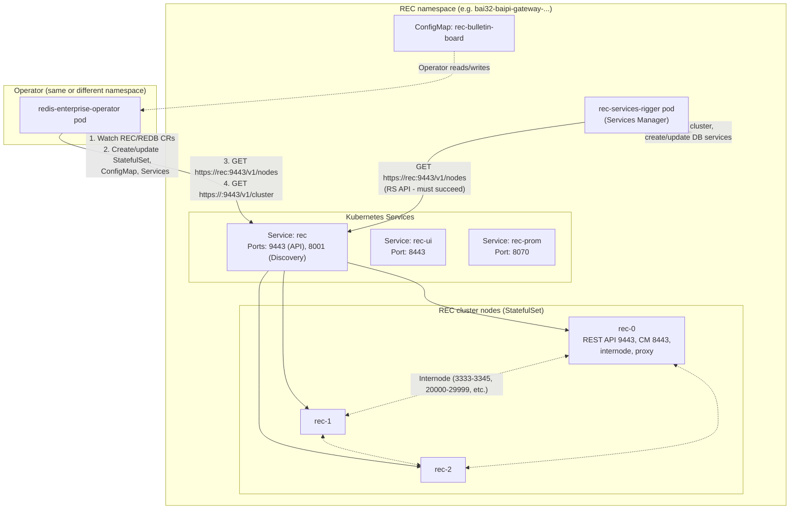

# Redis Enterprise Cluster on OpenShift — Architecture, Pods, Communications & Config

This document describes the **architecture** of a Redis Enterprise Cluster (REC) deployment on OpenShift: which **pods** and **services** are created, how they **communicate**, and which **config variables** matter—especially for fixing the **services-rigger → rec:9443** (RS API not available) issue.

---

## 1. High-level architecture

When you create a **RedisEnterpriseCluster (REC)** custom resource, the Redis Enterprise **operator** creates and manages:

| Component | Type | Purpose |
|-----------|------|---------|
| **StatefulSet** (name = REC name, e.g. `rec`) | StatefulSet | Redis Enterprise cluster nodes (rec-0, rec-1, rec-2, …) |
| **rec-services-rigger** | Deployment | Services Manager: creates/updates K8s Services for databases, talks to REC REST API |
| **ConfigMap** `<rec-name>-bulletin-board` | ConfigMap | Operator internal coordination for REC bootstrap |
| **Service `rec`** | Service | REC REST API (9443) + Discovery (8001); targets REC pods |
| **Service `rec-ui`** | Service | Cluster Manager UI (8443) |
| **Service `rec-prom`** | Service | Prometheus metrics (8070) |
| **Secrets** | Secret | Cluster credentials, license, certificates |
| **PVCs** | PersistentVolumeClaim | One per REC node for persistent data |

The **operator** itself runs as a separate Deployment (e.g. `redis-enterprise-operator`) and may be in the same namespace as the REC or in another namespace (multi-namespace).

---

## 2. Architecture diagram (pods and communications)



**Critical path for "RS API is not available":**  
**rec-services-rigger** → **Service rec** (TCP 9443) → **REC pods (rec-0, …)**. If NetworkPolicy or missing endpoints block this, the services-rigger logs timeout errors.

---

## 3. Pods created by the deployment

### 3.1 REC cluster nodes (StatefulSet)

| Pod name pattern | Labels (typical) | Purpose |
|------------------|------------------|---------|
| **rec-0**, **rec-1**, **rec-2**, … | `app=redis-enterprise`, `redis.io/cluster=rec`, `redis.io/role=node` | Redis Enterprise node: REST API (9443), Cluster Manager UI (8443), proxy, internode, data shards |

**Ports on each REC pod (relevant):**
- **9443** — REST API (HTTPS)
- **8443** — Cluster Manager UI
- **8001** — Discovery service
- **8070** — Metrics (Prometheus)
- **3333–3345, 20000–29999, …** — Internode and proxy (see [Redis port config](https://redis.io/docs/latest/operate/rs/networking/port-configurations/))

### 3.2 rec-services-rigger (Services Manager)

| Pod name pattern | Labels (typical) | Purpose |
|------------------|------------------|---------|
| **rec-services-rigger-&lt;hash&gt;-&lt;pod&gt;** | `app=redis-enterprise`, `name=services-rigger`, `redis.io/cluster=rec`, `redis.io/role=services-rigger` | Creates/updates K8s Services for databases; calls REC REST API (rec:9443) to get cluster state |

**Critical:** This pod **must** be able to reach **https://rec:9443** (and optionally REC pod IPs on 9443). If not, you see "RS API is not available: Get \"https://rec:9443/v1/nodes\": context deadline exceeded".

### 3.3 redis-enterprise-operator (if in same namespace)

| Pod name pattern | Purpose |
|------------------|---------|
| **redis-enterprise-operator-&lt;hash&gt;-&lt;pod&gt;** | Watches REC/REDB CRs; creates StatefulSet, ConfigMap, Services; calls rec:9443 and &lt;pod-ip&gt;:9443 for cluster state |

---

## 4. Services created

| Service name | Selector (typical) | Ports | Purpose |
|--------------|--------------------|-------|---------|
| **rec** | `app=redis-enterprise`, `redis.io/cluster=rec`, `redis.io/role=node` | 9443, 8001 | REC REST API + Discovery; **target of services-rigger and operator** |
| **rec-ui** | Same + master role | 8443 | Cluster Manager UI |
| **rec-prom** | Same + metrics | 8070 (or None if no endpoints) | Prometheus metrics |

**rec** must have **endpoints** (at least one REC pod Ready). Otherwise `rec:9443` resolves but traffic goes nowhere → timeout.

---

## 5. Communication matrix

| From | To | Port / path | Protocol | Purpose |
|------|----|-------------|----------|---------|
| **rec-services-rigger** | Service **rec** | 9443 | HTTPS | GET /v1/nodes, cluster state (RS API) |
| **rec-services-rigger** | REC pods | 9443 (via Service rec) | HTTPS | Same as above (traffic goes to REC pods) |
| **redis-enterprise-operator** | Service **rec** | 9443 | HTTPS | GET /v1/nodes, cluster validation |
| **redis-enterprise-operator** | REC pod IP | 9443 | HTTPS | GET /v1/cluster (e.g. https://10.x.x.x:9443/v1/cluster) |
| **redis-enterprise-operator** | REC namespace | API (create/update) | K8s API | StatefulSet, ConfigMap, Services, Secrets |
| **REC pod** | REC pod | 3333–3345, 20000–29999, etc. | TCP | Internode, proxy, data |
| **Clients / vLLM / LiteLLM** | Service **rec** or DB services | 9443 (API), 12000+ (DB) | TCP/TLS | Admin API and database access |

**NetworkPolicy must allow:**
- **Ingress to REC pods (rec-0, …)** on port **9443** from **rec-services-rigger** and from **redis-enterprise-operator** (if in same namespace or allowed by namespaceSelector).
- Optionally **egress from rec-services-rigger** to REC pods (if you have a default-deny egress policy on the services-rigger pod).

---

## 6. Config variables that matter

### 6.1 REC spec — general

| Variable | Description | Relevance to services-rigger / API |
|----------|-------------|-------------------------------------|
| **nodes** | Number of REC nodes (e.g. 3) | More nodes → more endpoints for Service rec |
| **persistentSpec** | PVC size, storage class | If PVC pending, REC pods don't start → no endpoints |
| **redisEnterpriseNodeResources** | CPU/memory requests and limits | Too low → pods OOMKill or not Ready |
| **serviceAccountName** | Service account for REC pods | On OpenShift, must have SCC (e.g. redis-enterprise-scc-v2) |
| **pullSecrets** | Image pull secret | Required for Red Hat / private registry |
| **createServiceAccount** | Create SA for REC | Usually true; SA name often = REC name (e.g. `rec`) |

### 6.2 REC spec — services and API

| Variable | Description | Relevance to services-rigger / API |
|----------|-------------|-------------------------------------|
| **spec.services** | Customization for operator-managed services | See [API reference](https://redis.io/docs/latest/operate/kubernetes/reference/api/redis_enterprise_cluster_api/#specservices) |
| **spec.services.apiService** | API service options | Affects how Service rec is exposed; default is ClusterIP with 9443 |
| **spec.servicesRiggerSpec** | Services Rigger pod spec | extraEnvVars, resources, etc.; **no direct "API URL" override** — services-rigger uses service name **rec** in same namespace |
| **spec.redisEnterpriseServicesRiggerImageSpec** | Image for services-rigger | Must match operator version |
| **spec.redisEnterpriseServicesRiggerResources** | CPU/memory for services-rigger | Avoid OOM or CPU starvation |

**Important:** The services-rigger does **not** take an explicit "API URL" in the REC spec. It uses the Kubernetes service name **`<rec-name>`** (e.g. **rec**) in the **same namespace** as the REC. So:

- REC name = **rec** → service **rec** → **https://rec:9443**
- REC name = **my-rec** → service **my-rec** → **https://my-rec:9443**

Ensure the Service **rec** exists and has endpoints (REC pods Ready).

### 6.3 REC spec — OpenShift-specific

| Variable | Description |
|----------|-------------|
| **openshift.mode** (Helm) / SCC | OpenShift security context; REC pods need **redis-enterprise-scc-v2** (or equivalent) for the REC service account |
| **ingressOrRouteSpec** | For external access (OpenShift Routes); does not replace internal **rec:9443** used by services-rigger |

### 6.4 Environment / runtime (services-rigger)

The services-rigger pod gets its **cluster URL** from the operator (service name = REC name). There is no standard REC spec field to set "API timeout" or "API URL" for the services-rigger; it uses cluster DNS. If you need to tune timeouts, check **spec.servicesRiggerSpec.extraEnvVars** in the [API reference](https://redis.io/docs/latest/operate/kubernetes/reference/api/redis_enterprise_cluster_api/#specservicesriggerspec) for any supported env vars (implementation-specific).

---

## 7. Fixing "RS API is not available" (services-rigger cannot reach rec:9443)

### 7.1 Checklist (config + network)

1. **Service rec has endpoints**  
   In OpenShift: **Networking → Services → rec** → check **Endpoints** tab. If empty, REC pods are not Ready → fix PVC, image pull, memory, or SCC.

2. **REC pods Running and Ready**  
   **Workloads → Pods** → rec-0, rec-1, … must be **Running** and **Ready**. Port 9443 is only listening when the node has joined the cluster.

3. **NetworkPolicy — ingress to REC pods**  
   Policies that select REC pods (e.g. **rec-allow-9443**, **redis-enterprise-allow**) must allow **ingress** from:
   - **rec-services-rigger** (labels: `app=redis-enterprise`, `name=services-rigger`)
   - **redis-enterprise-operator** (if in same namespace; or add namespaceSelector if in another namespace)  
   Use **podSelector** matching these labels, or a rule with **podSelector: {}** (all pods in namespace).  
   **podSelector.matchLabels** on the policy must match **REC pod labels** (e.g. `app: redis-enterprise`, `redis.io/cluster: rec`), not `app.kubernetes.io/name: redis-enterprise`.

4. **NetworkPolicy — egress from rec-services-rigger**  
   If a NetworkPolicy selects the services-rigger pod and restricts **egress**, it must allow egress **to** REC pods (or to the same namespace) on port **9443**.

5. **Namespace**  
   rec-services-rigger and Service **rec** must be in the **same namespace**. REC name = service name = hostname (**rec** → **https://rec:9443**).

### 7.2 Config variables that can help (indirectly)

- **spec.redisEnterpriseServicesRiggerResources** — Ensure enough CPU/memory so the services-rigger is not throttled or OOMKilled.
- **spec.servicesRiggerSpec.extraEnvVars** — Only if Redis documents a timeout or API URL env var for the services-rigger image (check release notes).
- **spec.bootstrapperResources** / **spec.redisEnterpriseNodeResources** — Ensure REC nodes start and become Ready so Service rec gets endpoints and 9443 is listening.

---

## 8. Summary diagram (text)

```
┌─────────────────────────────────────────────────────────────────────────┐
│  OpenShift project (e.g. bai32-baipi-gateway-baipi-gateway-dev-01)      │
├─────────────────────────────────────────────────────────────────────────┤
│  Operator (optional same ns)                                            │
│    redis-enterprise-operator  ──► GET rec:9443/v1/nodes, pod:9443/v1/   │
│                                   cluster; creates STS, ConfigMap, SVCs  │
├─────────────────────────────────────────────────────────────────────────┤
│  Services:   rec (9443, 8001)   rec-ui (8443)   rec-prom (8070)         │
│                  │                                                       │
│  Pods:          ▼                                                       │
│  rec-0, rec-1, rec-2  ◄──── ingress:9443 must be allowed from          │
│  (StatefulSet)              rec-services-rigger (and operator)           │
│       ▲                                                                 │
│       │ GET https://rec:9443/v1/nodes (RS API)                          │
│  rec-services-rigger  ──────► Service rec ──────► rec-0 (9443)         │
│  (Deployment)                                                           │
└─────────────────────────────────────────────────────────────────────────┘
```

---

## 9. References

- **Project:** [architecture-diagram.md](redis-enterprise-argocd-example/architecture-diagram.md) — Mermaid diagrams (pods, services, sequence for rec:9443)
- [Redis Enterprise for Kubernetes architecture](https://redis.io/docs/latest/operate/kubernetes/architecture)
- [RedisEnterpriseCluster API Reference](https://redis.io/docs/latest/operate/kubernetes/reference/api/redis_enterprise_cluster_api/) — spec.services, spec.servicesRiggerSpec
- [Network port configurations](https://redis.io/docs/latest/operate/rs/networking/port-configurations/) — 9443, 8001, etc.
- [Services Rigger](https://redis.io/docs/latest/operate/kubernetes/architecture/#services-rigger) — creates/updates services, uses REC API
- Project docs: [10-redis-enterprise-rec-services-rigger-9443-timeout-deep-dive.md](10-redis-enterprise-rec-services-rigger-9443-timeout-deep-dive.md), [FIX-NOW-OpenShift-UI.md](redis-enterprise-argocd-example/FIX-NOW-OpenShift-UI.md)
