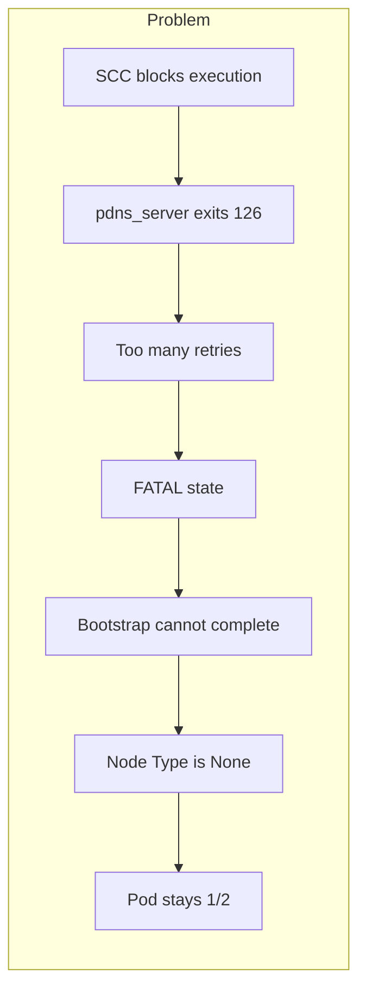
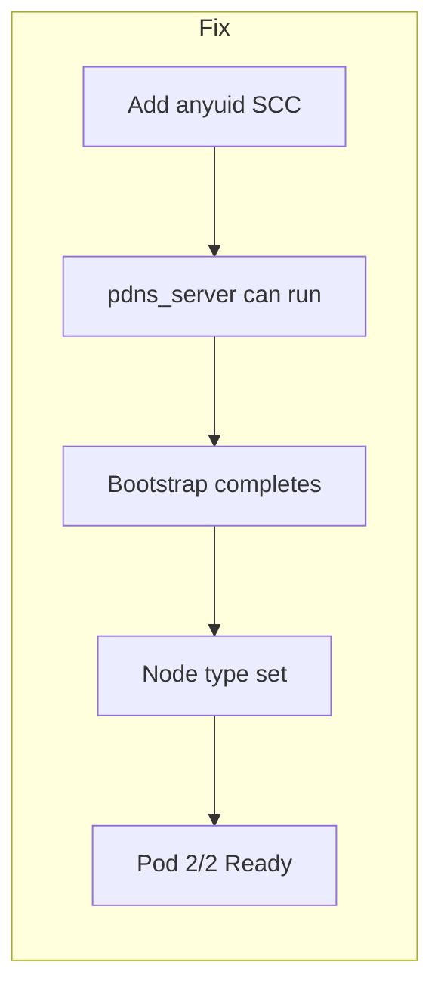

# Fix: pdns_server Exit 126 + "Node Type is None" — Beginner-Friendly Guide

This guide explains the error in simple terms and how to fix it.

---

## Glossary (Technical Terms Explained)

| Term | Plain English |
|------|----------------|
| **Pod** | A single running unit in Kubernetes/OpenShift. Think of it as one "box" that runs your app (here: one Redis Enterprise node). |
| **rec-0, rec-1, rec-2** | The three Redis Enterprise Cluster (REC) nodes. rec-0 is the first, rec-1 and rec-2 join later. |
| **pdns_server** | A small program inside the REC pod that handles internal DNS (name resolution). Redis Enterprise needs it to start correctly. |
| **Exit status 126** | A number the program returns when it **cannot run at all**. It’s like the system saying: "I tried to run this program but I’m not allowed to." |
| **Bootstrap** | The startup process: the pod starts, loads config, joins the cluster, and becomes "ready". |
| **Node Type** | The role of a node: "first node" (creates the cluster) or "joining node" (joins an existing cluster). |
| **SCC (Security Context Constraints)** | OpenShift rules that limit what a pod can do (e.g. which user it runs as, whether it can run certain programs). |
| **anyuid** | An SCC that allows the pod to run as any user ID. It’s more permissive, so it often fixes "cannot execute" errors. |
| **ServiceAccount** | An identity that Kubernetes gives to a pod. SCCs are often applied to this identity. |
| **Namespace** | A separate area in the cluster (like a folder). Your REC runs in one namespace (e.g. `redis-enterprise`). |
| **FATAL state** | The supervisor gave up restarting the program because it failed too many times in a short time. |

---

## What’s Going Wrong? (In Plain English)

1. **Your REC pods (rec-0, rec-1, rec-2) are starting.**
2. **Inside each pod, Redis Enterprise tries to run a program called `pdns_server`.**
3. **OpenShift’s security rules (SCC) say: "This pod is not allowed to run that program."**  
   So the program exits immediately with **exit status 126** (cannot execute).
4. **The system keeps trying to start `pdns_server`**, it fails again and again, and eventually goes into **FATAL state** (too many retries).
5. **Because `pdns_server` never runs, the bootstrap process cannot finish.**  
   So you see **"Node Type is None"** (the node never got a proper role) and the pod stays **not fully ready (1/2)**.

**In one sentence:**  
OpenShift is blocking the pod from running `pdns_server`, so the node never finishes starting and stays in bootstrap.

---

## Simple Diagram: What Should Happen vs What Happens Now

### What should happen (normal startup)

```
┌─────────────────────────────────────────────────────────────────┐
│  Pod rec-0 starts                                                │
│                                                                  │
│  1. Container starts        ✓                                   │
│  2. pdns_server runs        ✓  ← Handles internal DNS           │
│  3. Bootstrap runs          ✓  ← Node gets a "type" (first node) │
│  4. Node becomes Ready      ✓  ← Pod shows 2/2                   │
└─────────────────────────────────────────────────────────────────┘
```

### What happens when you see the error

```
┌─────────────────────────────────────────────────────────────────┐
│  Pod rec-0 starts                                                │
│                                                                  │
│  1. Container starts        ✓                                   │
│  2. pdns_server runs        ✗  ← BLOCKED (exit 126)             │
│     └─ OpenShift SCC says "not allowed to run this"              │
│  3. pdns_server retries      ✗  ✗  ✗  → FATAL (gave up)         │
│  4. Bootstrap runs          ✗  ← Can't finish → "Node Type None" │
│  5. Node stays not ready     ✗  ← Pod stays 1/2                 │
└─────────────────────────────────────────────────────────────────┘
```

### Flow diagram (cause and effect)



### After the fix



---

## Why Does OpenShift Block It?

- **Security:** By default, OpenShift uses strict rules (e.g. **restricted** or **restricted-v2** SCC) so pods cannot do everything (e.g. run as any user or run certain binaries).
- **pdns_server** may need to run in a way that these strict rules don’t allow, so the system refuses to execute it → **exit status 126**.
- **anyuid** is a less strict SCC that allows the pod to run as different user IDs. When you attach **anyuid** to the ServiceAccount used by your REC pods, OpenShift stops blocking that execution and **pdns_server** can run.

**Important:** Using **anyuid** is a security trade-off. Your platform team may have policies about when it’s allowed.

---

## Fix Steps (With Simple Explanations)

### Step 1: Find the ServiceAccount

**What you’re doing:** Finding the "identity" (ServiceAccount) that your REC pods use. SCCs are tied to this identity.

```bash
# Replace <namespace> with your namespace (e.g. redis-enterprise)
kubectl get pod rec-0 -n <namespace> -o jsonpath='{.spec.serviceAccountName}' && echo
```

**You’ll get:** A name like `default` or `redis-enterprise`. Remember it; it’s `<sa-name>` in the next step.

---

### Step 2: Check which SCC is applied (optional but useful)

**What you’re doing:** Seeing which security profile the pod is using. If it’s `restricted-v2` or `restricted`, that’s why execution is blocked.

```bash
oc get pod rec-0 -n <namespace> -o jsonpath='{.metadata.annotations.openshift\.io/scc}' && echo
```

**If you see `restricted-v2` or `restricted`:** That’s the one blocking `pdns_server`.

---

### Step 3: Add anyuid SCC to the ServiceAccount

**What you’re doing:** Telling OpenShift: "Pods using this ServiceAccount are allowed to use the anyuid security profile," so they can run `pdns_server`.

```bash
# Replace <sa-name> with the name from Step 1
# Replace <namespace> with your namespace
oc adm policy add-scc-to-user anyuid -z <sa-name> -n <namespace>
```

**Example:** If ServiceAccount is `default` and namespace is `redis-enterprise`:

```bash
oc adm policy add-scc-to-user anyuid -z default -n redis-enterprise
```

**Note:** If your company has security policies, check with your platform team before using `anyuid`.

---

### Step 4: Restart the REC pods

**What you’re doing:** Starting the pods again so they get the new SCC. After restart, they should be allowed to run `pdns_server`.

```bash
kubectl delete pod rec-0 rec-1 rec-2 -n <namespace>
```

Kubernetes/OpenShift will recreate the pods automatically. After that:

- `pdns_server` should run (no more exit 126).
- Bootstrap should complete.
- "Node Type is None" should disappear (node type gets set).
- Pods should become **2/2 Ready**.

---

## Understanding "Node Type is None"

- **Node Type** = role of this node: "I am the first node" or "I am a node joining an existing cluster."
- **"Node Type is None"** = the startup process hasn’t finished yet, so the node doesn’t have a role.
- **Why you see it:** Bootstrap depends on `pdns_server`. When `pdns_server` fails (exit 126), bootstrap never completes, so the node type is never set.
- **Fix:** Fix `pdns_server` (with the anyuid SCC and restart). Once `pdns_server` runs, bootstrap completes and "Node Type is None" goes away.

---

## If the Fix Doesn’t Work: Check the Program Itself

Sometimes the problem isn’t SCC but a missing or broken program. You can check inside the pod:

```bash
# Does the pdns_server file exist?
kubectl exec -it rec-0 -n <namespace> -- ls -la /opt/redislabs/bin/pdns_server

# What kind of file is it?
kubectl exec -it rec-0 -n <namespace> -- file /opt/redislabs/bin/pdns_server

# Are any libraries it needs missing?
kubectl exec -it rec-0 -n <namespace> -- ldd /opt/redislabs/bin/pdns_server
```

- **If the file is missing or not executable:** Could be a bad or wrong container image; try a known-good image version.
- **If `ldd` shows "not found" for some libraries:** Again, often an image or environment issue.

---

## How to Check That Everything Is Fixed

1. **pdns_server is running (no more exit 126):**
   ```bash
   kubectl logs rec-0 -n <namespace> | grep pdns_server
   ```
   You want to see something like: `INFO success: pdns_server entered RUNNING state`  
   You should **not** see: `exited: pdns_server (exit status 126)`.

2. **Bootstrap and node type:**
   ```bash
   kubectl logs rec-0 -n <namespace> | grep -i "node type\|bootstrap"
   ```
   You should see node type set (e.g. first node or joining node), not "Node Type is None".

3. **Pod ready:**
   ```bash
   kubectl get pod rec-0 -n <namespace>
   ```
   **READY** should be **2/2**, not 1/2.

---

## Summary (Short Version)

| What you see | What it means | What to do |
|--------------|----------------|------------|
| `pdns_server (exit status 126)` | OpenShift is blocking the pod from running this program | Add **anyuid** SCC to the ServiceAccount used by REC pods |
| `Node Type is None` | Bootstrap didn’t finish because `pdns_server` never ran | Same fix: once `pdns_server` runs, bootstrap completes and node type is set |
| Pod **1/2** | One part of the pod is ready, the other (with `pdns_server`/bootstrap) is not | After the fix and restart, pod should go **2/2** |

**Steps:**  
1) Find ServiceAccount.  
2) Add anyuid SCC to that ServiceAccount.  
3) Restart rec-0, rec-1, rec-2.  
4) Check logs and **READY** column to confirm.

---

## Quick Reference: Commands in Order

```bash
# 1. Find ServiceAccount
kubectl get pod rec-0 -n <namespace> -o jsonpath='{.spec.serviceAccountName}' && echo

# 2. (Optional) Check current SCC
oc get pod rec-0 -n <namespace> -o jsonpath='{.metadata.annotations.openshift\.io/scc}' && echo

# 3. Add anyuid SCC (use the ServiceAccount name from step 1)
oc adm policy add-scc-to-user anyuid -z <sa-name> -n <namespace>

# 4. Restart pods
kubectl delete pod rec-0 rec-1 rec-2 -n <namespace>

# 5. Verify (after pods are back)
kubectl get pod rec-0 -n <namespace>
kubectl logs rec-0 -n <namespace> | grep pdns_server | tail -5
```

Replace `<namespace>` with your namespace (e.g. `redis-enterprise`) and `<sa-name>` with the ServiceAccount name from step 1.
