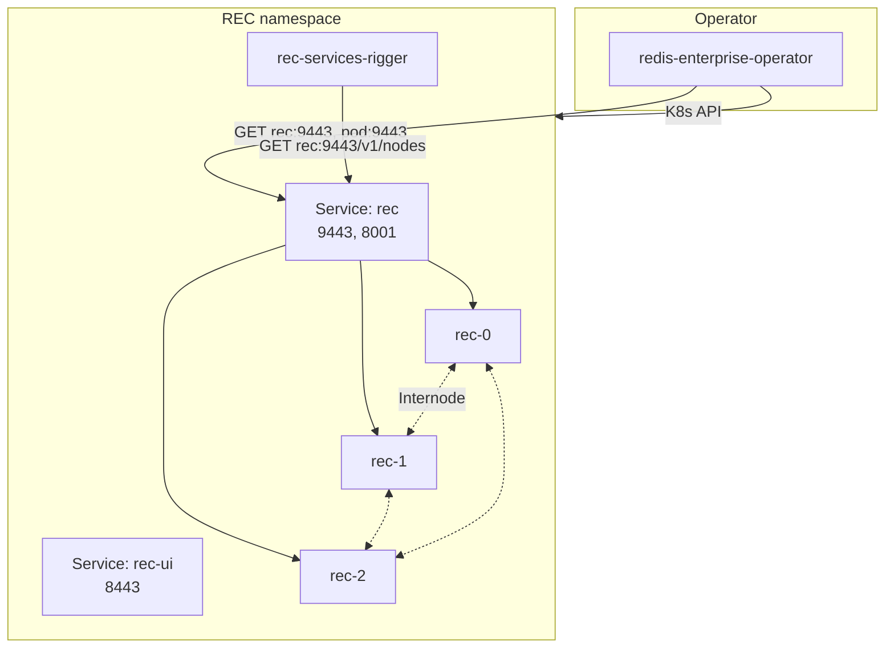
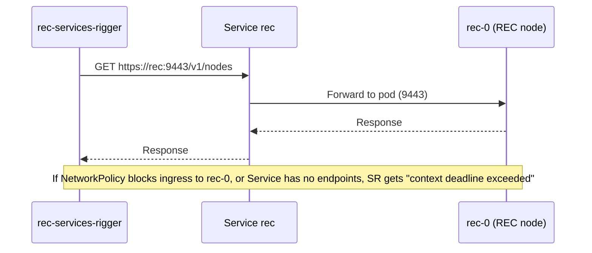

# Redis Enterprise Cluster on OpenShift — Architecture Diagram

This file contains Mermaid diagrams that render on GitHub. See [11-redis-enterprise-openshift-architecture-and-config.md](../11-redis-enterprise-openshift-architecture-and-config.md) for full documentation.

---

## Pods and communications (overview)

---

## Critical path: services-rigger → RS API (9443)

---

## Ports and services table (reference)

| Service  | Port(s) | Targets   | Used by                    |
|----------|---------|-----------|----------------------------|
| rec      | 9443    | REC pods  | services-rigger, operator  |
| rec      | 8001    | REC pods  | Discovery                  |
| rec-ui   | 8443    | REC pods  | Cluster Manager UI         |
| rec-prom | 8070    | REC pods  | Prometheus                 |

REC pod labels (for NetworkPolicy): `app=redis-enterprise`, `redis.io/cluster=rec`, `redis.io/role=node`  
rec-services-rigger labels: `app=redis-enterprise`, `name=services-rigger`, `redis.io/cluster=rec`
